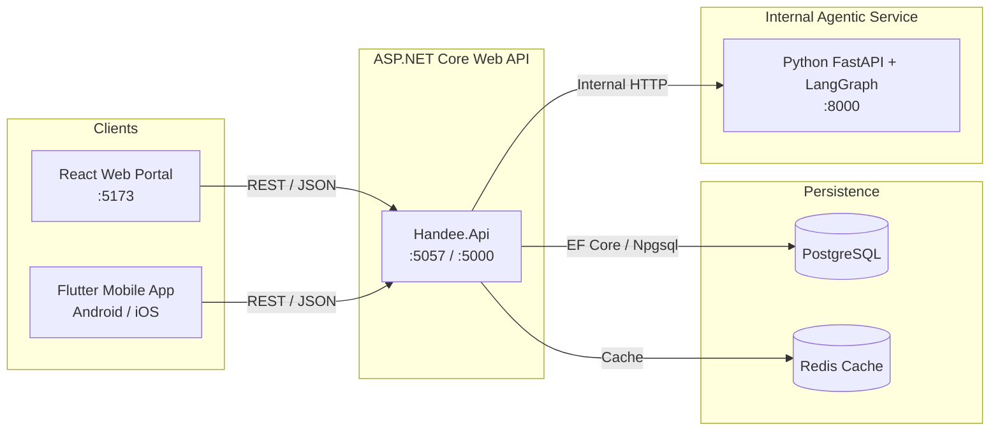
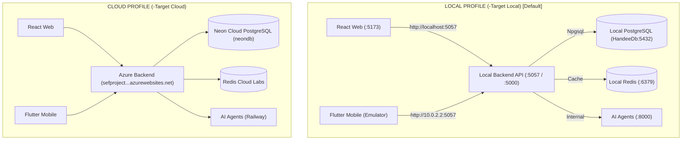

booking
hours ballan onboarding
form sect combo
form font
colcbo search city

location and address overlap issue
mobile phone pay doenest work
redis not working on web (specially on verifiactnio action on https://handee-mu.vercel.app/admin/verifications/*)
back to service from providers goes to home
desc not retailo new lines

verfications

# Handee — Integrated Full-Stack & Agentic AI Marketplace

**Handee** is a trust-verified marketplace connecting homeowners with vetted tradespeople (plumbers, electricians, AC technicians, painters, carpenters, and more) across Sri Lanka.

The platform combines a **Single Public ASP.NET Core Backend**, an **Internal 4-Agent LangGraph AI Subsystem**, a **React Web Portal** (for Admins, Providers, and Customers), and a **Flutter Mobile App** (live field app for job submission, tracking, and provider dispatch).

---

## 1. System Architecture



### Architecture Guarantees
- **Single Public Backend Rule**: Neither the React web app nor the Flutter mobile app ever calls the Python AI service directly. All client interactions flow exclusively through the ASP.NET Core API.
- **Tiered Human-in-the-Loop (HITL) Gate**: The AI Validation/Safety agent deterministically categorizes job requests into 3 tiers:
  - `approved_for_auto_dispatch` (Low risk): Verified provider, normal price band, auto-dispatched.
  - `approved_with_audit` (Medium risk): Single non-critical variance, dispatched immediately with audit flag.
  - `requires_human_approval` (High risk): Paused in `PendingAiReview` until Admin reviews and decides in the React portal.

---

## 2. Platform Ports & URLs

| Component | Technology | Local Port(s) | Documentation / Health |
| :--- | :--- | :--- | :--- |
| **Backend API** | ASP.NET Core 9 / 10 | `http://localhost:5057`<br/>`http://localhost:5000` | OpenAPI: `http://localhost:5057/openapi/v1.json` |
| **AI Agent Service** | Python FastAPI / LangGraph | `http://localhost:8000` | Swagger: `http://localhost:8000/docs`<br/>Health: `http://localhost:8000/health` |
| **Web Portal** | React 19 / Vite / TypeScript | `http://localhost:5173` | — |
| **Mobile App** | Flutter 3.x / Dart | Android emulator (`10.0.2.2`) | Hot Reload (`r` in terminal) |

---

## 3. Prerequisites

Ensure you have the following installed on your system:
- **.NET SDK 9.0 or 10.0**: `dotnet --version`
- **Python 3.11+**: `python --version`
- **Node.js 20+ & npm**: `node -v` and `npm -v`
- **Flutter SDK 3.x**: `flutter --version`
- **PostgreSQL connection**: configured in `src/backend/Handee.Api/appsettings.json` (defaults to cloud Neon DB).

---

## 4. Environment & Connectivity Topology (Local vs Deployed Cloud)

To prevent confusion regarding where data comes from and where it is saved, the Handee platform provides two clean connectivity profiles:



### Environment Matrix

| Component | Local Profile (`-Target Local` / Default) | Cloud Profile (`-Target Cloud`) |
| :--- | :--- | :--- |
| **Backend API** | `http://localhost:5057` & `:5000` | Deployed Azure (`https://sefproject...azurewebsites.net`) |
| **Database** | Local PostgreSQL (`localhost:5432` / `HandeeDb`) | Neon Tech Cloud PostgreSQL (`neondb`) |
| **Redis Cache** | Local Redis (`localhost:6379`) | Redis Labs Cloud Instance |
| **React Web Portal** | Talks to `http://localhost:5057` (`npm run dev:local`) | Talks to Azure Backend (`npm run dev:cloud`) |
| **Flutter Mobile** | Talks to `http://10.0.2.2:5057` (`--dart-define=USE_LOCAL=true`) | Talks to Azure Backend (`--dart-define=USE_LOCAL=false`) |

### Instant Startup Transparency (Console Banners)

Every application automatically outputs a diagnostic banner when it spins up, eliminating ambiguity:

1. **Backend API**:
   - Prints active database host, DB name, Redis connection, and AI agent endpoint to the console on startup.
   - Live JSON diagnostic endpoint: `GET http://localhost:5057/api/system/info`.
2. **React Web Portal**:
   - Terminal shows the active target backend URL when Vite starts.
   - Browser DevTools Console (`F12`) displays a styled `[Handee Web]` badge with the active API URL on every page load.
3. **Flutter Mobile App**:
   - Debug console prints the target backend URL, routing aliases (`10.0.2.2:5057`), and platform flags when `main()` initializes.

---

## 5. Running Services (One-Command Runner)

The project provides a unified PowerShell runner script [`run-services.ps1`](./run-services.ps1) with flags to run specific service profiles and target environments:

### Target Profile Shortcuts

```powershell
# 1. All services connected LOCALLY (Default)
.\run-services.ps1

# 2. All services targeting DEPLOYED CLOUD (Azure & Neon Cloud DB)
.\run-services.ps1 -Target Cloud

# 3. Local backend connected to Neon Cloud DB (useful if you don't have local Postgres installed)
.\run-services.ps1 -CloudDb
```

### Selective Subsystem Profiles

You can combine `-Target` with any service profile:

```powershell
# Backend & AI Only (Local DB)
.\run-services.ps1 -BackendAndAiOnly

# Backend, AI & Mobile Only (Targeting Local)
.\run-services.ps1 -BackendAiAndMobileOnly

# Backend, AI & Web Only (Targeting Local)
.\run-services.ps1 -BackendAiAndWebOnly

# Stop all background services
.\run-services.ps1 -Stop
```

---

## 6. Running Services Manually

If you prefer launching services in individual terminal tabs:

### 1. AI Agent Service (`agents/`)
```powershell
cd agents
python -m pip install -r requirements.txt
python -m uvicorn src.main:app --host 0.0.0.0 --port 8000 --reload
```
*Health check:* `curl http://localhost:8000/health`

### 2. ASP.NET Core Backend (`src/backend/Handee.Api/`)
```powershell
cd src/backend/Handee.Api
dotnet build

# Run against Local PostgreSQL (default):
dotnet run --urls "http://0.0.0.0:5057;http://0.0.0.0:5000"

# Or run against Neon Cloud PostgreSQL:
$env:USE_CLOUD_DB='true'; dotnet run --urls "http://0.0.0.0:5057;http://0.0.0.0:5000"
```
*Diagnostics check:* `curl http://localhost:5057/api/system/info`

### 3. React Web Portal (`web/`)
```powershell
cd web
npm install

# Connect to Local Backend (http://localhost:5057):
npm run dev:local
# (or simply: npm run dev)

# Connect to Deployed Azure Backend:
npm run dev:cloud
```

### 4. Flutter Mobile App (`app/`)
```powershell
cd app
flutter pub get

# Connect to Local Backend (Android emulator automatically uses 10.0.2.2:5057):
flutter run --dart-define=USE_LOCAL=true

# Connect to Deployed Azure Backend:
flutter run --dart-define=USE_LOCAL=false
```

---

## 7. VS Code 1-Click Debugging

The workspace includes pre-configured launch profiles in [`.vscode/launch.json`](./.vscode/launch.json). Open the **Run and Debug** view (`Ctrl+Shift+D`) to start any service with 1 click:
- `Backend (.NET - Local Database)`
- `Backend (.NET - Cloud Neon DB)`
- `Flutter Mobile (Local Backend)`
- `Flutter Mobile (Cloud Azure Backend)`

---

## 8. Testing Guide

### 1. AI Agent Subsystem Tests (Python / pytest)
Tests the 4-agent LangGraph workflow, category classification, scope estimation, price estimation, and the 3 deterministic risk validation tiers:
```powershell
cd agents
python -m pytest tests -v
```
**Expected Output**: `8 passed`

### 2. ASP.NET Core Backend Build & Validation (.NET)
Verifies project compilation, EF Core database mappings, and controller integrity:
```powershell
dotnet build src/backend/Handee.Api
```
**Expected Output**: `Build succeeded. 0 Error(s)`

To update or re-apply database migrations manually:
```powershell
dotnet ef database update --project src/backend/Handee.Api
```

### 3. Flutter Mobile App Tests & Static Analysis
Verifies Dart code hygiene, null safety, and repository interaction with the backend API:
```powershell
cd app

# Static code analysis
flutter analyze

# Unit & Widget tests
flutter test
```
**Expected Output**: `No issues found!`, `All tests passed!`

### 4. React Web Portal Tests (Vitest)
```powershell
cd web
npm test
```

---

## 9. End-to-End Workflow Verification

### Scenario A: Instant Match Job Request with AI Auto-Dispatch (Low Risk)
1. **Submit Job Request**:
   - Customer logs in on Flutter app.
   - Creates a request: Category: `Plumbing`, Description: *"Fix leaking kitchen sink tap"*, Location: *"Colombo 03"*, Budget: *"3000-4500"*.
2. **Backend & AI Execution**:
   - ASP.NET Core saves `JobRequest` with status `PendingAiReview`.
   - Calls AI service `POST /api/v1/workflow/dispatch`.
   - Coordinator plans workflow -> Domain Analysis estimates Low/Medium scope -> Action Agent finds verified plumber Sunil Perera and estimates price Rs. 3,500 -> Validation Agent checks verified status & price band -> classifies as `approved_for_auto_dispatch`.
3. **Dispatch & Booking**:
   - Backend auto-promotes `JobRequest` to `Open` and creates a `Booking` (status `Requested`) assigned to Sunil Perera.
   - Provider receives dispatch offer in their **Live Dispatch Queue** (`/bookings/provider-offers`).

### Scenario B: High-Risk Match & HITL Admin Approval
1. **Trigger**:
   - Customer submits a request with an unverified provider or high price variance (> 40%).
2. **AI Classification**:
   - Validation/Safety Agent flags proposal as `requires_human_approval`.
   - `AgentWorkflow` is persisted with `approval_status: pending`.
3. **Admin Review (Web)**:
   - Admin logs into React portal (`http://localhost:5173/login`).
   - Navigates to **Agent Monitoring & Approval** (`/admin/agent-workflow`).
   - Reviews agent reasoning trail, risk flags, and candidate provider.
   - Clicks **Approve**: Backend moves `JobRequest` to `Open` and issues the booking offer.

### Scenario C: Conversational Customer Assistant
1. Customer chats in the Flutter Assistant tab (`AssistantChatScreen`).
2. Prompt: *"Find me an AC repair specialist under Rs 5,000"*.
3. Flutter calls backend `POST /assistant/query`, which invokes Python AI service `/api/v1/assistant/query`.
4. Returns smart recommendations with quick-action suggestion chips (*"Request Instant Match for AC Repair"*, *"Book AC Cleaning"*).

---

## 10. Default Credentials & Seed Data

| Role | Email | Password | Surface |
| :--- | :--- | :--- | :--- |
| **Admin** | `admin@handee.lk` | `Admin@1234!` | React Web (`/login`) |
| **Provider** | `provider@example.com` | Registered via App/Web | Flutter & React Web |
| **Customer** | `customer@example.com` | Registered via App/Web | Flutter & React Web |

---

## 11. Project Structure

```
.
├── agents/                       # Python AI Subsystem (FastAPI + LangGraph)
│   ├── src/
│   │   ├── api/routes.py         # /workflow/dispatch & /assistant/query
│   │   ├── core/state.py         # AgentWorkflowState schema
│   │   ├── tools/                # Allowed agent tools (domain, action, validation)
│   │   └── workflows/            # Compiled 4-agent LangGraph workflow
│   └── tests/                    # pytest agent test suite
│
├── app/                          # Flutter Mobile Application
│   ├── lib/
│   │   ├── core/                 # ApiClient, storage, theme, constants
│   │   ├── data/                 # Repositories (real backend-connected) & models
│   │   ├── providers/            # State management (ChangeNotifier)
│   │   └── screens/              # Customer & Provider UI screens
│   └── test/                     # Flutter unit & widget tests
│
├── src/backend/Handee.Api/       # ASP.NET Core Web API (Single Public Entry Point)
│   ├── Controllers/              # REST controllers (Auth, Jobs, Bookings, AI, Admin)
│   ├── Data/                     # AppDbContext, EF Core migrations, Seeders
│   ├── DTO/                      # Request/Response contracts
│   ├── Entities/                 # Domain entities (JobRequest, Booking, AgentWorkflow)
│   └── Services/                 # Business logic & AI workflow client service
│
├── web/                          # React Web Portal (Admin, Provider, Customer)
│   ├── src/                      # Vite + React 19 pages & components
│   └── package.json
│
├── docs/                         # Project architecture & specification docs
├── run-services.ps1              # Multi-service PowerShell runner script
└── README.md                     # Platform documentation
```
