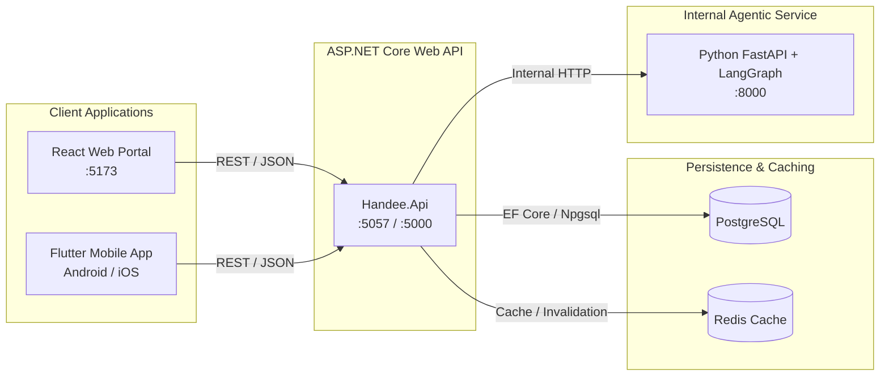
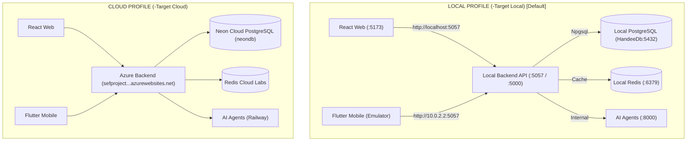

# Handee — Integrated Full-Stack & Agentic AI Marketplace

[](https://dotnet.microsoft.com/)
[](https://fastapi.tiangolo.com/)
[](https://langchain-ai.github.io/langgraph/)
[](https://react.dev/)
[](https://flutter.dev/)
[](https://www.postgresql.org/)
[](./docs/testing-evidence/test-suite-master-summary.txt)
[](./docs/testing/05-software-testing-report.md)
[](./tests/security/zap-security-report.html)

**Handee** is a trust-verified marketplace connecting homeowners with vetted tradespeople (plumbers, electricians, AC technicians, painters, carpenters, and more) across Sri Lanka.

The platform integrates a **Single Public ASP.NET Core Backend**, an **Internal 4-Agent LangGraph AI Subsystem**, a **React Web Portal** (for Admins, Providers, and Customers), and a **Flutter Mobile App** (live field application for job creation, real-time tracking, and provider dispatch).

---

## Table of Contents

- [1. System Architecture](#1-system-architecture)
  - [Architecture Guarantees](#architecture-guarantees)
- [2. Quick Start (One-Command Runner)](#2-quick-start-one-command-runner)
- [3. Platform Ports & Endpoints](#3-platform-ports--endpoints)
- [4. Default Credentials & Seed Data](#4-default-credentials--seed-data)
- [5. Environment & Connectivity Topology](#5-environment--connectivity-topology)
  - [Environment Matrix](#environment-matrix)
  - [Console Diagnostic Banners](#console-diagnostic-banners)
- [6. Prerequisites & Manual Execution](#6-prerequisites--manual-execution)
- [7. Automated Testing & Quality Engineering](#7-automated-testing--quality-engineering)
  - [7.1 Master Test Suite Runner](#71-master-test-suite-runner)
  - [7.2 Subsystem Test Suites](#72-subsystem-test-suites)
  - [7.3 Non-Functional & Security Testing](#73-non-functional--security-testing)
  - [7.4 Continuous Integration (CI/CD)](#74-continuous-integration-cicd)
  - [7.5 Quality Assurance & Testing Specifications](#75-quality-assurance--testing-specifications)
- [8. End-to-End Workflow Verification](#8-end-to-end-workflow-verification)
- [9. Project Structure](#9-project-structure)

---

## 1. System Architecture



### Architecture Guarantees

- **Single Public Backend Rule**: Neither the React web app nor the Flutter mobile app ever contacts the Python AI service directly. All client requests flow strictly through the ASP.NET Core API gateway.
- **Tiered Human-in-the-Loop (HITL) Gate**: The AI Validation/Safety agent deterministically categorizes job requests into 3 safety tiers:
  - `approved_for_auto_dispatch` *(Low risk)*: Verified provider and standard price band; automatically dispatched.
  - `approved_with_audit` *(Medium risk)*: Minor non-critical variance; dispatched immediately with an audit flag.
  - `requires_human_approval` *(High risk)*: Paused in `PendingAiReview` until an Admin reviews and approves it in the React portal.

---

## 2. Quick Start (One-Command Runner)

The fastest way to launch the entire platform is with the unified PowerShell runner [`run-services.ps1`](./run-services.ps1):

```powershell
# 1. Launch all services connected LOCALLY (Default)
.\run-services.ps1

# 2. Launch all services targeting DEPLOYED CLOUD (Azure Backend & Neon Cloud DB)
.\run-services.ps1 -Target Cloud

# 3. Launch local backend connected to Neon Cloud DB (No local Postgres required)
.\run-services.ps1 -CloudDb
```

<details>
<summary><strong>Selective Subsystem Profiles & Controls</strong></summary>

```powershell
# Backend & AI Service only (Local DB)
.\run-services.ps1 -BackendAndAiOnly

# Backend, AI & Mobile only
.\run-services.ps1 -BackendAiAndMobileOnly

# Backend, AI & Web only
.\run-services.ps1 -BackendAiAndWebOnly

# Gracefully stop all background services
.\run-services.ps1 -Stop
```
</details>

---

## 3. Platform Ports & Endpoints

| Component | Technology | Local Port(s) | Documentation / Diagnostics |
| :--- | :--- | :--- | :--- |
| **Backend API** | ASP.NET Core 10 | `http://localhost:5057`<br/>`http://localhost:5000` | OpenAPI: `http://localhost:5057/openapi/v1.json`<br/>Diagnostics: `http://localhost:5057/api/system/info` |
| **AI Agent Service** | Python FastAPI / LangGraph | `http://localhost:8000` | Swagger: `http://localhost:8000/docs`<br/>Health: `http://localhost:8000/health` |
| **Web Portal** | React 19 / Vite / TypeScript | `http://localhost:5173` | Browser DevTools Console badge |
| **Mobile App** | Flutter 3.x / Dart | Android Emulator (`10.0.2.2:5057`) | Hot Reload (`r` in terminal) |

---

## 4. Default Credentials & Seed Data

| Role | Email | Password | Surface | Notes |
| :--- | :--- | :--- | :--- | :--- |
| **Admin** | `admin@handee.lk` | `Admin@1234!` | React Web (`/login`) | Full system management & HITL reviews |
| **Provider** | `provider@example.com` | Registered via App/Web | Flutter & React Web | View dispatch offers & accept jobs |
| **Customer** | `customer@example.com` | Registered via App/Web | Flutter & React Web | Submit requests & book verified pros |

---

## 5. Environment & Connectivity Topology

Handee supports two clean connectivity profiles to seamlessly switch between local loopback development and cloud staging:



### Environment Matrix

| Component | Local Profile (`-Target Local` / Default) | Cloud Profile (`-Target Cloud`) |
| :--- | :--- | :--- |
| **Backend API** | `http://localhost:5057` & `:5000` | Deployed Azure (`https://sefproject...azurewebsites.net`) |
| **Database** | Local PostgreSQL (`localhost:5432` / `HandeeDb`) | Neon Tech Cloud PostgreSQL (`neondb`) |
| **Redis Cache** | Local Redis (`localhost:6379`) | Redis Labs Cloud Instance |
| **React Web Portal** | Points to `http://localhost:5057` (`npm run dev:local`) | Points to Azure Backend (`npm run dev:cloud`) |
| **Flutter Mobile** | Points to `http://10.0.2.2:5057` (`--dart-define=USE_LOCAL=true`) | Points to Azure Backend (`--dart-define=USE_LOCAL=false`) |

### Console Diagnostic Banners

Every service outputs an explicit diagnostic banner upon startup to eliminate guesswork:
- **Backend API**: Prints active database host, DB name, Redis connection, and AI agent endpoint.
- **React Web Portal**: Vite logs target API; browser console displays a styled `[Handee Web]` banner with active endpoint.
- **Flutter Mobile App**: Debug console prints active target backend URL, routing aliases (`10.0.2.2`), and environment flags.

---

## 6. Prerequisites & Manual Execution

### Prerequisites
- **.NET SDK 10.0 / 9.0**: `dotnet --version`
- **Python 3.11+**: `python --version`
- **Node.js 20+ & npm**: `node -v` and `npm -v`
- **Flutter SDK 3.x**: `flutter --version`
- **PostgreSQL**: Local instance or Cloud Neon DB configured in [`src/backend/Handee.Api/appsettings.json`](./src/backend/Handee.Api/appsettings.json)

<details>
<summary><strong>Manual Service Startup Instructions</strong></summary>

#### 1. AI Agent Service (`agents/`)
```powershell
cd agents
python -m pip install -r requirements.txt
python -m uvicorn src.main:app --host 0.0.0.0 --port 8000 --reload
```
*Health check:* `curl http://localhost:8000/health`

#### 2. ASP.NET Core Backend (`src/backend/Handee.Api/`)
```powershell
cd src/backend/Handee.Api
dotnet build

# Run against Local PostgreSQL (default):
dotnet run --urls "http://0.0.0.0:5057;http://0.0.0.0:5000"

# Or run against Neon Cloud PostgreSQL:
$env:USE_CLOUD_DB='true'; dotnet run --urls "http://0.0.0.0:5057;http://0.0.0.0:5000"
```
*Diagnostics check:* `curl http://localhost:5057/api/system/info`

#### 3. React Web Portal (`web/`)
```powershell
cd web
npm install

# Connect to Local Backend (http://localhost:5057):
npm run dev:local

# Connect to Deployed Azure Backend:
npm run dev:cloud
```

#### 4. Flutter Mobile App (`app/`)
```powershell
cd app
flutter pub get

# Connect to Local Backend (Android emulator uses 10.0.2.2:5057):
flutter run --dart-define=USE_LOCAL=true

# Connect to Deployed Azure Backend:
flutter run --dart-define=USE_LOCAL=false
```

#### 5. VS Code 1-Click Debugging
Launch profiles are pre-configured in [`.vscode/launch.json`](./.vscode/launch.json). Press `Ctrl+Shift+D` to launch:
- `Backend (.NET - Local Database)`
- `Backend (.NET - Cloud Neon DB)`
- `Flutter Mobile (Local Backend)`
- `Flutter Mobile (Cloud Azure Backend)`
</details>

---

## 7. Automated Testing & Quality Engineering

The Handee platform features a production-grade, multi-layer testing and quality assurance harness. The suite comprises **687+ automated tests** spanning all 4 subsystems with **100% pass rate**, non-functional performance SLAs, OWASP security audits, and multi-tier CI/CD pipelines.

### 7.1 Master Test Suite Runner

Execute all 6 testing layers and generate unified evidence logs in one command:

```powershell
# Run all test layers targeting Deployed Cloud:
.\scripts\generate-all-evidence.ps1 -Cloud

# Run all test layers targeting Local Development:
.\scripts\generate-all-evidence.ps1 -Local
```

*Execution evidence and summary logs are recorded in [`docs/testing-evidence/test-suite-master-summary.txt`](./docs/testing-evidence/test-suite-master-summary.txt).*

---

### 7.2 Subsystem Test Suites

| Subsystem | Framework | Tests | Focus Area | Command |
| :--- | :--- | :--- | :--- | :--- |
| **Backend API** | xUnit 2.x / .NET 10 | **252** | Business logic, entity controllers, DB transactions & concurrency | `dotnet test src/backend/handee.Tests` |
| **AI Agents** | pytest / Python 3.11 | **126** | 4-agent LangGraph workflow, HITL gates, prompt injection defense | `python -m pytest agents/tests -v` |
| **Web Portal** | Vitest + RTL / Node 22 | **111** | Admin/Provider/Customer portals, auth, HITL review tables | `npm test -- --run` (in `web/`) |
| **Mobile App** | flutter_test / Dart 3.x | **128** | State management, auth persistence, API error mapping, UI screens | `flutter test` (in `app/`) |
| **Total** | | **617+** | **100% Passing** across all 4 platforms | |

<details>
<summary><strong>Subsystem Test Details & Key Modules</strong></summary>

1. **Backend & Database Integrity Tests (`src/backend/handee.Tests`)**
   - Validates business logic, domain entities, transaction rollback atomicity, concurrency tokens, and constraint enforcement.
   - Key suite: [`DatabaseIntegrityAndTransactionTests.cs`](./src/backend/handee.Tests/Data/DatabaseIntegrityAndTransactionTests.cs).

2. **Agentic AI & Safety Tests (`agents/tests`)**
   - Validates workflow state transitions, contract integrity, and jailbreak/prompt-injection defenses.
   - Key suite: [`test_ai_safety_and_adversarial.py`](./agents/tests/test_ai_safety_and_adversarial.py).

3. **React Web Management Portal Tests (`web/`)**
   - Validates Admin verification dashboards, provider management tables, and interactive HITL approvals.

4. **Flutter Mobile App Tests (`app/`)**
   - Validates `ChangeNotifier` state, offline-tolerant storage, API client error handlers, and review submission flows.
</details>

---

### 7.3 Non-Functional & Security Testing

#### Performance & Load Testing (Concurrent VUs & SLA Verifier)
- **Node.js Automated SLA Runner**:
  ```powershell
  .\tests\performance\run-load-test.ps1 -Cloud   # or -Local
  ```
- **k6 Performance Script**:
  ```powershell
  k6 run -e TARGET=cloud tests/performance/k6-load-test.js
  ```
- **Endpoints Evaluated**: Service listings, provider search, AI readiness (`/health`), and LLM inference (`POST /api/v1/assistant/query`).
- **Results Output**: [`tests/performance/load-test-results.json`](./tests/performance/load-test-results.json) (100% Passed, 0.00% error rate).

#### Dynamic Security & OWASP Top 10 Audit
- **Security Audit Runner**:
  ```powershell
  .\tests\security\run-owasp-zap.ps1 -Cloud      # or -Local
  ```
- **Evaluated Vectors**: Authentication Enforcement (OWASP API2), JWT Integrity, SQL Injection Resilience, HTTP Security Headers, and AI Prompt Injection (OWASP LLM01).
- **Reports**: [`zap-security-report.html`](./tests/security/zap-security-report.html) & [`zap-security-report.json`](./tests/security/zap-security-report.json).

#### End-to-End (E2E) API Workflows (Newman CLI)
- **70+ Request Postman Suite**:
  ```powershell
  .\tests\e2e\run-e2e-workflow.ps1 -Cloud        # or -Local
  ```
- **Environment Profiles**: [`Handee_Cloud.postman_environment.json`](./tests/postman/Handee_Cloud.postman_environment.json) and [`Handee_Local.postman_environment.json`](./tests/postman/Handee_Local.postman_environment.json).

---

### 7.4 Continuous Integration (CI/CD)

Modular, path-filtered GitHub Actions workflows prevent redundant executions while assuring 100% CI coverage:

| Pipeline | Workflow File | Trigger Path | Validation Steps |
| :--- | :--- | :--- | :--- |
| **Backend CI** | [`.github/workflows/backend-ci.yml`](./.github/workflows/backend-ci.yml) | `src/backend/**` | .NET 10 SDK, restore, build Release, xUnit tests, TRX report upload |
| **AI Subsystem CI** | [`.github/workflows/ai-ci.yml`](./.github/workflows/ai-ci.yml) | `agents/**` | Python 3.12, pip cache, Ruff linting, pytest suite, coverage report |
| **Web Frontend CI** | [`.github/workflows/frontend-ci.yml`](./.github/workflows/frontend-ci.yml) | `web/**`, `src/backend/**` | Node 22, npm clean install, Vitest unit & contract tests, Vite build |
| **Mobile App CI** | [`.github/workflows/mobile-ci.yml`](./.github/workflows/mobile-ci.yml) | `app/**` | Java 17, Flutter stable, `flutter analyze`, `flutter test`, APK build |

---

### 7.5 Quality Assurance & Testing Specifications

Detailed test strategies, case specifications, defect reports, and evaluation summaries are maintained in the [`docs/testing/`](./docs/testing/) directory:

| Document | Title | Description |
| :--- | :--- | :--- |
| **01** | [`01-test-plan.md`](./docs/testing/01-test-plan.md) | Comprehensive master test strategy, scope, environment, and criteria |
| **02** | [`02-test-case-document.md`](./docs/testing/02-test-case-document.md) | Complete traceability matrix & test cases across all subsystems |
| **03** | [`03-defect-bug-report.md`](./docs/testing/03-defect-bug-report.md) | Formally logged defects, severity matrices, and resolution logs |
| **04** | [`04-test-execution-summary.md`](./docs/testing/04-test-execution-summary.md) | Execution metrics, pass rates, environment stats, and timeline |
| **05** | [`05-software-testing-report.md`](./docs/testing/05-software-testing-report.md) | Final quality evaluation, security audit synthesis, and recommendations |

---

## 8. End-to-End Workflow Verification

### Scenario A: Instant Match Job Request with AI Auto-Dispatch (Low Risk)
1. **Submit Job Request**: Customer submits a job request on Flutter (e.g., Category: *Plumbing*, Description: *"Fix leaking kitchen sink tap"*, Budget: *"3000-4500"*).
2. **Backend & AI Execution**: ASP.NET Core records `JobRequest` with status `PendingAiReview` and invokes AI `POST /api/v1/workflow/dispatch`. Coordinator plans workflow -> Domain Analysis estimates scope -> Action Agent selects verified provider Sunil Perera -> Validation Agent classifies proposal as `approved_for_auto_dispatch`.
3. **Dispatch & Booking**: Backend automatically moves `JobRequest` to `Open` and creates a `Booking` (`Requested`). The provider receives the offer instantly in their **Live Dispatch Queue**.

### Scenario B: High-Risk Match & HITL Admin Approval
1. **Trigger**: Job submission involves an unverified provider or a price variance exceeding 40%.
2. **AI Classification**: Validation/Safety Agent tags proposal as `requires_human_approval`. `AgentWorkflow` is persisted with `approval_status: pending`.
3. **Admin Review (Web)**: Admin navigates to `/admin/agent-workflow` on React portal, reviews agent reasoning trail, risk flags, and candidate details, then clicks **Approve** to trigger booking dispatch.

### Scenario C: Conversational Customer Assistant
1. Customer queries the Flutter Assistant chat: *"Find me an AC repair specialist under Rs 5,000"*.
2. Flutter calls Backend `POST /assistant/query` -> invokes Python AI service `/api/v1/assistant/query`.
3. Assistant returns grounded recommendations with interactive suggestion chips (*"Request Instant Match for AC Repair"*, *"Book AC Cleaning"*).

---

## 9. Project Structure

```
.
├── .github/workflows/            # Modular CI/CD pipeline workflows
├── agents/                       # Python AI Subsystem (FastAPI + LangGraph)
│   ├── src/
│   │   ├── api/routes.py         # AI API endpoints (/workflow/dispatch, /assistant/query)
│   │   ├── core/state.py         # AgentWorkflowState schema definition
│   │   ├── tools/                # Specialized domain, action, and validation tools
│   │   └── workflows/            # Compiled 4-agent LangGraph workflow
│   └── tests/                    # pytest suite & adversarial prompt injection tests
│
├── app/                          # Flutter Mobile Application
│   ├── lib/
│   │   ├── core/                 # ApiClient, local storage, theme, constants
│   │   ├── data/                 # Repositories & domain models
│   │   ├── providers/            # State management (ChangeNotifier)
│   │   └── screens/              # Customer & Provider application screens
│   └── test/                     # Flutter unit & widget tests
│
├── src/backend/Handee.Api/       # ASP.NET Core Web API (Single Public Entry Point)
│   ├── Controllers/              # REST controllers (Auth, Jobs, Bookings, AI, Admin)
│   ├── Data/                     # AppDbContext, EF Core migrations, Seeders
│   ├── DTO/                      # Request/Response data transfer contracts
│   ├── Entities/                 # Core domain entities (JobRequest, Booking, etc.)
│   └── Services/                 # Business services & AI workflow integration
│
├── src/backend/handee.Tests/     # ASP.NET Core xUnit Test Suite & DB Integrity Tests
│
├── web/                          # React Web Portal (Admin, Provider, Customer)
│   ├── src/                      # Vite + React 19 pages, components, & hooks
│   └── package.json              # Vitest + RTL test configuration
│
├── tests/                        # Multi-Layer Quality Harness (Performance, Security, E2E)
│   ├── performance/              # k6 script & Node.js concurrent SLA load runner
│   ├── security/                 # OWASP Top 10 API & LLM vulnerability audit
│   ├── postman/                  # Postman collection & environment configurations
│   └── e2e/                      # Newman CLI automated workflow runner
│
├── scripts/                      # Unified Master Quality Evidence Runner
│   └── generate-all-evidence.ps1 # Dual-target master quality evidence script
│
├── docs/                         # Architecture Specs & Engineering Documentation
│   ├── testing/                  # Quality Strategy, Test Cases & Evaluation Reports
│   └── testing-evidence/         # Generated test run logs & execution artifacts
│
├── run-services.ps1              # Unified multi-service PowerShell runner script
└── README.md                     # Platform documentation & operational guide
```
