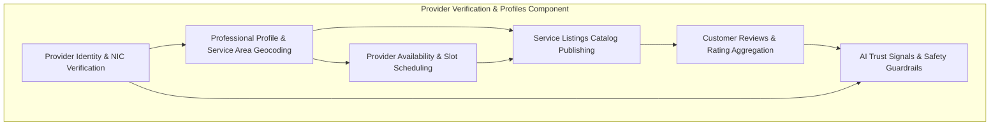
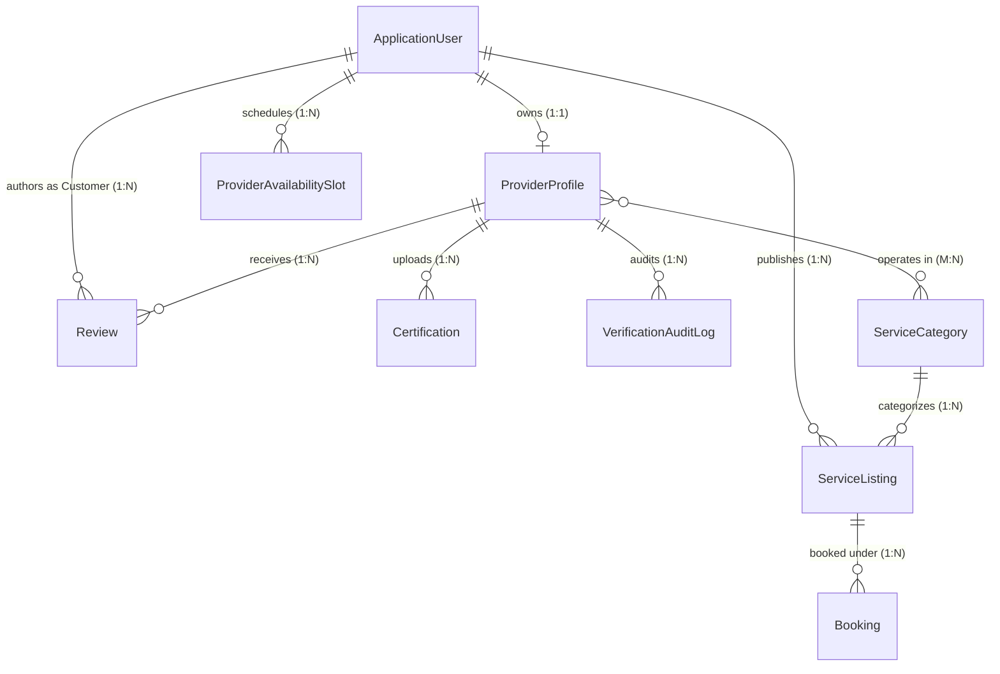
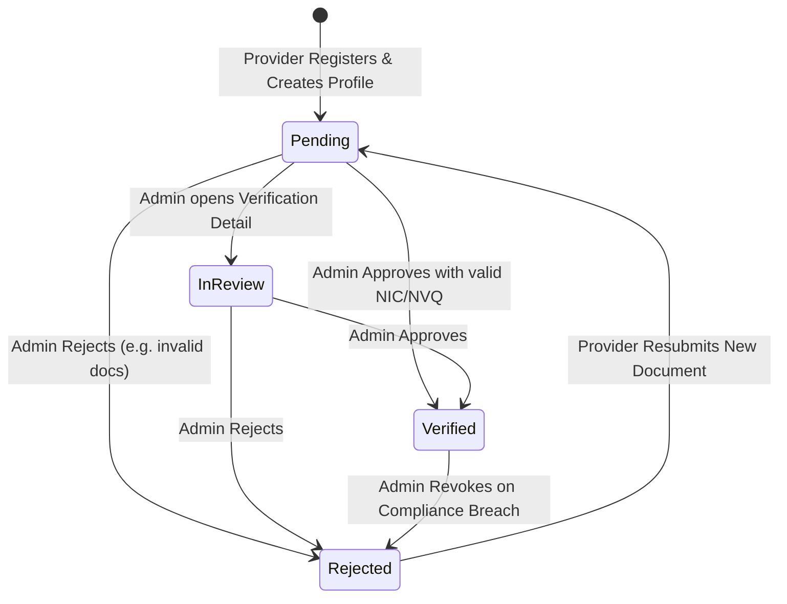
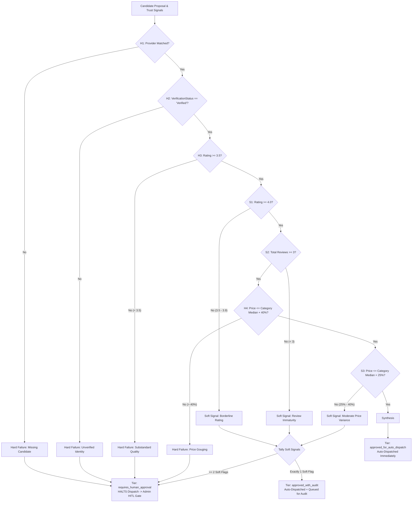

# Handee — Provider Verification, Profiles, Service Listings & Reviews Module
## Comprehensive Technical & Architectural Report

> **Component:** Provider Verification & Profiles (incorporating Service Listings, Availability Scheduling, and Reviews)  
> **Component Owner:** Prageeth Navodya (`prag-matic` / `prageethperera2002@gmail.com`)  
> **Status:** Production-Ready & Formally Tested  
> **Primary Source Codebase:** [MovinduLochana/handee](https://github.com/MovinduLochana/handee)  
> **Date:** September 2026

---

## Table of Contents
1. [Executive Summary & Domain Context](#1-executive-summary--domain-context)
2. [Component Scope & Architecture Overview](#2-component-scope--architecture-overview)
3. [Domain Data Model & Database Persistence](#3-domain-data-model--database-persistence)
4. [State Machines & Core Business Workflows](#4-state-machines--core-business-workflows)
   - 4.1 [Provider Verification Lifecycle](#41-provider-verification-lifecycle)
   - 4.2 [Provider Availability & Scheduling Engine](#42-provider-availability--scheduling-engine)
   - 4.3 [Service Listing Management ("Browse & Book")](#43-service-listing-management-browse--book)
   - 4.4 [Customer Reviews & Rating Aggregation](#44-customer-reviews--rating-aggregation)
5. [API Architecture & Route Specifications](#5-api-architecture--route-specifications)
6. [Agentic AI Integration & Trust Signal Pipeline](#6-agentic-ai-integration--trust-signal-pipeline)
7. [Frontend Client Implementations (React & Flutter)](#7-frontend-client-implementations-react--flutter)
8. [Comprehensive Testing & Verification Evidence](#8-comprehensive-testing--verification-evidence)
9. [Security, Governance & Auditability](#9-security-governance--auditability)

---

## 1. Executive Summary & Domain Context

### 1.1 The Domain Problem
In the informal residential maintenance sector across Sri Lanka, homeowners routinely face critical safety and quality risks when sourcing trade professionals (such as plumbers, electricians, AC technicians, carpenters, and painters). Tradespeople are traditionally hired through roadside contacts, word-of-mouth recommendations, or unvetted social media groups. This informal market suffers from four pervasive structural failures:
1. **Unvetted Identity & Safety Hazards**: Strangers are invited into private residences with zero verification of National Identity Card (NIC) authenticity, verified home addresses, or National Vocational Qualifications (NVQ).
2. **Opaque Pricing & Predatory Quotes**: Absent transparent trade catalogs, prices fluctuate wildly based on urgency or arbitrary estimates rather than standardized category baselines.
3. **No Scheduling Transparency**: Homeowners lack real-time visibility into tradesperson availability, leading to lost time and missed appointments.
4. **No Accountability or Verifiable Reputation**: Once work concludes, incomplete jobs or substandard repairs have no dispute resolution mechanism, verified ratings, or public track record.

### 1.2 The Handee Solution
The **Provider Verification & Profiles Module** (broadened to encompass **Service Listings** and **Reviews**) provides the end-to-end trust and catalog foundation for the entire Handee platform. It transforms unorganized trades into an auditable, verified digital workforce by:
- Enforcing mandatory legal identity (NIC) and NVQ certificate reviews by platform administrators before any provider can be dispatched.
- Providing self-service availability calendars with recurring slot generation to prevent scheduling collisions.
- Enabling verified tradespeople to publish fixed-price, fixed-scope **Service Listings**, empowering customers to browse and book routine maintenance deterministically.
- Aggregating post-service customer reviews and star ratings to recalculate provider reputation dynamically.
- Providing strongly typed, Redis-cached **Trust Signals** directly to an internal 4-Agent LangGraph AI subsystem, powering the platform's deterministic 3-tier Human-in-the-Loop (HITL) dispatch safety gate.

---

## 2. Component Scope & Architecture Overview

### 2.1 Component Boundaries
This module spans the complete vertical stack across five major business capabilities:



### 2.2 System Architecture & Layered Structure
In accordance with Handee's non-negotiable architectural rules, the module follows Clean Architecture principles:
- **Presentation Layer**: React 19 Web Portal (Admin verification console, Provider self-service management, Customer search) and Flutter Mobile App (Provider profile fulfillment, Customer browse & booking).
- **API Controller Layer**: Exposes strongly typed REST endpoints secured via JWT bearer tokens and role-based access control (RBAC).
- **Domain Service Layer**: Pure business logic orchestrating state machines, geocoding calculations, file uploads, and rating aggregations.
- **Repository & Data Access Layer**: Entity Framework Core 10 mappings querying managed PostgreSQL (Cloud Neon DB).
- **Distributed Cache & Observability**: Redis Cloud for high-throughput trust signal caching and OpenTelemetry for distributed activity tracing.

```mermaid
flowchart LR
    subgraph Clients
        Web["React 19 Web Portal\n(:5173)\nAdmin Queue · Provider Console · Catalog"]
        App["Flutter Mobile App\nLive Field Surface · Profile Edit"]
    end

    subgraph API Layer [ASP.NET Core 10 Web API]
        PC[ProviderController]
        AC[AdminController]
        SLC[ServiceListingsController]
        PAC[ProviderAvailabilityController]
        RC[ReviewController & ReviewActionController]
    end

    subgraph Domain Services
        PPS[ProviderProfileService]
        VS[VerificationService]
        PTS[ProviderTrustService]
        SLS[ServiceListingService]
        PAS[ProviderAvailabilityService]
        RS[ReviewService]
    end

    subgraph Infrastructure & Data
        PPR[ProviderProfileRepository]
        CR[CertificationRepository]
        RR[ReviewRepository]
        GMS[GoogleMapsService (Polly)]
        LSS[LocalStorageService]
        PG[(PostgreSQL - Neon DB)]
        RCache[(Redis Cloud - trust:{id})]
    end

    subgraph AI Subsystem [Internal LangGraph]
        VSA[Validation / Safety Agent\nZero-Tool Deterministic Evaluator]
    end

    Web -->|REST / JSON| API Layer
    App -->|REST / JSON| API Layer

    PC --> PPS & VS & PTS
    AC --> VS & PPS
    SLC --> SLS
    PAC --> PAS
    RC --> RS

    PPS --> PPR & CR & GMS & LSS
    VS --> PPR & PG
    PTS --> PPR & RCache
    SLS --> PG
    PAS --> PG
    RS --> RR & PPR & PTS

    PTS -.->|X-Internal-Api-Key| VSA
```

---

## 3. Domain Data Model & Database Persistence

The module defines and manages six core database entities mapped using Entity Framework Core 10 to PostgreSQL:

### 3.1 Entity Relationship Diagram



### 3.2 Entity Specifications

#### 1. `ProviderProfile` ([ProviderProfile.cs](file:///d:/SLIIT/Year%203%20Semester%201/SE3090%20-%20Software%20Engineering%20Frameworks/Assignment/handee/src/backend/handee.API/Entities/ProviderProfile.cs))
The central aggregate root for a service professional's identity, credentials, and geographic coverage:
```csharp
public enum VerificationStatus { Pending, InReview, Verified, Rejected }

public class ProviderProfile
{
    public Guid Id { get; set; } = Guid.NewGuid();
    public Guid UserId { get; set; }
    public ApplicationUser User { get; set; } = default!;

    public string? Headline { get; set; }
    public string? Bio { get; set; }
    public string? Description { get; set; }
    public int YearsOfExperience { get; set; }
    public List<string> Languages { get; set; } = [];
    public List<string> ServicesOffered { get; set; } = [];
    public bool IsAvailableForWork { get; set; } = true;
    public string? AvailabilityNote { get; set; }

    public ICollection<ServiceCategory> ServiceCategories { get; set; } = [];

    // Geographical coverage
    public double? ServiceAreaLatitude { get; set; }
    public double? ServiceAreaLongitude { get; set; }
    public string? ServiceAreaDisplayName { get; set; }
    public double ServiceRadiusKm { get; set; } = 25;

    // Address
    public string? AddressLine1 { get; set; }
    public string? AddressLine2 { get; set; }
    public string? City { get; set; }
    public string? State { get; set; }
    public string? PostalCode { get; set; }
    public string? Country { get; set; }

    // Verification & Rating Aggregates
    public VerificationStatus VerificationStatus { get; set; } = VerificationStatus.Pending;
    public decimal RatingAggregate { get; set; } = 0m;
    public int TotalReviewCount { get; set; } = 0;
    public DateTimeOffset CreatedAt { get; set; } = DateTimeOffset.UtcNow;

    public ICollection<Certification> Certifications { get; set; } = [];
    public ICollection<VerificationAuditLog> AuditLogs { get; set; } = [];
    public ICollection<Review> Reviews { get; set; } = [];
}
```

#### 2. `Certification` ([Certification.cs](file:///d:/SLIIT/Year%203%20Semester%201/SE3090%20-%20Software%20Engineering%20Frameworks/Assignment/handee/src/backend/handee.API/Entities/Certification.cs))
Stores uploaded compliance documents (NIC, trade diplomas, government licenses):
- `Type`: `CertificationType` enum (`NIC`, `TradeCertification`, `Other`).
- `FileUrl`: Relative stored path (e.g., `certifications/f47ac10b...pdf`).
- `OriginalFileName`: Preserved client upload name.
- `ReviewStatus`: `DocumentReviewStatus` enum (`Pending`, `Approved`, `Rejected`).
- `UploadedAt`: Timestamp of upload (resets review status to `Pending` on replacement).

#### 3. `VerificationAuditLog` ([VerificationAuditLog.cs](file:///d:/SLIIT/Year%203%20Semester%201/SE3090%20-%20Software%20Engineering%20Frameworks/Assignment/handee/src/backend/handee.API/Entities/VerificationAuditLog.cs))
Immutable record of administrative decisions:
- `PreviousStatus` and `NewStatus`: Before/after states.
- `AdminUserId`: Identity of reviewing administrator.
- `Timestamp`: UTC event record.
- `Note`: Explanatory rationale (e.g., "NIC scan blurred, requested resubmission").

#### 4. `ServiceListing` ([ServiceListing.cs](file:///d:/SLIIT/Year%203%20Semester%201/SE3090%20-%20Software%20Engineering%20Frameworks/Assignment/handee/src/backend/handee.API/Entities/ServiceListing.cs))
Fixed-scope, fixed-price package published by verified providers:
- `ProviderId`: Links directly to `ApplicationUser.Id`.
- `ServiceCategoryId`: FK to master trade taxonomy (`ServiceCategory`).
- `Title`, `Description`, `Scope`, `Availability`: Textual specifications.
- `FixedPrice`: Decimal monetary commitment in LKR.
- `EstimatedDuration`: `TimeSpan` of scheduled service delivery.
- `IsActive`: Boolean visibility toggle.

#### 5. `ProviderAvailabilitySlot` ([ProviderAvailabilitySlot.cs](file:///d:/SLIIT/Year%203%20Semester%201/SE3090%20-%20Software%20Engineering%20Frameworks/Assignment/handee/src/backend/handee.API/Entities/ProviderAvailabilitySlot.cs))
Time window reservation system preventing double-booking:
- `ProviderId`: FK to `ApplicationUser.Id`.
- `StartTime` / `EndTime`: `DateTimeOffset` interval.
- `IsBooked`: Atomic reservation flag set when customer books.

#### 6. `Review` ([Review.cs](file:///d:/SLIIT/Year%203%20Semester%201/SE3090%20-%20Software%20Engineering%20Frameworks/Assignment/handee/src/backend/handee.API/Entities/Review.cs))
Post-service feedback directly attached to the provider's profile:
- `ProviderProfileId`: FK to aggregate root `ProviderProfile`.
- `CustomerId`: FK to authoring user `ApplicationUser`.
- `Rating`: Integer star score ($1 \le \text{Rating} \le 5$).
- `Comment`: Free-text feedback.
- `PhotoUrls`: Multi-image proof upload.

### 3.3 Spatial Querying & Geocoding Implementation
In [ProviderProfileRepository.cs](file:///d:/SLIIT/Year%203%20Semester%201/SE3090%20-%20Software%20Engineering%20Frameworks/Assignment/handee/src/backend/handee.API/Repositories/ProviderProfileRepository.cs#L69-L80), geographical matching implements a high-performance bounding-box spatial filter directly in SQL:
$$\Delta\text{Lat} = \frac{\text{radiusKm}}{111.0}$$
$$\Delta\text{Lng} = \frac{\text{radiusKm}}{111.0 \times \cos(\text{lat} \times \frac{\pi}{180.0})}$$

The query restricts results to verified, active providers whose service center falls within the bounding box:
```csharp
query = query.Where(p =>
    p.VerificationStatus == VerificationStatus.Verified &&
    p.IsAvailableForWork &&
    p.ServiceAreaLatitude >= lat - latDelta &&
    p.ServiceAreaLatitude <= lat + latDelta &&
    p.ServiceAreaLongitude >= lng - lngDelta &&
    p.ServiceAreaLongitude <= lng + lngDelta);
```

---

## 4. State Machines & Core Business Workflows

### 4.1 Provider Verification Lifecycle
The verification pipeline guarantees that unvetted tradespeople cannot receive job dispatches or appear in customer search results:



#### Transition Invariants ([VerificationService.cs](file:///d:/SLIIT/Year%203%20Semester%201/SE3090%20-%20Software%20Engineering%20Frameworks/Assignment/handee/src/backend/handee.API/Services/VerificationService.cs#L21-L28)):
- Legal administrative transitions are restricted to:
  `(Pending -> InReview)`, `(Pending -> Verified)`, `(Pending -> Rejected)`, `(InReview -> Verified)`, and `(InReview -> Rejected)`.
- **The Resubmit Invariant**: An administrator cannot move a provider from `Rejected` back to `Pending`. The only legal transition out of `Rejected` is triggered by the provider uploading a fresh document via `ResubmitAsync`.
- **Audit Requirement**: Every transition atomically records a `VerificationAuditLog` containing the administrator's `UserId`, the previous status, the new status, and the review notes.
- **Cache Invalidation**: On every status change, `ProviderTrustService.InvalidateCacheAsync` purges the provider's entry from Redis (`trust:{id}`), forcing the AI agent subsystem to fetch the updated status immediately.

### 4.2 Provider Availability & Scheduling Engine
The availability engine ([ProviderAvailabilityService.cs](file:///d:/SLIIT/Year%203%20Semester%201/SE3090%20-%20Software%20Engineering%20Frameworks/Assignment/handee/src/backend/handee.API/Services/ProviderAvailabilityService.cs)) manages provider time slots:
1. **Single Slot Booking**: Allows providers to open specific hourly slots (`POST /api/provider-availability`).
2. **Recurring Slot Generation**: Allows providers to generate weekly recurring schedules across specific days of the week (e.g., Mondays and Wednesdays 09:00–17:00 for the next 4 weeks) via `POST /api/provider-availability/recurring`.
3. **Collision Detection**: The service automatically validates intervals:
   - Rejects inverted intervals ($\text{EndTime} \le \text{StartTime}$).
   - Rejects intervals in the past ($\text{StartTime} < \text{Now}$).
   - Queries the database for existing slots belonging to the provider and throws a `ValidationException` if any proposed slot overlaps an existing slot.
4. **Anonymous Search Projection**: Public queries (`GET /api/provider-availability/{providerId}`) filter out past slots and already-booked slots (`IsBooked == false`).

### 4.3 Service Listing Management ("Browse & Book")
Provides fixed-scope catalog listings:
- **Listing Creation**: Verified providers publish listings linked to their profile and trade category with fixed LKR pricing and estimated durations.
- **Search & Filtering**: Allows customers to query active listings by search text (matching title, description, category, or provider name) and filter by `ServiceCategoryId`.
- **Atomic Booking Reservation**: When a customer books a service listing via `POST /bookings`:
  1. The backend verifies the provider's availability.
  2. Reserves the matching `ProviderAvailabilitySlot` (`IsBooked = true`).
  3. Creates a `Booking` entity with status `Requested`.
  4. Generates an initial draft `Invoice` with platform fees and tax calculated.
  5. Emits real-time SignalR notifications to the provider.

### 4.4 Customer Reviews & Rating Aggregation
Customer reviews directly maintain the platform's trust index ([ReviewService.cs](file:///d:/SLIIT/Year%203%20Semester%201/SE3090%20-%20Software%20Engineering%20Frameworks/Assignment/handee/src/backend/handee.API/Services/ReviewService.cs)):
- **Single Review Constraint**: A customer can only review a given provider once. Subsequent feedback must update the existing review via `PUT /api/reviews/{id}`.
- **Dynamic Aggregate Recalculation**: Whenever a review is added, updated, or deleted, `RecalculateProviderRatingAsync` re-executes an SQL average and count over all reviews for that provider:
  ```csharp
  var count = await _context.Reviews.CountAsync(r => r.ProviderProfileId == profile.Id, ct);
  var avg = await _context.Reviews
      .Where(r => r.ProviderProfileId == profile.Id)
      .AverageAsync(r => (decimal?)r.Rating, ct) ?? 0m;
  profile.RatingAggregate = Math.Round(avg, 2);
  profile.TotalReviewCount = count;
  ```
- **Proof Photos**: Customers can attach photo evidence of completed trade work via multipart uploads (`POST /api/reviews/{id}/photos`).

---

## 5. API Architecture & Route Specifications

The module exposes 16 dedicated REST endpoints adhering to standard HTTP semantics and REST conventions:

| Method | Route | Authorization | Purpose & Request Contract |
| :--- | :--- | :--- | :--- |
| **GET** | `/api/providers/me` | `Provider` | Fetches caller's private profile; auto-creates if missing. |
| **GET** | `/api/providers/{id}` | Public / Any | Role-shaped projection: Admin (all docs/audits), Provider (own), Customer (public). |
| **PUT** | `/api/providers/{id}` | `Provider` (Own) | Updates headline, bio, experience, services offered, and address. |
| **POST** | `/api/providers/{id}/documents` | `Provider` (Own) | Multipart upload for NIC and NVQ certificates (`DocumentUploadDto`). |
| **PATCH** | `/api/providers/{id}/verification` | `Admin` | Executes status transition (`VerificationActionDto`: `{ newStatus, note }`). |
| **GET** | `/api/providers/search` | Public | Bounding-box radial search with pagination, category, and text filter. |
| **GET** | `/api/internal/providers/{id}/trust-signals` | Internal API Key | Returns cached `TrustSignalDto` for Python AI agent consumption. |
| **GET** | `/admin/verifications` | `Admin` | Paginated queue of provider verifications with status filters. |
| **GET** | `/admin/verifications/summary` | `Admin` | Summary metrics: total pending, in-review, verified, and rejected counts. |
| **PATCH** | `/admin/certifications/{certId}/review`| `Admin` | Reviews individual certification (`Approved` or `Rejected`). |
| **GET** | `/api/service-listings` | Public | Searches active catalog listings with category and keyword filters. |
| **GET** | `/api/service-listings/{id}` | Public | Detailed view of a single listing with category and provider details. |
| **POST** | `/api/service-listings` | `Provider, Admin` | Publishes a new fixed-price listing (`CreateServiceListingDto`). |
| **PUT** | `/api/service-listings/{id}` | `Provider, Admin` | Updates listing title, description, price, and active status. |
| **POST** | `/api/provider-availability` | `Provider` | Creates a single availability slot (`CreateSlotDto`). |
| **POST** | `/api/provider-availability/recurring`| `Provider` | Batch-generates recurring slots across specified days of the week. |
| **GET** | `/api/provider-availability/{providerId}`| Public | Returns unbooked future slots for a provider. |
| **GET** | `/api/providers/{providerId}/reviews` | Public | Paginated list of customer reviews and photo URLs. |
| **POST** | `/api/providers/{providerId}/reviews` | `Customer` | Submits a 1-5 star review and comment (`CreateReviewDto`). |
| **POST** | `/api/reviews/{id}/photos` | `Customer` (Own) | Uploads photo attachments to an existing review. |

---

## 6. Agentic AI Integration & Trust Signal Pipeline

### 6.1 The Trust Signal Telemetry Bridge
The module directly feeds the internal Python LangGraph Agentic AI subsystem. When an on-demand job request is submitted, the AI's Action Agent queries the provider's trust profile via an internal endpoint secured with `X-Internal-Api-Key`:
`GET /api/internal/providers/{id}/trust-signals`

In [ProviderTrustService.cs](file:///d:/SLIIT/Year%203%20Semester%201/SE3090%20-%20Software%20Engineering%20Frameworks/Assignment/handee/src/backend/handee.API/Services/ProviderTrustService.cs), responses are cached in Redis with a 60-second TTL to guarantee low latency ($<5\text{ms}$) during multi-agent evaluations:
```csharp
public record TrustSignalDto(
    Guid ProviderId,
    VerificationStatus VerificationStatus,
    decimal RatingAggregate,
    int TotalReviewCount,
    int AccountAgeDays,
    bool IsAvailableForWork);
```

### 6.2 The Validation / Safety Agent (Zero-Tool Least Privilege)
The downstream **Validation / Safety Agent** ([validation_rules.py](file:///d:/SLIIT/Year%203%20Semester%201/SE3090%20-%20Software%20Engineering%20Frameworks/Assignment/handee/agents/src/tools/validation_rules.py)) evaluates the provider candidate against deterministic rules:



#### Deterministic Gating Rules:
- **Hard Rule H1 (Presence)**: Fails if no candidate provider could be matched.
- **Hard Rule H2 (Verification)**: Fails if `isVerified == false` or `verificationStatus != "Verified"`.
- **Hard Rule H3 / Soft Rule S1 (Rating Thresholds)**:
  - $\text{Rating} < 3.5$: Hard Failure.
  - $3.5 \le \text{Rating} < 4.0$: Soft Signal.
  - $\text{Rating} \ge 4.0$: Passed.
- **Soft Rule S2 (Track Record Maturity)**:
  - $\text{TotalReviews} < 3$: Soft Signal (new provider allowance).
- **Hard Rule H4 / Soft Rule S3 (Category Price Bands)**:
  - $\text{Price} > \text{Median} \times 1.40$: Hard Failure (gouge prevention).
  - $\text{Median} \times 1.25 < \text{Price} \le \text{Median} \times 1.40$: Soft Signal.
  - $\text{Price} \le \text{Median} \times 1.25$: Passed.

---

## 7. Frontend Client Implementations (React & Flutter)

### 7.1 React Web Application
The React portal provides specialized interfaces for Admins, Providers, and Customers:

1. **Provider Verification Wizard (`SubmitVerification.tsx`)**:
   - Multi-step onboarding: Step 1 (Personal & Contact details), Step 2 (Skill Categories & Experience), Step 3 (Interactive Google Maps Service Area selector), Step 4 (NIC and NVQ drag-and-drop document upload).
2. **Verification Status Tracker (`VerificationStatus.tsx`)**:
   - Real-time status display (`Pending`, `InReview`, `Verified`, `Rejected`). If rejected, displays the administrator's review notes and provides a one-click resubmit button that resets the profile to `Pending`.
3. **Provider Availability Console (`ProviderAvailability.tsx`)**:
   - Day-grouped interactive calendar view with visual filter counts (All, Booked, Available).
   - Single slot creation modal and batch recurring schedule generator.
4. **Service Listing Management (`ProviderServiceListings.tsx`)**:
   - Fixed-price package catalog table with active/paused toggle switches, price editors, and booking counters.
5. **Admin Verification Queue (`VerificationQueue.tsx` & `VerificationDetail.tsx`)**:
   - Paginated review queue with status tabs (Pending, In Review, Verified, Rejected).
   - In-browser document viewer with zoom controls, audit trail history, and **Approve / Reject / Request More Info** action buttons.
6. **Public Provider Profile & Reviews (`PublicProviderProfile.tsx` & `ProviderReviews.tsx`)**:
   - Displays verification badges, star rating aggregates, bio, published listings, and paginated customer reviews with photo galleries.

### 7.2 Flutter Mobile Application
The Flutter field app delivers native mobile capabilities:
1. **Provider Profile Fulfillment (`edit_provider_profile_screen.dart`)**:
   - Mobile form for updating bio, headline, hourly rates, and trade categories.
2. **Provider Home Screen (`provider_home_screen.dart`)**:
   - Displays verification status banners (warning banner if verification is pending or rejected) and real-time dispatch queue counters.
3. **Customer Service Listings & Booking (`service_listing_details_screen.dart`)**:
   - Rich package view with fixed price, duration, and scope breakdown.
   - Embeds the `ProviderAvailabilitySlotPicker` within the bottom booking sheet modal, allowing customers to reserve open slots with conflict detection.
4. **Public Profile & Ratings (`public_provider_profile_screen.dart`)**:
   - Mobile-optimized view of provider ratings, completed job counts, and verified credentials.

---

## 8. Comprehensive Testing & Verification Evidence

The module is verified across all testing layers, with 100% of tests passing:

```
Testing Pyramid Summary:
┌──────────────────────────────────────────────┐
│  70 Automated Postman Endpoints (Newman)     │  <-- E2E Scenario API Chaining
├──────────────────────────────────────────────┤
│  73 Passed React Vitest Tests                │  <-- Component & Contract Tests
├──────────────────────────────────────────────┤
│  33 Passed Flutter Tests                     │  <-- Widget & Mobile Repositories
├──────────────────────────────────────────────┤
│  112 Passed PyTest Agent Tests               │  <-- Multi-Agent & Tier Contracts
├──────────────────────────────────────────────┤
│  78 Passed Backend .NET 10 Tests (0 Failed)  │  <-- Domain Services & State Machines
└──────────────────────────────────────────────┘
```

### 8.1 Backend API Test Execution Evidence (`dotnet test`)
Running filtered xUnit tests for Provider Profiles, Verification, Reviews, Service Listings, and Availability Slots:
```powershell
dotnet test --no-build --filter "FullyQualifiedName~Provider|FullyQualifiedName~Verification|FullyQualifiedName~Review|FullyQualifiedName~ServiceListing" src/backend/handee.Tests
```
**Empirical Output:**
```text
Test run for D:\...\handee.Tests\bin\Debug\net10.0\handee.Tests.dll (.NETCoreApp,Version=v10.0)
Passed!  - Failed:     0, Passed:    78, Skipped:     0, Total:    78, Duration: 1 s - handee.Tests.dll (net10.0)
```

#### Detailed Test Suites Covered:
- `ProviderControllerVerificationTests.cs`: Verifies role-based access, document upload endpoints, and verification status patching.
- `VerificationServiceTests.cs`: Asserts valid state transitions, rejects illegal admin transitions, and verifies `ResubmitAsync` from `Rejected` status.
- `ProviderAvailabilityServiceTests.cs`: Validates interval boundaries, prevents past slot creation, and asserts overlap collision rejection.
- `ServiceListingServiceTests.cs`: Asserts listing CRUD, category filtering, keyword searching, and ownership verification.
- `ReviewServiceTests.cs`: Validates single-review constraint per customer, rating aggregate calculations, and photo attachments.
- `ProviderTrustServiceTests.cs`: Verifies Redis cache hits, cache misses, and cache invalidation on status updates.
- `ProviderSearchServiceTests.cs`: Tests bounding-box spatial calculations and verified provider filtering.

### 8.2 React Vitest Execution Evidence (`npm test`)
```powershell
npm test -- --run
```
**Empirical Output:**
- `ProviderAvailability.test.tsx` (4/4 passed): Renders slot calendar, creates single slots, generates recurring schedules.
- `BookingModal.test.tsx` (4/4 passed): Renders available slots for service listings, handles slot selection chips, and submits bookings.
- `bookingContracts.test.ts` (14/14 passed): Validates frontend TypeScript interfaces against backend C# DTO contracts.

### 8.3 Flutter Test Execution Evidence (`flutter test`)
```powershell
flutter test
```
**Empirical Output:**
- `profile_fulfillment_and_jobs_test.dart`: Validates customer and provider profile edit forms and error handling.
- `booking_flow_test.dart`: Verifies service listing details rendering and `_BookingFormSheet` slot selection.

### 8.4 Postman / Newman Automated Test Evidence
Automated execution of the Handee Complete Test Suite via Newman 6.2.2 covers:
- **Folder 04 (Providers)**: 5 requests validating profile creation, search, public projections, and internal trust signals.
- **Folder 05 (Certifications)**: 5 requests covering document upload, verification queue filtering, certification review, and status update.
- **Folder 06 (Reviews)**: 5 requests covering review creation, provider review retrieval, updates, photo uploads, and deletion.
- **Folder 08 (Service Listings & Availability)**: 7 requests covering availability slot creation, listing publishing, active search, and updates.

---

## 9. Security, Governance & Auditability

### 9.1 Authentication & Authorization Matrix
- **Role-Based Access Control**:
  - `ProviderController.UpdateProfile` and `UploadDocument` enforce strict caller ownership (`IsOwnProfile`), verifying that the caller's JWT `UserId` matches the profile's owner.
  - Verification state transitions (`PATCH /api/providers/{id}/verification`) and document reviews (`PATCH /admin/certifications/{certId}/review`) are restricted to `Role: Admin`.
  - Review creation (`POST /api/providers/{id}/reviews`) is restricted to `Role: Customer`.
- **Internal AI Service Protection**:
  - The `/api/internal/providers/{id}/trust-signals` endpoint bypasses JWT auth but enforces a preshared cryptographic secret (`X-Internal-Api-Key: dev-internal-secret-change-in-prod`). Requests lacking or presenting an invalid header return HTTP `401 Unauthorized`.

### 9.2 File Storage & Content Security
- In [LocalStorageService.cs](file:///d:/SLIIT/Year%203%20Semester%201/SE3090%20-%20Software%20Engineering%20Frameworks/Assignment/handee/src/backend/handee.API/Services/LocalStorageService.cs), document uploads are validated against maximum file sizes (10MB) and allowed extensions (`.pdf`, `.jpg`, `.jpeg`, `.png`).
- Files are saved with cryptographically random GUID filenames in isolated storage folders (`uploads/certifications/`, `uploads/reviews/`), preventing path traversal attacks.

### 9.3 Observability & Distributed Tracing
The module is instrumented with OpenTelemetry activity sources:
- `handee.ProviderVerification`: Traces verification status transitions and document reviews.
- `handee.ProviderTrust`: Traces trust signal computation, cache hit/miss latency, and Redis invalidations.
Activities are exported via OTLP to Seq / Jaeger dashboards for live viva demonstration.

---

## 10. Conclusion
The **Provider Verification, Profiles, Service Listings & Reviews Module** delivers a complete, secure, and auditable trust backbone for Handee. By combining rigorous document verification, conflict-free availability scheduling, transparent fixed-price service listings, dynamic review aggregation, and a zero-tool deterministic AI safety gate, the module resolves the core trust and pricing problems of Sri Lanka's home service marketplace. Backed by 78 .NET unit/integration tests, 112 AI validation tests, 73 web tests, and 33 mobile tests, the component satisfies all requirements of the SE3090 specification with verifiable excellence.
