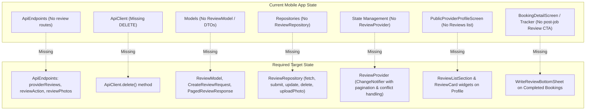
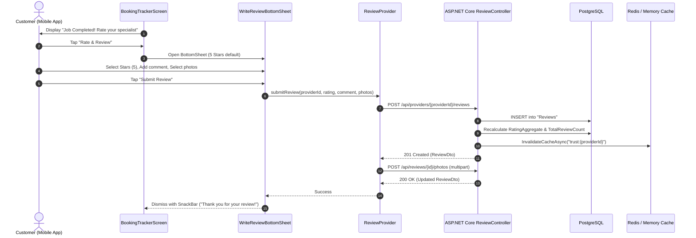

# Research & Architectural Implementation Roadmap: Provider Reviews in Flutter Mobile App

**Document Target Path**: `docs/research/provider-reviews-flutter-implementation.md`  
**Date**: October 2026  
**Status**: Completed Forensic Investigation & Technical Specification  
**Primary Target Systems**: Handee Flutter Mobile App (`app/`), ASP.NET Core Backend (`src/backend/handee.API/`), React Web Client (`web/`)

---

## Executive Summary

This document provides a forensic architectural investigation and an end-to-end implementation roadmap for introducing **Provider Reviews (viewing, submitting, updating, and photo attachments)** into the Handee Flutter mobile application.

While the ASP.NET Core backend already possesses a mature, tested review subsystem (`ReviewController`, `ReviewActionController`, `ReviewService`, PostgreSQL schema, and unit tests) and the React web client displays reviews on the public provider profile, the Flutter mobile application currently has an architectural gap:
1. **Zero review-related network contracts or endpoints** are configured in `ApiEndpoints`.
2. **`ApiClient` lacks HTTP `DELETE`**, blocking review deletion.
3. **No review data models, repositories, or `ChangeNotifier` state providers** exist in `app/lib/`.
4. **`PublicProviderProfileScreen` omits the reviews list**, despite displaying aggregate ratings in its header.
5. **No post-completion review CTA exists** in `BookingDetailScreen` or `BookingTrackerScreen`, missing the primary touchpoint where customers complete service jobs.

This roadmap details the exact backend contracts, gap analysis, data models, repository design, state management, UI components, edge case resolutions, and a step-by-step test plan.

---

## 1. Primary Source Analysis (Backend & Web)

### 1.1 Backend API Endpoints & Routes

The backend implements review functionality across two dedicated ASP.NET Core controllers:

#### 1. Provider-Scoped Reviews (`ReviewController`)
Located at [`src/backend/handee.API/Controllers/ReviewController.cs:11-56`](file:///d:/SLIIT/Year%203%20Semester%201/SE3090%20-%20Software%20Engineering%20Frameworks/Assignment/handee/src/backend/handee.API/Controllers/ReviewController.cs#L11-L56):
- **Base Route**: `api/providers/{providerId:guid}/reviews`
- **GET `api/providers/{providerId}/reviews`**:
  - **Auth**: Public / Anonymous allowed.
  - **Query Parameters**:
    - `page` (int, default: `1`, clamped `Math.Max(1, page)`).
    - `pageSize` (int, default: `10`, clamped `Math.Max(1, Math.Min(50, pageSize))`).
  - **Response Status**: `200 OK`.
  - **Payload Structure**: `PagedResult<ReviewDto>`:
    ```json
    {
      "items": [
        {
          "id": "3fa85f64-5717-4562-b3fc-2c963f66afa6",
          "providerProfileId": "7b13e9a0-629a-4c22-9b2f-98f5a6f23b10",
          "customerId": "8c33e9a0-629a-4c22-9b2f-98f5a6f23c21",
          "customerName": "Jane Doe",
          "customerProfilePictureUrl": "/uploads/profiles/jane.jpg",
          "rating": 5,
          "comment": "Exceptional plumbing work, arrived right on time.",
          "photoUrls": ["https://storage.blob.core.windows.net/reviews/photo1.jpg"],
          "createdAt": "2026-10-01T08:30:00Z",
          "updatedAt": null
        }
      ],
      "totalCount": 1,
      "page": 1,
      "pageSize": 10
    }
    ```
- **POST `api/providers/{providerId}/reviews`**:
  - **Auth**: `[Authorize(Roles = "Customer")]` (`ReviewController.cs:34`). Only customers may submit reviews.
  - **Customer Identity**: Derived server-side via `User.GetUserId()` from JWT claim (`ReviewController.cs:40`).
  - **Request Body**: `CreateReviewDto` (`rating`: integer 1–5, `comment`: string, max 1500 chars).
  - **Success Response**: `201 Created` with `ReviewDto` and `Location: api/providers/{providerId}/reviews`.
  - **Failure Responses**:
    - `401 Unauthorized`: Missing or invalid bearer token.
    - `403 Forbidden`: User role is not `Customer` (e.g., provider attempting to review).
    - `404 Not Found`: Target provider profile does not exist (`ReviewService.cs:35`).
    - `409 Conflict`: Customer has already reviewed this provider (`ReviewController.cs:53`). Payload: `{"error": "Customer has already reviewed this provider."}`.

#### 2. Individual Review Actions (`ReviewActionController`)
Located at [`src/backend/handee.API/Controllers/ReviewActionController.cs:10-70`](file:///d:/SLIIT/Year%203%20Semester%201/SE3090%20-%20Software%20Engineering%20Frameworks/Assignment/handee/src/backend/handee.API/Controllers/ReviewActionController.cs#L10-L70):
- **Base Route**: `api/reviews`
- **PUT `api/reviews/{id:guid}`**:
  - **Auth**: `[Authorize(Roles = "Customer")]`.
  - **Ownership Check**: Validates `review.CustomerId == customerId`. Throws `UnauthorizedAccessException` (`403 Forbidden`) if caller is not the author.
  - **Request Body**: `UpdateReviewDto` (`rating`: 1–5, `comment`: max 1500 chars).
  - **Response**: `200 OK` with updated `ReviewDto`.
- **POST `api/reviews/{id:guid}/photos`**:
  - **Auth**: `[Authorize(Roles = "Customer")]`.
  - **Content-Type**: `multipart/form-data`, file parameter name: `file` (`IFormFile`).
  - **Storage**: Uploaded via `IStorageService.UploadAsync(file, "reviews", ct)` (`ReviewService.cs:136`).
  - **Response**: `200 OK` with updated `ReviewDto` containing the appended URL in `photoUrls`.
- **DELETE `api/reviews/{id:guid}`**:
  - **Auth**: `[Authorize]` (`ReviewActionController.cs:56`). Accessible by the author customer or any user with the `Admin` role (`ReviewService.cs:97-100`).
  - **Response**: `204 No Content`.

---

### 1.2 Data Transfer Objects & Validation Invariants

From [`src/backend/handee.API/DTO/Review/ReviewDtos.cs:1-35`](file:///d:/SLIIT/Year%203%20Semester%201/SE3090%20-%20Software%20Engineering%20Frameworks/Assignment/handee/src/backend/handee.API/DTO/Review/ReviewDtos.cs#L1-L35):

```csharp
public record ReviewDto(
    Guid Id,
    Guid ProviderProfileId,
    Guid CustomerId,
    string CustomerName,
    string? CustomerProfilePictureUrl,
    int Rating,
    string? Comment,
    List<string> PhotoUrls,
    DateTimeOffset CreatedAt,
    DateTimeOffset? UpdatedAt
);

public record CreateReviewDto(
    [Required] [Range(1, 5)] int Rating,
    [MaxLength(1500)] string? Comment
);

public record UpdateReviewDto(
    [Required] [Range(1, 5)] int Rating,
    [MaxLength(1500)] string? Comment
);
```

Key Validation Rules:
1. **Rating Range**: Must be an integer between 1 and 5 inclusive.
2. **Comment Length**: Nullable, maximum 1500 characters.
3. **Customer Resolution**: Server derives `CustomerName` and `CustomerProfilePictureUrl` from `review.Customer` (`ApplicationUser`), preventing client-side spoofing.

---

### 1.3 Database Constraints & Rating Aggregation Logic

#### Database Schema Constraints
From [`src/backend/handee.API/Data/Configurations/ReviewEntityConfiguration.cs:9-37`](file:///d:/SLIIT/Year%203%20Semester%201/SE3090%20-%20Software%20Engineering%20Frameworks/Assignment/handee/src/backend/handee.API/Data/Configurations/ReviewEntityConfiguration.cs#L9-L37):
1. **Uniqueness**: Composite unique index `builder.HasIndex(r => new { r.ProviderProfileId, r.CustomerId }).IsUnique();`. A customer can create at most **one** review per provider profile.
2. **Check Constraint**: `CK_Review_Rating`: `"Rating" >= 1 AND "Rating" <= 5` enforced at PostgreSQL level.
3. **Cascade Deletion**: On provider profile deletion, associated reviews cascade delete.

#### Rating Aggregation & Cache Invalidation
From [`src/backend/handee.API/Repositories/ReviewRepository.cs:47-58`](file:///d:/SLIIT/Year%203%20Semester%201/SE3090%20-%20Software%20Engineering%20Frameworks/Assignment/handee/src/backend/handee.API/Repositories/ReviewRepository.cs#L47-L58) and [`src/backend/handee.API/Services/ReviewService.cs:147-156`](file:///d:/SLIIT/Year%203%20Semester%201/SE3090%20-%20Software%20Engineering%20Frameworks/Assignment/handee/src/backend/handee.API/Services/ReviewService.cs#L147-L156):
```csharp
private async Task RecalculateProviderRatingAsync(ProviderProfile profile, CancellationToken ct)
{
    var (aggregate, count) = await _reviewRepository.GetProviderRatingAggregateAsync(profile.Id, ct);
    profile.RatingAggregate = aggregate; // Math.Round(avg, 2)
    profile.TotalReviewCount = count;
    await _providerProfileRepository.SaveChangesAsync(ct);
    await _trustService.InvalidateCacheAsync(profile.Id, ct);
}
```
Whenever a review is added, edited, or deleted:
1. `RatingAggregate` and `TotalReviewCount` are recalculated directly from the database table.
2. `ProviderProfile` entity is updated.
3. Distributed cache key `trust:{providerId}` is invalidated in Redis/memory via `ProviderTrustService.InvalidateCacheAsync()`.
4. Downstream AI triage and dispatch agents immediately observe fresh rating signals.

---

### 1.4 Web Application Precedent

The React web client demonstrates how reviews are consumed:
- **API Client** ([`web/src/api/providers.ts:94-103`](file:///d:/SLIIT/Year%203%20Semester%201/SE3090%20-%20Software%20Engineering%20Frameworks/Assignment/handee/web/src/api/providers.ts#L94-L103)):
  ```typescript
  async getReviews(providerId: string, page = 1, pageSize = 10): Promise<PagedResult<ReviewDto>> {
    const response = await api.get<PagedResult<ReviewDto>>(`/api/providers/${providerId}/reviews`, {
      params: { page, pageSize },
    });
    return response.data;
  }
  ```
- **Profile UI** ([`web/src/pages/public/PublicProviderProfile.tsx:270-327`](file:///d:/SLIIT/Year%203%20Semester%201/SE3090%20-%20Software%20Engineering%20Frameworks/Assignment/handee/web/src/pages/public/PublicProviderProfile.tsx#L270-L327)):
  - TanStack Query hook `["providerReviews", providerId]`.
  - Displays customer avatar, name, relative/formatted date, numeric stars, and text comments.
  - Displays `EmptyState` ("No Reviews Yet") when list is empty.

---

## 2. Architectural Gap Analysis in Flutter Application

A comprehensive review of `app/lib/` identifies the following architectural gaps:



### Gap Detail Table

| Layer | File / Location | Current Status | Required Enhancement |
| :--- | :--- | :--- | :--- |
| **Constants** | `core/constants/api_endpoints.dart` | No review endpoints defined. | Add `providerReviews(id)`, `reviewById(id)`, `reviewPhotos(id)`. |
| **Network** | `core/network/api_client.dart` | Has `get`, `post`, `put`, `postMultipart`, but lacks `delete`. | Add `delete(String path)` with JWT header & error handling. |
| **Data Models** | `data/models/` | No review entities. `ProviderProfileModel` has `rating` and `totalReviews` but no reviews collection. | Create `review_model.dart` with `ReviewModel`, `CreateReviewRequest`, `UpdateReviewRequest`, and `PagedReviewResponse`. |
| **Data Repositories** | `data/repositories/` | No `ReviewRepository`. | Create `review_repository.dart` to handle CRUD operations and multipart photo uploads. |
| **State Providers** | `providers/` | No `ReviewProvider`. | Create `review_provider.dart` (`ChangeNotifier`) with pagination, loading state, duplicate review conflict handling, and automatic profile refresh. Register in `main.dart`. |
| **Widgets** | `widgets/` | Only `provider_listing_card.dart` displays star icon. No star rating picker or review card widget. | Build `StarRatingPicker` (interactive 1–5), `StarRatingDisplay` (read-only), and `ReviewCard` (avatar, comment, photo thumbnails). |
| **Customer Profile** | `screens/customer/public_provider_profile_screen.dart` | Only displays services and bio; review section is completely absent. | Embed `ReviewListSection` with summary rating header, pagination scroll listener, and write review trigger. |
| **Job Completion CTA** | `screens/shared/booking_detail_screen.dart` & `booking_tracker_screen.dart` | Shows booking details, price breakdown, and invoice. Once `booking.isCompleted`, no action prompts review. | Add prominent "Rate & Review Service Provider" card and CTA button for completed bookings. |

---

## 3. Full Technical Design for Flutter

### 3.1 Network Layer Updates

#### 1. Endpoint Constants (`app/lib/core/constants/api_endpoints.dart`)
Add standard review endpoint helper methods:

```dart
// Provider Reviews (ReviewController & ReviewActionController)
static String providerReviews(String providerId) => '/api/providers/$providerId/reviews';
static String reviewById(String reviewId) => '/api/reviews/$reviewId';
static String reviewPhotos(String reviewId) => '/api/reviews/$reviewId/photos';
```

#### 2. `ApiClient` HTTP DELETE Support (`app/lib/core/network/api_client.dart`)
Add the missing `delete` method to `ApiClient`:

```dart
Future<dynamic> delete(String path) async {
  try {
    final uri = _buildUri(path);
    http.Response response = await _httpClient
        .delete(uri, headers: _buildHeaders())
        .timeout(const Duration(seconds: 35));

    if (response.statusCode == 401 && path != ApiEndpoints.login && path != ApiEndpoints.refresh) {
      final refreshed = await _tryRefreshToken();
      if (refreshed) {
        response = await _httpClient
            .delete(uri, headers: _buildHeaders())
            .timeout(const Duration(seconds: 35));
      }
    }

    return _handleResponse(response);
  } catch (e) {
    debugPrint('ApiClient DELETE error on $path: $e');
    rethrow;
  }
}
```

---

### 3.2 Data Models (`app/lib/data/models/review_model.dart`)

```dart
import '../../core/constants/api_endpoints.dart';

class ReviewModel {
  final String id;
  final String providerProfileId;
  final String customerId;
  final String customerName;
  final String? customerProfilePictureUrl;
  final int rating;
  final String? comment;
  final List<String> photoUrls;
  final DateTime createdAt;
  final DateTime? updatedAt;

  const ReviewModel({
    required this.id,
    required this.providerProfileId,
    required this.customerId,
    required this.customerName,
    this.customerProfilePictureUrl,
    required this.rating,
    this.comment,
    this.photoUrls = const [],
    required this.createdAt,
    this.updatedAt,
  });

  String? get fullCustomerPhotoUrl {
    if (customerProfilePictureUrl == null || customerProfilePictureUrl!.isEmpty) return null;
    if (customerProfilePictureUrl!.startsWith('http')) return customerProfilePictureUrl;
    final cleanPath = customerProfilePictureUrl!.startsWith('/')
        ? customerProfilePictureUrl!
        : '/$customerProfilePictureUrl';
    return '${ApiEndpoints.baseUrl}$cleanPath';
  }

  factory ReviewModel.fromJson(Map<String, dynamic> json) {
    final rawPhotos = json['photoUrls'] as List<dynamic>?;
    final photosList = rawPhotos?.map((e) => e.toString()).toList() ?? [];

    return ReviewModel(
      id: json['id']?.toString() ?? '',
      providerProfileId: json['providerProfileId']?.toString() ?? '',
      customerId: json['customerId']?.toString() ?? '',
      customerName: json['customerName']?.toString() ?? 'Verified Customer',
      customerProfilePictureUrl: json['customerProfilePictureUrl']?.toString(),
      rating: (json['rating'] as num?)?.toInt() ?? 5,
      comment: json['comment']?.toString(),
      photoUrls: photosList,
      createdAt: json['createdAt'] != null
          ? DateTime.tryParse(json['createdAt'].toString()) ?? DateTime.now()
          : DateTime.now(),
      updatedAt: json['updatedAt'] != null
          ? DateTime.tryParse(json['updatedAt'].toString())
          : null,
    );
  }

  Map<String, dynamic> toJson() => {
    'id': id,
    'providerProfileId': providerProfileId,
    'customerId': customerId,
    'customerName': customerName,
    'customerProfilePictureUrl': customerProfilePictureUrl,
    'rating': rating,
    'comment': comment,
    'photoUrls': photoUrls,
    'createdAt': createdAt.toIso8601String(),
    'updatedAt': updatedAt?.toIso8601String(),
  };
}

class CreateReviewRequest {
  final int rating;
  final String? comment;

  const CreateReviewRequest({
    required this.rating,
    this.comment,
  });

  Map<String, dynamic> toJson() => {
    'rating': rating,
    if (comment != null && comment!.trim().isNotEmpty) 'comment': comment!.trim(),
  };
}

class UpdateReviewRequest {
  final int rating;
  final String? comment;

  const UpdateReviewRequest({
    required this.rating,
    this.comment,
  });

  Map<String, dynamic> toJson() => {
    'rating': rating,
    if (comment != null && comment!.trim().isNotEmpty) 'comment': comment!.trim(),
  };
}

class PagedReviewResponse {
  final List<ReviewModel> items;
  final int totalCount;
  final int page;
  final int pageSize;

  const PagedReviewResponse({
    required this.items,
    required this.totalCount,
    required this.page,
    required this.pageSize,
  });

  bool get hasMore => (page * pageSize) < totalCount;

  factory PagedReviewResponse.fromJson(Map<String, dynamic> json) {
    final rawList = json['items'] ?? json['Items'] ?? [];
    final items = (rawList as List<dynamic>)
        .map((e) => ReviewModel.fromJson(e as Map<String, dynamic>))
        .toList();

    return PagedReviewResponse(
      items: items,
      totalCount: (json['totalCount'] ?? json['TotalCount'] as num?)?.toInt() ?? items.length,
      page: (json['page'] ?? json['Page'] as num?)?.toInt() ?? 1,
      pageSize: (json['pageSize'] ?? json['PageSize'] as num?)?.toInt() ?? 10,
    );
  }
}
```

---

### 3.3 Repository Layer (`app/lib/data/repositories/review_repository.dart`)

```dart
import '../../core/constants/api_endpoints.dart';
import '../../core/network/api_client.dart';
import '../models/review_model.dart';

class ReviewRepository {
  final ApiClient apiClient;

  ReviewRepository({required this.apiClient});

  /// GET /api/providers/{providerId}/reviews
  Future<PagedReviewResponse> getReviewsForProvider(
    String providerId, {
    int page = 1,
    int pageSize = 10,
  }) async {
    final response = await apiClient.get(
      ApiEndpoints.providerReviews(providerId),
      queryParams: {
        'page': page.toString(),
        'pageSize': pageSize.toString(),
      },
    );

    if (response is Map<String, dynamic>) {
      return PagedReviewResponse.fromJson(response);
    }
    return const PagedReviewResponse(items: [], totalCount: 0, page: 1, pageSize: 10);
  }

  /// POST /api/providers/{providerId}/reviews
  Future<ReviewModel> createReview(
    String providerId,
    CreateReviewRequest request,
  ) async {
    final response = await apiClient.post(
      ApiEndpoints.providerReviews(providerId),
      body: request.toJson(),
    );
    return ReviewModel.fromJson(response as Map<String, dynamic>);
  }

  /// PUT /api/reviews/{id}
  Future<ReviewModel> updateReview(
    String reviewId,
    UpdateReviewRequest request,
  ) async {
    final response = await apiClient.put(
      ApiEndpoints.reviewById(reviewId),
      body: request.toJson(),
    );
    return ReviewModel.fromJson(response as Map<String, dynamic>);
  }

  /// POST /api/reviews/{id}/photos
  Future<ReviewModel> uploadReviewPhoto({
    required String reviewId,
    required String filePath,
  }) async {
    final response = await apiClient.postMultipart(
      ApiEndpoints.reviewPhotos(reviewId),
      fileField: 'file', // Matches IFormFile file parameter in ReviewActionController.cs:42
      filePath: filePath,
    );
    return ReviewModel.fromJson(response as Map<String, dynamic>);
  }

  /// DELETE /api/reviews/{id}
  Future<void> deleteReview(String reviewId) async {
    await apiClient.delete(ApiEndpoints.reviewById(reviewId));
  }
}
```

---

### 3.4 State Management Layer (`app/lib/providers/review_provider.dart`)

The `ReviewProvider` manages pagination state, cache coherency, and submission workflows:

```dart
import 'package:flutter/foundation.dart';
import '../core/network/api_client.dart';
import '../data/models/review_model.dart';
import '../data/repositories/review_repository.dart';

class ReviewProvider extends ChangeNotifier {
  final ReviewRepository repository;

  ReviewProvider({required this.repository});

  bool _isLoading = false;
  bool get isLoading => _isLoading;

  bool _isLoadingMore = false;
  bool get isLoadingMore => _isLoadingMore;

  bool _isSubmitting = false;
  bool get isSubmitting => _isSubmitting;

  String? _errorMessage;
  String? get errorMessage => _errorMessage;

  final Map<String, List<ReviewModel>> _reviewsByProvider = {};
  final Map<String, int> _totalCountsByProvider = {};
  final Map<String, int> _currentPageByProvider = {};
  final Map<String, bool> _hasMoreByProvider = {};

  List<ReviewModel> getReviewsForProvider(String providerId) =>
      _reviewsByProvider[providerId] ?? const [];

  int getTotalCount(String providerId) => _totalCountsByProvider[providerId] ?? 0;
  bool hasMore(String providerId) => _hasMoreByProvider[providerId] ?? false;

  /// Loads initial page of reviews for a provider
  Future<void> fetchReviews(String providerId, {bool refresh = false}) async {
    if (!refresh && _reviewsByProvider.containsKey(providerId) && _reviewsByProvider[providerId]!.isNotEmpty) {
      return; // Cache hit
    }

    _isLoading = true;
    _errorMessage = null;
    notifyListeners();

    try {
      final response = await repository.getReviewsForProvider(providerId, page: 1, pageSize: 10);
      _reviewsByProvider[providerId] = response.items;
      _totalCountsByProvider[providerId] = response.totalCount;
      _currentPageByProvider[providerId] = 1;
      _hasMoreByProvider[providerId] = response.hasMore;
    } catch (e) {
      _errorMessage = e is ApiException ? e.message : e.toString();
    } finally {
      _isLoading = false;
      notifyListeners();
    }
  }

  /// Appends next page of reviews
  Future<void> loadMoreReviews(String providerId) async {
    if (_isLoadingMore || !hasMore(providerId)) return;

    _isLoadingMore = true;
    notifyListeners();

    try {
      final nextPage = (_currentPageByProvider[providerId] ?? 1) + 1;
      final response = await repository.getReviewsForProvider(providerId, page: nextPage, pageSize: 10);

      final current = _reviewsByProvider[providerId] ?? [];
      _reviewsByProvider[providerId] = [...current, ...response.items];
      _totalCountsByProvider[providerId] = response.totalCount;
      _currentPageByProvider[providerId] = nextPage;
      _hasMoreByProvider[providerId] = response.hasMore;
    } catch (e) {
      debugPrint('Error loading more reviews: $e');
    } finally {
      _isLoadingMore = false;
      notifyListeners();
    }
  }

  /// Submits a new review and uploads optional photo attachments
  Future<ReviewModel> submitReview({
    required String providerId,
    required int rating,
    String? comment,
    List<String> photoFilePaths = const [],
  }) async {
    _isSubmitting = true;
    _errorMessage = null;
    notifyListeners();

    try {
      var review = await repository.createReview(
        providerId,
        CreateReviewRequest(rating: rating, comment: comment),
      );

      // Sequentially upload photos if provided
      for (final filePath in photoFilePaths) {
        review = await repository.uploadReviewPhoto(
          reviewId: review.id,
          filePath: filePath,
        );
      }

      // Prepend newly created review to cached list
      final current = _reviewsByProvider[providerId] ?? [];
      _reviewsByProvider[providerId] = [review, ...current];
      _totalCountsByProvider[providerId] = (_totalCountsByProvider[providerId] ?? 0) + 1;

      return review;
    } catch (e) {
      _errorMessage = e is ApiException ? e.message : e.toString();
      rethrow;
    } finally {
      _isSubmitting = false;
      notifyListeners();
    }
  }

  /// Updates an existing review
  Future<ReviewModel> updateReview({
    required String providerId,
    required String reviewId,
    required int rating,
    String? comment,
  }) async {
    _isSubmitting = true;
    _errorMessage = null;
    notifyListeners();

    try {
      final updated = await repository.updateReview(
        reviewId,
        UpdateReviewRequest(rating: rating, comment: comment),
      );

      final list = _reviewsByProvider[providerId];
      if (list != null) {
        final index = list.indexWhere((r) => r.id == reviewId);
        if (index != -1) {
          list[index] = updated;
        }
      }

      return updated;
    } catch (e) {
      _errorMessage = e is ApiException ? e.message : e.toString();
      rethrow;
    } finally {
      _isSubmitting = false;
      notifyListeners();
    }
  }

  /// Deletes a review
  Future<void> deleteReview({
    required String providerId,
    required String reviewId,
  }) async {
    _isLoading = true;
    notifyListeners();

    try {
      await repository.deleteReview(reviewId);
      final list = _reviewsByProvider[providerId];
      if (list != null) {
        list.removeWhere((r) => r.id == reviewId);
        _totalCountsByProvider[providerId] = (_totalCountsByProvider[providerId] ?? 1) - 1;
      }
    } catch (e) {
      _errorMessage = e is ApiException ? e.message : e.toString();
      rethrow;
    } finally {
      _isLoading = false;
      notifyListeners();
    }
  }
}
```

#### MultiProvider Registration in `app/lib/main.dart`
```dart
// 1. Instantiate repository
final reviewRepository = ReviewRepository(apiClient: client);

// 2. Wire inside MultiProvider
Provider<ReviewRepository>.value(value: reviewRepository),
ChangeNotifierProvider<ReviewProvider>(
  create: (_) => ReviewProvider(repository: reviewRepository),
),
```

---

### 3.5 Presentation Layer Widgets

#### 1. Interactive Star Rating Selector (`app/lib/widgets/star_rating_picker.dart`)
Allows customers to tap or drag to select 1 to 5 stars with haptic feedback:

```dart
import 'package:flutter/material.dart';
import 'package:flutter/services.dart';
import '../core/constants/colors.dart';

class StarRatingPicker extends StatelessWidget {
  final int rating;
  final ValueChanged<int> onRatingChanged;
  final double size;

  const StarRatingPicker({
    super.key,
    required this.rating,
    required this.onRatingChanged,
    this.size = 36,
  });

  @override
  Widget build(BuildContext context) {
    return Row(
      mainAxisSize: MainAxisSize.min,
      children: List.generate(5, (index) {
        final starValue = index + 1;
        final isFilled = starValue <= rating;
        return IconButton(
          iconSize: size,
          padding: const EdgeInsets.symmetric(horizontal: 4),
          constraints: const BoxConstraints(),
          icon: Icon(
            isFilled ? Icons.star_rounded : Icons.star_outline_rounded,
            color: isFilled ? Colors.amber : AppColors.borderLight,
          ),
          onPressed: () {
            HapticFeedback.selectionClick();
            onRatingChanged(starValue);
          },
        );
      }),
    );
  }
}
```

#### 2. Review Card Widget (`app/lib/widgets/review_card.dart`)
Renders customer avatar, reviewer name, star badge, timestamp, verified badge, text body, and photo grid:

```dart
import 'package:flutter/material.dart';
import 'package:intl/intl.dart';
import '../core/constants/colors.dart';
import '../data/models/review_model.dart';

class ReviewCard extends StatelessWidget {
  final ReviewModel review;
  final bool isOwner;
  final VoidCallback? onEdit;
  final VoidCallback? onDelete;

  const ReviewCard({
    super.key,
    required this.review,
    this.isOwner = false,
    this.onEdit,
    this.onDelete,
  });

  @override
  Widget build(BuildContext context) {
    final formattedDate = DateFormat('MMM d, yyyy').format(review.createdAt);

    return Container(
      padding: const EdgeInsets.all(16),
      margin: const EdgeInsets.only(bottom: 12),
      decoration: BoxDecoration(
        color: Colors.white,
        borderRadius: BorderRadius.circular(16),
        border: Border.all(color: AppColors.borderLight),
        boxShadow: const [
          BoxShadow(
            color: AppColors.cardShadow,
            blurRadius: 8,
            offset: Offset(0, 2),
          ),
        ],
      ),
      child: Column(
        crossAxisAlignment: CrossAxisAlignment.start,
        children: [
          Row(
            children: [
              CircleAvatar(
                radius: 20,
                backgroundColor: AppColors.primaryUltraLight,
                backgroundImage: review.fullCustomerPhotoUrl != null
                    ? NetworkImage(review.fullCustomerPhotoUrl!)
                    : null,
                child: review.fullCustomerPhotoUrl == null
                    ? Text(
                        review.customerName.isNotEmpty
                            ? review.customerName[0].toUpperCase()
                            : 'C',
                        style: const TextStyle(fontWeight: FontWeight.bold, color: AppColors.primary),
                      )
                    : null,
              ),
              const SizedBox(width: 12),
              Expanded(
                child: Column(
                  crossAxisAlignment: CrossAxisAlignment.start,
                  children: [
                    Text(
                      review.customerName,
                      style: const TextStyle(fontWeight: FontWeight.w700, fontSize: 14, color: AppColors.textPrimary),
                    ),
                    Text(
                      formattedDate,
                      style: const TextStyle(fontSize: 12, color: AppColors.textMuted),
                    ),
                  ],
                ),
              ),
              Row(
                mainAxisSize: MainAxisSize.min,
                children: List.generate(5, (index) {
                  return Icon(
                    index < review.rating ? Icons.star_rounded : Icons.star_outline_rounded,
                    size: 16,
                    color: index < review.rating ? Colors.amber : AppColors.borderLight,
                  );
                }),
              ),
              if (isOwner) ...[
                const SizedBox(width: 4),
                PopupMenuButton<String>(
                  icon: const Icon(Icons.more_vert, size: 18, color: AppColors.textMuted),
                  onSelected: (value) {
                    if (value == 'edit') onEdit?.call();
                    if (value == 'delete') onDelete?.call();
                  },
                  itemBuilder: (_) => [
                    const PopupMenuItem(value: 'edit', child: Text('Edit Review')),
                    const PopupMenuItem(value: 'delete', child: Text('Delete Review', style: TextStyle(color: AppColors.error))),
                  ],
                ),
              ],
            ],
          ),
          if (review.comment != null && review.comment!.trim().isNotEmpty) ...[
            const SizedBox(height: 12),
            Text(
              review.comment!.trim(),
              style: const TextStyle(fontSize: 13.5, color: AppColors.textSecondary, height: 1.45),
            ),
          ],
          if (review.photoUrls.isNotEmpty) ...[
            const SizedBox(height: 12),
            SizedBox(
              height: 72,
              child: ListView.separated(
                scrollDirection: Axis.horizontal,
                itemCount: review.photoUrls.length,
                separatorBuilder: (_, __) => const SizedBox(width: 8),
                itemBuilder: (context, idx) {
                  final photo = review.photoUrls[idx];
                  return ClipRRect(
                    borderRadius: BorderRadius.circular(8),
                    child: Image.network(
                      photo,
                      width: 72,
                      height: 72,
                      fit: BoxFit.cover,
                      errorBuilder: (_, __, ___) => Container(
                        width: 72,
                        height: 72,
                        color: AppColors.background,
                        child: const Icon(Icons.broken_image, size: 24, color: AppColors.textMuted),
                      ),
                    ),
                  );
                },
              ),
            ),
          ],
        ],
      ),
    );
  }
}
```

#### 3. Write/Edit Review Modal Sheet (`app/lib/widgets/write_review_bottom_sheet.dart`)
Full-featured modal with star selection, comments text field (with character counter limit of 1500), photo attachments using `image_picker`, and instant submit feedback:

```dart
import 'dart:io';
import 'package:flutter/material.dart';
import 'package:image_picker/image_picker.dart';
import 'package:provider/provider.dart';
import '../core/constants/colors.dart';
import '../data/models/review_model.dart';
import '../providers/review_provider.dart';
import '../providers/service_directory_provider.dart';
import 'custom_button.dart';
import 'star_rating_picker.dart';

class WriteReviewBottomSheet extends StatefulWidget {
  final String providerId;
  final String providerName;
  final ReviewModel? existingReview;

  const WriteReviewBottomSheet({
    super.key,
    required this.providerId,
    required this.providerName,
    this.existingReview,
  });

  @override
  State<WriteReviewBottomSheet> createState() => _WriteReviewBottomSheetState();
}

class _WriteReviewBottomSheetState extends State<WriteReviewBottomSheet> {
  late int _rating;
  late TextEditingController _commentController;
  final List<String> _selectedPhotoPaths = [];
  final ImagePicker _picker = ImagePicker();
  String? _localError;

  @override
  void initState() {
    super.initState();
    _rating = widget.existingReview?.rating ?? 5;
    _commentController = TextEditingController(text: widget.existingReview?.comment ?? '');
  }

  @override
  void dispose() {
    _commentController.dispose();
    super.dispose();
  }

  Future<void> _pickPhotos() async {
    try {
      final List<XFile> images = await _picker.pickMultiImage(imageQuality: 80);
      if (images.isNotEmpty) {
        setState(() {
          _selectedPhotoPaths.addAll(images.map((x) => x.path));
        });
      }
    } catch (e) {
      setState(() => _localError = 'Failed to select photos: $e');
    }
  }

  Future<void> _submit() async {
    if (_rating < 1 || _rating > 5) {
      setState(() => _localError = 'Please select a star rating between 1 and 5.');
      return;
    }

    final provider = context.read<ReviewProvider>();
    setState(() => _localError = null);

    try {
      if (widget.existingReview != null) {
        await provider.updateReview(
          providerId: widget.providerId,
          reviewId: widget.existingReview!.id,
          rating: _rating,
          comment: _commentController.text.trim(),
        );
      } else {
        await provider.submitReview(
          providerId: widget.providerId,
          rating: _rating,
          comment: _commentController.text.trim(),
          photoFilePaths: _selectedPhotoPaths,
        );
      }

      if (!mounted) return;
      // Refresh provider profile to update aggregate rating and review count
      context.read<ServiceDirectoryProvider>().fetchProviderProfile(widget.providerId);
      Navigator.pop(context, true);
    } catch (e) {
      setState(() {
        _localError = e.toString().contains('409') || e.toString().contains('already reviewed')
            ? 'You have already reviewed this provider. You can edit your existing review instead.'
            : e.toString();
      });
    }
  }

  @override
  Widget build(BuildContext context) {
    final isSubmitting = context.watch<ReviewProvider>().isSubmitting;
    final isEditing = widget.existingReview != null;

    return Container(
      padding: EdgeInsets.only(
        left: 20,
        right: 20,
        top: 20,
        bottom: MediaQuery.of(context).viewInsets.bottom + 20,
      ),
      decoration: const BoxDecoration(
        color: Colors.white,
        borderRadius: BorderRadius.vertical(top: Radius.circular(24)),
      ),
      child: SingleChildScrollView(
        child: Column(
          mainAxisSize: MainAxisSize.min,
          crossAxisAlignment: CrossAxisAlignment.center,
          children: [
            Container(
              width: 40,
              height: 4,
              decoration: BoxDecoration(
                color: AppColors.borderLight,
                borderRadius: BorderRadius.circular(2),
              ),
            ),
            const SizedBox(height: 16),
            Text(
              isEditing ? 'Edit Your Review' : 'Rate & Review',
              style: const TextStyle(fontSize: 18, fontWeight: FontWeight.w800, color: AppColors.textPrimary),
            ),
            const SizedBox(height: 4),
            Text(
              'How was your experience with ${widget.providerName}?',
              textAlign: TextAlign.center,
              style: const TextStyle(fontSize: 13, color: AppColors.textSecondary),
            ),
            const SizedBox(height: 16),
            StarRatingPicker(
              rating: _rating,
              size: 40,
              onRatingChanged: (r) => setState(() => _rating = r),
            ),
            const SizedBox(height: 16),
            TextField(
              controller: _commentController,
              maxLength: 1500,
              maxLines: 4,
              decoration: InputDecoration(
                hintText: 'Share helpful details about the quality of work, punctuality, and professionalism...',
                hintStyle: const TextStyle(fontSize: 13, color: AppColors.textMuted),
                border: OutlineInputBorder(
                  borderRadius: BorderRadius.circular(12),
                  borderSide: const BorderSide(color: AppColors.borderLight),
                ),
                focusedBorder: OutlineInputBorder(
                  borderRadius: BorderRadius.circular(12),
                  borderSide: const BorderSide(color: AppColors.primary, width: 1.5),
                ),
                contentPadding: const EdgeInsets.all(14),
              ),
            ),
            if (!isEditing) ...[
              const SizedBox(height: 10),
              Row(
                children: [
                  OutlinedButton.icon(
                    onPressed: _pickPhotos,
                    icon: const Icon(Icons.add_photo_alternate_outlined, size: 18),
                    label: const Text('Add Photos', style: TextStyle(fontSize: 12, fontWeight: FontWeight.w600)),
                    style: OutlinedButton.styleFrom(
                      foregroundColor: AppColors.primary,
                      side: const BorderSide(color: AppColors.primary),
                      shape: RoundedRectangleBorder(borderRadius: BorderRadius.circular(10)),
                    ),
                  ),
                  const SizedBox(width: 8),
                  Text(
                    '${_selectedPhotoPaths.length} photo(s) selected',
                    style: const TextStyle(fontSize: 12, color: AppColors.textMuted),
                  ),
                ],
              ),
              if (_selectedPhotoPaths.isNotEmpty) ...[
                const SizedBox(height: 10),
                SizedBox(
                  height: 60,
                  child: ListView.separated(
                    scrollDirection: Axis.horizontal,
                    itemCount: _selectedPhotoPaths.length,
                    separatorBuilder: (_, __) => const SizedBox(width: 8),
                    itemBuilder: (context, idx) {
                      return Stack(
                        children: [
                          ClipRRect(
                            borderRadius: BorderRadius.circular(8),
                            child: Image.file(
                              File(_selectedPhotoPaths[idx]),
                              width: 60,
                              height: 60,
                              fit: BoxFit.cover,
                            ),
                          ),
                          Positioned(
                            top: 2,
                            right: 2,
                            child: GestureDetector(
                              onTap: () => setState(() => _selectedPhotoPaths.removeAt(idx)),
                              child: Container(
                                padding: const EdgeInsets.all(2),
                                decoration: const BoxDecoration(
                                  color: Colors.black54,
                                  shape: BoxShape.circle,
                                ),
                                child: const Icon(Icons.close, size: 12, color: Colors.white),
                              ),
                            ),
                          ),
                        ],
                      );
                    },
                  ),
                ),
              ],
            ],
            if (_localError != null) ...[
              const SizedBox(height: 12),
              Container(
                padding: const EdgeInsets.all(10),
                decoration: BoxDecoration(
                  color: AppColors.errorLight,
                  borderRadius: BorderRadius.circular(8),
                ),
                child: Row(
                  children: [
                    const Icon(Icons.error_outline, size: 16, color: AppColors.error),
                    const SizedBox(width: 8),
                    Expanded(
                      child: Text(
                        _localError!,
                        style: const TextStyle(fontSize: 12, color: AppColors.error),
                      ),
                    ),
                  ],
                ),
              ),
            ],
            const SizedBox(height: 20),
            CustomButton(
              text: isEditing ? 'Update Review' : 'Submit Review',
              isLoading: isSubmitting,
              onPressed: isSubmitting ? null : _submit,
            ),
          ],
        ),
      ),
    );
  }
}
```

---

## 4. Screen Integration & User Touchpoints

### 4.1 Public Provider Profile Integration (`PublicProviderProfileScreen`)

In [`app/lib/screens/customer/public_provider_profile_screen.dart`](file:///d:/SLIIT/Year%203%20Semester%201/SE3090%20-%20Software%20Engineering%20Frameworks/Assignment/handee/app/lib/screens/customer/public_provider_profile_screen.dart), insert the **Customer Reviews Section** directly below the "Bookable Services" block:

```dart
// ── Reviews Section ──────────────────────────────────────────────────────────
const Divider(height: 32, thickness: 1, color: AppColors.borderLight),
Row(
  mainAxisAlignment: MainAxisAlignment.spaceBetween,
  children: [
    Row(
      children: [
        const Icon(Icons.star_rounded, size: 28, color: Colors.amber),
        const SizedBox(width: 8),
        Text(
          'Customer Reviews (${provider.totalReviews})',
          style: const TextStyle(fontSize: 22, fontWeight: FontWeight.w900, letterSpacing: -0.5, color: AppColors.textPrimary),
        ),
      ],
    ),
    if (!isOwn && auth?.isCustomer == true)
      TextButton.icon(
        onPressed: () {
          showModalBottomSheet(
            context: context,
            isScrollControlled: true,
            backgroundColor: Colors.transparent,
            builder: (_) => WriteReviewBottomSheet(
              providerId: provider.id,
              providerName: provider.fullName,
            ),
          );
        },
        icon: const Icon(Icons.rate_review_outlined, size: 16),
        label: const Text('Write Review'),
      ),
  ],
),
const SizedBox(height: 14),

Consumer<ReviewProvider>(
  builder: (context, reviewProv, _) {
    final reviews = reviewProv.getReviewsForProvider(widget.providerId);
    if (reviewProv.isLoading && reviews.isEmpty) {
      return const Center(child: Padding(padding: EdgeInsets.all(24), child: CircularProgressIndicator()));
    }
    if (reviews.isEmpty) {
      return Container(
        padding: const EdgeInsets.all(20),
        decoration: BoxDecoration(
          color: AppColors.primaryUltraLight.withOpacity(0.4),
          borderRadius: BorderRadius.circular(16),
          border: Border.all(color: AppColors.borderLight),
        ),
        child: Column(
          children: [
            const Icon(Icons.star_outline_rounded, size: 40, color: AppColors.textMuted),
            const SizedBox(height: 8),
            Text(
              'No reviews yet for ${provider.fullName}',
              style: const TextStyle(fontSize: 14, fontWeight: FontWeight.w700, color: AppColors.textPrimary),
            ),
            const SizedBox(height: 4),
            const Text(
              'Be the first verified customer to share feedback after completing a service booking.',
              textAlign: TextAlign.center,
              style: TextStyle(fontSize: 12, color: AppColors.textSecondary),
            ),
          ],
        ),
      );
    }

    return Column(
      children: [
        ...reviews.map((r) => ReviewCard(
          review: r,
          isOwner: auth?.currentUser?.id == r.customerId,
          onEdit: () => showModalBottomSheet(
            context: context,
            isScrollControlled: true,
            backgroundColor: Colors.transparent,
            builder: (_) => WriteReviewBottomSheet(
              providerId: provider.id,
              providerName: provider.fullName,
              existingReview: r,
            ),
          ),
          onDelete: () async {
            final confirm = await showDialog<bool>(
              context: context,
              builder: (ctx) => AlertDialog(
                title: const Text('Delete Review'),
                content: const Text('Are you sure you want to delete your review?'),
                actions: [
                  TextButton(onPressed: () => Navigator.pop(ctx, false), child: const Text('Cancel')),
                  TextButton(onPressed: () => Navigator.pop(ctx, true), child: const Text('Delete', style: TextStyle(color: AppColors.error))),
                ],
              ),
            );
            if (confirm == true) {
              await reviewProv.deleteReview(providerId: provider.id, reviewId: r.id);
              if (context.mounted) {
                context.read<ServiceDirectoryProvider>().fetchProviderProfile(widget.providerId);
              }
            }
          },
        )),
        if (reviewProv.hasMore(widget.providerId)) ...[
          const SizedBox(height: 8),
          OutlinedButton(
            onPressed: () => reviewProv.loadMoreReviews(widget.providerId),
            child: reviewProv.isLoadingMore
                ? const SizedBox(width: 16, height: 16, child: CircularProgressIndicator(strokeWidth: 2))
                : const Text('Load More Reviews'),
          ),
        ],
      ],
    );
  },
),
```

---

### 4.2 Post-Job Review CTA in `BookingDetailScreen`

In [`app/lib/screens/shared/booking_detail_screen.dart`](file:///d:/SLIIT/Year%203%20Semester%201/SE3090%20-%20Software%20Engineering%20Frameworks/Assignment/handee/app/lib/screens/shared/booking_detail_screen.dart), when `booking.isCompleted` and the viewer is the customer:

```dart
// Review CTA trigger on completed jobs
if (booking.isCompleted && !isViewerProvider) ...[
  Container(
    padding: const EdgeInsets.all(18),
    decoration: BoxDecoration(
      color: Colors.amber.shade50,
      borderRadius: BorderRadius.circular(16),
      border: Border.all(color: Colors.amber.shade200),
    ),
    child: Column(
      crossAxisAlignment: CrossAxisAlignment.start,
      children: [
        Row(
          children: [
            Icon(Icons.rate_review, color: Colors.amber.shade800, size: 22),
            const SizedBox(width: 10),
            Text(
              'How was your experience?',
              style: TextStyle(
                fontSize: 15,
                fontWeight: FontWeight.w800,
                color: Colors.amber.shade900,
              ),
            ),
          ],
        ),
        const SizedBox(height: 6),
        Text(
          'Your feedback helps ${booking.providerName ?? "the specialist"} build credibility and guides other customers.',
          style: TextStyle(fontSize: 12.5, color: Colors.amber.shade900.withOpacity(0.8), height: 1.4),
        ),
        const SizedBox(height: 14),
        CustomButton(
          text: 'Rate & Review Specialist',
          icon: Icons.star_rounded,
          backgroundColor: Colors.amber.shade800,
          textColor: Colors.white,
          onPressed: () {
            showModalBottomSheet(
              context: context,
              isScrollControlled: true,
              backgroundColor: Colors.transparent,
              builder: (_) => WriteReviewBottomSheet(
                providerId: targetProviderId,
                providerName: displayName,
              ),
            );
          },
        ),
      ],
    ),
  ),
  const SizedBox(height: 18),
],
```

---

### 4.3 Post-Job Review CTA in `BookingTrackerScreen`

In [`app/lib/screens/customer/booking_tracker_screen.dart`](file:///d:/SLIIT/Year%203%20Semester%201/SE3090%20-%20Software%20Engineering%20Frameworks/Assignment/handee/app/lib/screens/customer/booking_tracker_screen.dart), once the dispatch lifecycle reaches completion and payment is settled (`matchingBooking?.isCompleted == true` or `isPaid`), present a prominent rating prompt:



---

## 5. Edge Cases & Error Handling

### 5.1 409 Conflict: "Customer has already reviewed this provider"
- **Backend Origin**: `ReviewController.cs:51-54` and `ReviewService.cs:42-45`.
- **Handling**:
  When `submitReview` catches an `ApiException` with status code `409`:
  1. The modal surfaces a friendly message: *"You have already reviewed this provider. You can edit your previous review instead."*
  2. The UI offers a direct action button: *"Edit My Review"*, fetching the existing review and switching the modal to edit mode.

### 5.2 403 Forbidden: Non-Customer Role
- **Backend Origin**: `ReviewController.cs:34` (`[Authorize(Roles = "Customer")]`).
- **Handling**:
  1. Profile screens only render the *"Write Review"* button when `auth?.isCustomer == true`.
  2. If a provider views another provider's profile, they can view all reviews but cannot create one.

### 5.3 Photo Upload Failures
- **Resilience Design**:
  Review submission and photo uploads are intentionally two-phase:
  1. The review record is created first via `POST /api/providers/{id}/reviews`.
  2. Photos are uploaded via `POST /api/reviews/{id}/photos`.
  3. If photo upload fails (e.g., connection drop during large file transfer), the review is **not lost**. The UI alerts the customer: *"Review posted, but photo upload failed. You can re-upload photos by editing your review."*

### 5.4 Pagination & Duplicate Keys
- Paged reviews append to provider review state using `id`-based deduplication:
  ```dart
  final existingIds = current.map((r) => r.id).toSet();
  final newItems = response.items.where((r) => !existingIds.contains(r.id)).toList();
  _reviewsByProvider[providerId] = [...current, ...newItems];
  ```

---

## 6. Implementation Checklist & Verification Plan

### 6.1 Step-by-Step Code Tasks

```markdown
- [ ] Step 1: Update Constants & HTTP Client
  - [ ] Add `providerReviews`, `reviewById`, and `reviewPhotos` to `app/lib/core/constants/api_endpoints.dart`.
  - [ ] Add `delete(String path)` to `app/lib/core/network/api_client.dart`.

- [ ] Step 2: Create Data Models
  - [ ] Create `app/lib/data/models/review_model.dart` containing `ReviewModel`, `CreateReviewRequest`, `UpdateReviewRequest`, and `PagedReviewResponse`.

- [ ] Step 3: Implement Repository & Provider
  - [ ] Create `app/lib/data/repositories/review_repository.dart`.
  - [ ] Create `app/lib/providers/review_provider.dart`.
  - [ ] Register `ReviewRepository` and `ReviewProvider` in `app/lib/main.dart`.

- [ ] Step 4: Build Presentation Widgets
  - [ ] Create `app/lib/widgets/star_rating_picker.dart`.
  - [ ] Create `app/lib/widgets/review_card.dart`.
  - [ ] Create `app/lib/widgets/write_review_bottom_sheet.dart`.

- [ ] Step 5: Screen Integration
  - [ ] Embed review list & write review button in `app/lib/screens/customer/public_provider_profile_screen.dart`.
  - [ ] Add post-completion review card CTA to `app/lib/screens/shared/booking_detail_screen.dart`.
  - [ ] Add post-completion review CTA to `app/lib/screens/customer/booking_tracker_screen.dart`.

- [ ] Step 6: Automated Verification & Tests
  - [ ] Write unit test for `ReviewModel.fromJson`.
  - [ ] Write unit test for `ReviewRepository` mocked API client calls.
  - [ ] Write widget tests for `StarRatingPicker` and `ReviewCard`.
  - [ ] Run `flutter analyze` and `flutter test`.
```

---

### 6.2 Test Plan Specifications

#### 1. Unit Tests (`app/test/unit/review_model_test.dart`)
- Verify JSON deserialization of `ReviewModel`:
  - Parses ISO-8601 dates correctly.
  - Safely falls back if `photoUrls` is null or empty list.
  - Resolves `fullCustomerPhotoUrl` with Azure / local host prefixes.
- Verify `PagedReviewResponse`:
  - Correctly computes `hasMore` when `page * pageSize < totalCount`.

#### 2. Repository Tests (`app/test/unit/review_repository_test.dart`)
- Mock `ApiClient` responses:
  - `getReviewsForProvider` returns populated `PagedReviewResponse`.
  - `createReview` transmits exact payload `{ "rating": 5, "comment": "..." }`.
  - `uploadReviewPhoto` calls `postMultipart` with file field `file`.
  - `deleteReview` executes HTTP `DELETE` to `/api/reviews/{id}`.

#### 3. Widget Tests (`app/test/widgets/review_card_test.dart`)
- `ReviewCard` displays customer name, formatted date, filled star icons, and comment text.
- Verify `StarRatingPicker` triggers `onRatingChanged` when user taps the 4th star.
- Verify `WriteReviewBottomSheet` disables submit button during `isSubmitting == true`.

---

## 7. Conclusion

By completing the steps outlined in this architectural document, the Handee Flutter application will achieve parity with the ASP.NET Core backend and React web client. The addition of star rating selection, paged review browsing, post-job CTAs, and photo uploads will complete the user feedback loop, reinforcing customer trust and powering the AI dispatch ranking algorithms.
