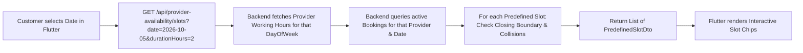
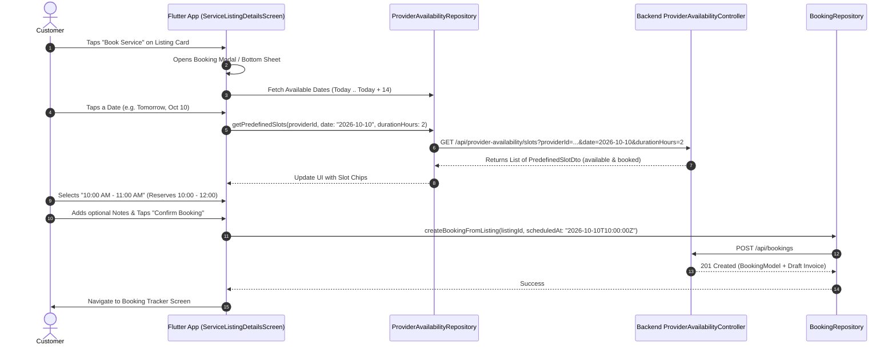

# Research: Flutter Mobile-First Booking with Predefined Time Slots & Simplified Backend Availability Engine

**Document Type**: Architectural Research & Implementation Plan  
**Repository**: `MovinduLochana/handee`  
**Target Path**: [`docs/specs/flutter-predefined-slots-booking-research.md`](file:///d:/SLIIT/Year%203%20Semester%201/SE3090%20-%20Software%20Engineering%20Frameworks/Assignment/handee/docs/specs/flutter-predefined-slots-booking-research.md)  
**Status**: Proposal / Ready for Implementation  

---

## 1. Executive Summary & Context

The Handee platform is transitioning **all customer booking workflows exclusively into the Flutter mobile application**. 

Currently, customer scheduling is burdened by an overcomplicated slot management architecture:
1. **The Batch Generation Burden**: The backend requires providers to generate and store hundreds of physical rows in a `ProviderAvailabilitySlots` database table over a rolling calendar window. If a provider forgets to run this generator, customer booking calendars show empty or disabled states.
2. **Confusing & Redundant Mobile UI**: In the Flutter customer app ([`service_listing_details_screen.dart`](file:///d:/SLIIT/Year%203%20Semester%201/SE3090%20-%20Software%20Engineering%20Frameworks/Assignment/handee/app/lib/screens/customer/service_listing_details_screen.dart)), customers are simultaneously presented with a database slot picker widget, a separate standard date picker, and a raw time picker dialog. When database slots are empty, the widget falls back to allowing arbitrary, non-standard times (e.g. `11:47 PM`), creating scheduling chaos.
3. **Disjointed Durations**: Service listings currently specify arbitrary duration spans (e.g. `00:45:00` or `01:30:00`), which cannot cleanly align with standardized 1-hour slots.

### The New Architecture: Date Picker + Predefined Time Slots
To solve these problems from scratch:
- **Mobile First-Class Experience**: The Flutter booking flow presents an intuitive 2-step interaction:
  1. **Pick a Date**: Customer selects a day from a 14-day horizontal calendar strip or date picker.
  2. **Pick from Predefined Time Slots**: The app renders the day's standard, predefined discrete time slots (e.g., `09:00 AM - 10:00 AM`, `10:00 AM - 11:00 AM`, etc.). Available slots are interactive; booked or out-of-bounds slots are clearly labeled and disabled.
- **Ultra-Simplified Backend Slot Management**:
  - **Eliminate discrete physical slot table generation**: Drop the need to generate or store thousands of empty slot rows.
  - Providers define simple **Weekly Working Hours** (e.g. Monday–Friday, 09:00 to 17:00).
  - When Flutter requests slots for a specific date, the backend **dynamically projects the predefined slots on the fly** by taking the provider's operating hours for that day and subtracting active bookings (`Requested`, `Accepted`, `InProgress`).
  - Integer-hour service listings ($N$ hours) cleanly consume $N$ consecutive predefined slots.

---

## 2. Investigation of Current System (Primary Source Findings)

### 2.1 Current Mobile Booking UI & Repositories

| Component / File | Primary Source | Current Implementation & Issues |
| :--- | :--- | :--- |
| **`service_listing_details_screen.dart`** | [`service_listing_details_screen.dart` (lines 600–650)](file:///d:/SLIIT/Year%203%20Semester%201/SE3090%20-%20Software%20Engineering%20Frameworks/Assignment/handee/app/lib/screens/customer/service_listing_details_screen.dart#L600-L650) | Renders `ProviderAvailabilitySlotPicker` on line 600, then immediately renders redundant `_pickDate` and `_pickTime` dialog triggers on lines 620–650. Confuses users with multiple ways to pick times. |
| **`provider_availability_slot_picker.dart`** | [`provider_availability_slot_picker.dart` (lines 70–138)](file:///d:/SLIIT/Year%203%20Semester%201/SE3090%20-%20Software%20Engineering%20Frameworks/Assignment/handee/app/lib/widgets/provider_availability_slot_picker.dart#L70-L138) | Calls `_repository.getForProvider()`. If slots are empty, displays fallback message: *"Flexible scheduling: Select your preferred date and time below"*, allowing customers to enter arbitrary hours and minutes. |
| **`public_provider_profile_screen.dart`** | [`public_provider_profile_screen.dart` (lines 333–355)](file:///d:/SLIIT/Year%203%20Semester%201/SE3090%20-%20Software%20Engineering%20Frameworks/Assignment/handee/app/lib/screens/customer/public_provider_profile_screen.dart#L333-L355) | Features a bottom CTA "Book this Pro" that navigates to `CreateJobScreen` (Instant Match) rather than booking the provider's service listings. |
| **`provider_availability_repository.dart`** | [`provider_availability_repository.dart` (lines 10–37)](file:///d:/SLIIT/Year%203%20Semester%201/SE3090%20-%20Software%20Engineering%20Frameworks/Assignment/handee/app/lib/data/repositories/provider_availability_repository.dart#L10-L37) | Expects a static list of `ProviderAvailabilitySlotModel` records matching the backend's physical table schema. |
| **`booking_repository.dart`** | [`booking_repository.dart` (lines 69–89)](file:///d:/SLIIT/Year%203%20Semester%201/SE3090%20-%20Software%20Engineering%20Frameworks/Assignment/handee/app/lib/data/repositories/booking_repository.dart#L69-L89) | Cleanly implements `createBookingFromListing({serviceListingId, scheduledAt, notes})`. Ready to receive standardized timestamps. |

### 2.2 Current Backend Availability Architecture

| Component / File | Primary Source | Current Implementation & Issues |
| :--- | :--- | :--- |
| **`ProviderAvailabilitySlot.cs`** | [`ProviderAvailabilitySlot.cs`](file:///d:/SLIIT/Year%203%20Semester%201/SE3090%20-%20Software%20Engineering%20Frameworks/Assignment/handee/src/backend/handee.API/Entities/ProviderAvailabilitySlot.cs) | Entity representing a single physical 1-hour interval row with `StartTime`, `EndTime`, `IsBooked`. Millions of rows generated over time. |
| **`ProviderAvailabilityService.cs`** | [`ProviderAvailabilityService.cs` (lines 104–158)](file:///d:/SLIIT/Year%203%20Semester%201/SE3090%20-%20Software%20Engineering%20Frameworks/Assignment/handee/src/backend/handee.API/Services/ProviderAvailabilityService.cs#L104-L158) | `CreateRecurringSlotsAsync` loops across days and times, inserting discrete rows into the DB. If a provider fails to generate slots, `GetForProviderAsync` returns an empty array. |
| **`BookingService.cs`** | [`BookingService.cs` (lines 281–394)](file:///d:/SLIIT/Year%203%20Semester%201/SE3090%20-%20Software%20Engineering%20Frameworks/Assignment/handee/src/backend/handee.API/Services/BookingService.cs#L281-L394) | `CreateFromListingAsync` checks for overlaps using `b.ScheduledAt.Value.AddMinutes(...)`, but does not validate top-of-hour alignment or multi-hour daily closing boundaries. |
| **`ServiceListing.cs`** | [`ServiceListing.cs` (line 13)](file:///d:/SLIIT/Year%203%20Semester%201/SE3090%20-%20Software%20Engineering%20Frameworks/Assignment/handee/src/backend/handee.API/Entities/ServiceListing.cs#L13) | `TimeSpan EstimatedDuration` allows arbitrary durations (e.g. 45 mins), causing slot misalignment. |

---

## 3. The New Predefined Time Slots & Simplified Backend Model

### 3.1 What are "Predefined Time Slots"?
Instead of arbitrary start times, the Handee platform establishes standardized daily discrete 1-hour slots:

| Slot Key | Start Hour (Local) | End Hour (Local) | Display Label |
| :---: | :---: | :---: | :---: |
| `08:00` | 08:00 | 09:00 | `08:00 AM - 09:00 AM` |
| `09:00` | 09:00 | 10:00 | `09:00 AM - 10:00 AM` |
| `10:00` | 10:00 | 11:00 | `10:00 AM - 11:00 AM` |
| `11:00` | 11:00 | 12:00 | `11:00 AM - 12:00 PM` |
| `12:00` | 12:00 | 13:00 | `12:00 PM - 01:00 PM` |
| `13:00` | 13:00 | 14:00 | `01:00 PM - 02:00 PM` |
| `14:00` | 14:00 | 15:00 | `02:00 PM - 03:00 PM` |
| `15:00` | 15:00 | 16:00 | `03:00 PM - 04:00 PM` |
| `16:00` | 16:00 | 17:00 | `04:00 PM - 05:00 PM` |
| `17:00` | 17:00 | 18:00 | `05:00 PM - 06:00 PM` |

### 3.2 Simplified Backend Availability Architecture
No slot rows are generated or stored in the database. Availability is a **pure dynamic projection**:



1. **Provider Operating Schedule**:
   - Provider specifies their standard active days and hours (e.g. Mon–Fri, 09:00 to 17:00).
   - If not set, system defaults to **Monday–Friday, 09:00 to 17:00**.
2. **On-Demand Projection**:
   - When Flutter queries a date, the backend generates the day's predefined slots.
   - For each slot $H$, it determines:
     - Is the slot within operating hours?
     - Does $H + \text{durationHours} \le \text{ClosingHour}$?
     - Is any part of $[H, H + \text{durationHours}]$ occupied by an active booking?
     - Is the slot in the past (if date is today)?
   - Returns each predefined slot with `isAvailable: true/false` and an optional `reason` (`"Booked"`, `"Outside Hours"`, `"Insufficient Time"`, or `"Past"`).

---

## 4. Flutter Customer App Booking Experience



### 4.1 UI Component: `PredefinedSlotPicker`
Replaces the old, confusing `provider_availability_slot_picker.dart` with a streamlined, 2-section widget:

1. **Date Strip**:
   - Horizontal list of the next 14 calendar days.
   - Each card displays Day Name (e.g. `WED`), Day Number (e.g. `10`), and Month (e.g. `OCT`).
   - Selecting a date automatically reloads slots for that date.
2. **Predefined Slots Grid**:
   - 2-column or 3-column grid of hourly chips (e.g. `09:00 AM - 10:00 AM`).
   - **Green / Primary border**: Selected slot.
   - **White / Surface**: Available slot.
   - **Greyed out + "Booked" / "Closed" badge**: Unavailable slot (disabled).
   - If a multi-hour service is chosen (e.g. 2 hours), selecting `10:00 AM` displays a banner:
     *“Reserved Window: 10:00 AM – 12:00 PM (2 consecutive slots)”*.

---

## 5. Technical Implementation Details

### 5.1 Backend Implementation (.NET 10)

#### 1. Predefined Slot Response DTO
In [`src/backend/handee.API/DTO/PredefinedSlotDto.cs`](file:///d:/SLIIT/Year%203%20Semester%201/SE3090%20-%20Software%20Engineering%20Frameworks/Assignment/handee/src/backend/handee.API/DTO/PredefinedSlotDto.cs):
```csharp
namespace handee.API.DTO;

public record PredefinedSlotDto(
    string SlotKey,             // e.g. "09:00"
    string DisplayLabel,        // e.g. "09:00 AM - 10:00 AM"
    DateTimeOffset StartTime,   // e.g. 2026-10-10T09:00:00Z
    DateTimeOffset EndTime,     // e.g. 2026-10-10T10:00:00Z (or +duration)
    bool IsAvailable,
    string? UnavailableReason  // "Booked", "Closed", "InsufficientTime", "Past"
);

public record DailySlotsResponseDto(
    Guid ProviderId,
    DateOnly Date,
    int DurationHours,
    bool IsWorkingDay,
    List<PredefinedSlotDto> Slots
);
```

#### 2. Simplified Dynamic Endpoint in `ProviderAvailabilityController.cs`
```csharp
// GET /api/provider-availability/slots?providerId={id}&date={yyyy-MM-dd}&durationHours=1
[HttpGet("slots")]
[AllowAnonymous]
public async Task<IActionResult> GetPredefinedSlots(
    [FromQuery] Guid providerId,
    [FromQuery] DateOnly date,
    [FromQuery] int durationHours = 1,
    CancellationToken ct = default)
{
    var result = await _availabilityService.GetPredefinedSlotsForDateAsync(providerId, date, durationHours, ct);
    return Ok(result);
}
```

#### 3. Dynamic Calculation in `ProviderAvailabilityService.cs`
```csharp
public async Task<DailySlotsResponseDto> GetPredefinedSlotsForDateAsync(
    Guid providerId,
    DateOnly date,
    int durationHours = 1,
    CancellationToken ct = default)
{
    var dayOfWeek = date.DayOfWeek;

    // 1. Fetch provider operating schedule for that DayOfWeek
    var schedule = await _db.ProviderOperatingSchedules
        .FirstOrDefaultAsync(s => s.ProviderId == providerId && s.DayOfWeek == dayOfWeek && s.IsActive, ct);

    // Fallback: Default Mon-Fri 09:00 - 17:00
    int opStartHour = schedule != null ? schedule.StartTime.Hours : (dayOfWeek >= DayOfWeek.Monday && dayOfWeek <= DayOfWeek.Friday ? 9 : 0);
    int opEndHour = schedule != null ? schedule.EndTime.Hours : (dayOfWeek >= DayOfWeek.Monday && dayOfWeek <= DayOfWeek.Friday ? 17 : 0);
    bool isWorkingDay = opStartHour < opEndHour;

    if (!isWorkingDay)
    {
        return new DailySlotsResponseDto(providerId, date, durationHours, false, new List<PredefinedSlotDto>());
    }

    // 2. Fetch existing active bookings for this provider on this date
    var dayStartUtc = new DateTimeOffset(date.Year, date.Month, date.Day, 0, 0, 0, TimeSpan.Zero);
    var dayEndUtc = dayStartUtc.AddDays(1);

    var activeBookings = await _db.Bookings
        .Include(b => b.ServiceListing)
        .Where(b => b.ProviderId == providerId
                    && b.ScheduledAt != null
                    && b.ScheduledAt < dayEndUtc
                    && b.ScheduledAt.Value.AddHours(b.ServiceListing != null ? b.ServiceListing.DurationHours : 1) > dayStartUtc
                    && (b.Status == BookingStatus.Requested || b.Status == BookingStatus.Accepted || b.Status == BookingStatus.InProgress))
        .Select(b => new {
            Start = b.ScheduledAt!.Value,
            End = b.ScheduledAt.Value.AddHours(b.ServiceListing != null ? b.ServiceListing.DurationHours : 1)
        })
        .ToListAsync(ct);

    var nowUtc = DateTimeOffset.UtcNow;
    var slots = new List<PredefinedSlotDto>();

    // 3. Evaluate each canonical slot from opStartHour to opEndHour - 1
    for (int h = opStartHour; h < opEndHour; h++)
    {
        var slotStart = new DateTimeOffset(date.Year, date.Month, date.Day, h, 0, 0, TimeSpan.Zero);
        var slotEnd = slotStart.AddHours(durationHours);
        var slotKey = $"{h:D2}:00";
        var label = $"{DateTime.Today.AddHours(h):hh:mm tt} - {DateTime.Today.AddHours(h + 1):hh:mm tt}";

        // Check if past
        if (slotStart <= nowUtc)
        {
            slots.Add(new PredefinedSlotDto(slotKey, label, slotStart, slotEnd, false, "Past"));
            continue;
        }

        // Check if multi-hour job exceeds operating closing time
        if (h + durationHours > opEndHour)
        {
            slots.Add(new PredefinedSlotDto(slotKey, label, slotStart, slotEnd, false, "InsufficientTime"));
            continue;
        }

        // Check collision against active bookings
        bool isBooked = activeBookings.Any(b => b.Start < slotEnd && slotStart < b.End);
        if (isBooked)
        {
            slots.Add(new PredefinedSlotDto(slotKey, label, slotStart, slotEnd, false, "Booked"));
            continue;
        }

        slots.Add(new PredefinedSlotDto(slotKey, label, slotStart, slotEnd, true, null));
    }

    return new DailySlotsResponseDto(providerId, date, durationHours, true, slots);
}
```

---

### 5.2 Flutter Implementation (`app/lib/`)

#### 1. Data Model: `PredefinedSlotModel`
In [`app/lib/data/models/predefined_slot_model.dart`](file:///d:/SLIIT/Year%203%20Semester%201/SE3090%20-%20Software%20Engineering%20Frameworks/Assignment/handee/app/lib/data/models/predefined_slot_model.dart):
```dart
class PredefinedSlotModel {
  final String slotKey;
  final String displayLabel;
  final DateTime startTime;
  final DateTime endTime;
  final bool isAvailable;
  final String? unavailableReason;

  PredefinedSlotModel({
    required this.slotKey,
    required this.displayLabel,
    required this.startTime,
    required this.endTime,
    required this.isAvailable,
    this.unavailableReason,
  });

  factory PredefinedSlotModel.fromJson(Map<String, dynamic> json) {
    return PredefinedSlotModel(
      slotKey: json['slotKey'] as String,
      displayLabel: json['displayLabel'] as String,
      startTime: DateTime.parse(json['startTime'] as String),
      endTime: DateTime.parse(json['endTime'] as String),
      isAvailable: json['isAvailable'] as bool,
      unavailableReason: json['unavailableReason'] as String?,
    );
  }
}
```

#### 2. Repository Method in `ProviderAvailabilityRepository`
```dart
Future<List<PredefinedSlotModel>> getPredefinedSlots({
  required String providerId,
  required DateTime date,
  int durationHours = 1,
}) async {
  final dateStr = "${date.year}-${date.month.toString().padLeft(2, '0')}-${date.day.toString().padLeft(2, '0')}";
  final response = await apiClient.get(
    '/api/provider-availability/slots',
    queryParams: {
      'providerId': providerId,
      'date': dateStr,
      'durationHours': durationHours.toString(),
    },
  );
  if (response is Map<String, dynamic> && response['slots'] is List) {
    return (response['slots'] as List)
        .map((s) => PredefinedSlotModel.fromJson(s as Map<String, dynamic>))
        .toList();
  }
  return [];
}
```

#### 3. Clean Interactive Sheet in `service_listing_details_screen.dart`
- Remove lines 619–660 (the redundant `_pickDate` and `_pickTime` dialogs).
- Use a dedicated **Date Strip** at the top (`HorizontalListView` showing 14 days).
- Underneath, display the **Predefined Slot Chips**:
  - Tapping an available slot sets `_selectedSlot = slot`.
  - Tapping "Confirm Booking" calls `bookingRepository.createBookingFromListing(...)` with `_selectedSlot.startTime`.
  - Navigates directly to `CustomerBookingsScreen` or `BookingTrackerScreen`.

---

## 6. Migration & Deprecation Strategy

1. **Deprecate Physical Slot Batch Table**:
   - Stop invoking `CreateRecurringSlotsAsync` and `CreateBatchSlotsAsync`.
   - The old table `ProviderAvailabilitySlots` can be kept temporarily or dropped in a clean EF migration, as `Bookings` + `ProviderOperatingSchedule` fully replace it.
2. **Remove Web Direct-Booking Placeholders**:
   - Remove `alert("Booking flow not implemented.")` on [`PublicProviderProfile.tsx`](file:///d:/SLIIT/Year%203%20Semester%201/SE3090%20-%20Software%20Engineering%20Frameworks/Assignment/handee/web/src/pages/public/PublicProviderProfile.tsx).
   - Display a direct call-to-action: *"To book an appointment, download and open the Handee Mobile App"* or link directly into the mobile deep link.
3. **Integer Hours Enforcement**:
   - `ServiceListing.DurationHours` defaults to 1. Existing `EstimatedDuration` values are rounded up to integer hours during migration.
