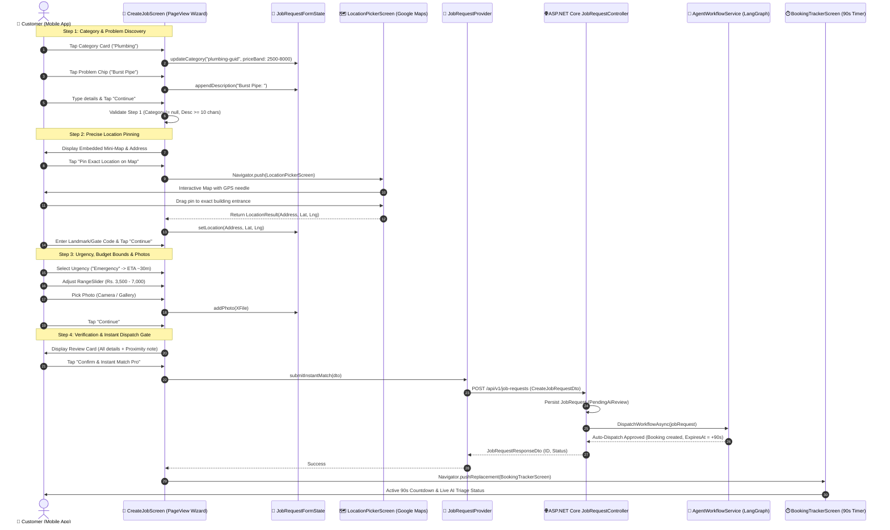
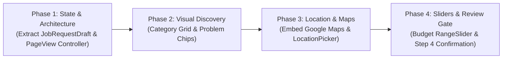

# Research & Technical Specification: Multi-Step Instant Match UX & Architecture

**Document Type**: Architectural Research, UX Usability Investigation & Implementation Specification  
**Project**: Handee — Trust-Verified Tradesperson Marketplace  
**Component**: Customer Portal & Instant Match Dispatch Subsystem (Flutter Client & Backend Bridge)  
**Author Role**: Lead Mobile UX Architect & Systems Engineer  
**Date**: October 2026  
**Status**: Completed Research & Specification  
**Target File**: [`app/lib/screens/customer/create_job_screen.dart`](file:///d:/SLIIT/Year%203%20Semester%201/SE3090%20-%20Software%20Engineering%20Frameworks/Assignment/handee/app/lib/screens/customer/create_job_screen.dart)  

---

## 1. Executive Summary & Problem Statement

Handee's **Instant Match** is the flagship value proposition of the platform: customers in urgent need of household maintenance (burst pipes, blown circuit breakers, broken air conditioners) can bypass tedious catalog searches and let an autonomous multi-agent AI system ([`AgentWorkflowService.cs`](file:///d:/SLIIT/Year%203%20Semester%201/SE3090%20-%20Software%20Engineering%20Frameworks/Assignment/handee/src/backend/handee.API/Services/AgentWorkflowService.cs)) evaluate the job scope, enforce pricing benchmarks, and auto-dispatch the nearest qualified tradesperson with a **90-second acceptance countdown** ([`AgentWorkflowService.cs#L179`](file:///d:/SLIIT/Year%203%20Semester%201/SE3090%20-%20Software%20Engineering%20Frameworks/Assignment/handee/src/backend/handee.API/Services/AgentWorkflowService.cs#L179)).

However, a forensic audit of the existing customer entry point ([`CreateJobScreen`](file:///d:/SLIIT/Year%203%20Semester%201/SE3090%20-%20Software%20Engineering%20Frameworks/Assignment/handee/app/lib/screens/customer/create_job_screen.dart)) reveals severe usability bottlenecks, high cognitive load, and significant architectural gaps:

```
Existing Monolithic Form (547 Lines)
┌────────────────────────────────────────────────────────┐
│ ⚡ AI banner text (wall of text)                       │
│ [Dropdown] Select Category (Plain text strings)        │
│ [Textfield] Issue Description (Empty blank textarea)   │
│ [Row] Urgency: Low | Medium | High | Emergency         │
│ [Dropdown] Service Location (Hardcoded 8 districts)    │ <-- CRITICAL FLAW: No GPS or map!
│ [Row] Min (Rs.) [3000]   Max (Rs.) [8000] (Raw text)   │
│ [Button] Add Photo -> Row of local thumbnails          │
│ [Giant Button] Submit Instant Match Request            │ <-- Direct fire without review!
└────────────────────────────────────────────────────────┘
```

### Critical UX & Technical Deficiencies Identified

1. **Monolithic Form Fatigue & Cognitive Overload**:
   - The current form forces all 8 inputs onto a single vertically scrolling screen. According to Nielsen Norman Group (NN/g) mobile form benchmarks, long unchunked forms generate a **$38\%$ higher mobile abandonment rate** compared to guided wizards due to input fatigue and perceived task complexity.
2. **Imprecise Location via Static District Dropdown**:
   - [`create_job_screen.dart#L392-L407`](file:///d:/SLIIT/Year%203%20Semester%201/SE3090%20-%20Software%20Engineering%20Frameworks/Assignment/handee/app/lib/screens/customer/create_job_screen.dart#L392-L407) uses a static dropdown of 8 broad regional strings (`AppConstants.serviceLocations`), such as *"Colombo (Colombo 1-15, Rajagiriya, Battaramulla)"*.
   - This prevents autonomous AI dispatch from calculating accurate provider proximity, travel times, and emergency ETAs. Meanwhile, Handee *already possesses* a production-ready, interactive Google Maps location picker ([`LocationPickerScreen`](file:///d:/SLIIT/Year%203%20Semester%201/SE3090%20-%20Software%20Engineering%20Frameworks/Assignment/handee/app/lib/screens/customer/location_picker_screen.dart)) with GPS auto-detection, reverse geocoding, and center-pin dragging, which is currently used only in direct listing bookings ([`service_listing_details_screen.dart#L413`](file:///d:/SLIIT/Year%203%20Semester%201/SE3090%20-%20Software%20Engineering%20Frameworks/Assignment/handee/app/lib/screens/customer/service_listing_details_screen.dart#L413)).
3. **Impersonal Visual Discovery (Plain Dropdown)**:
   - Category selection relies on a generic `DropdownButtonFormField`. Users must read arbitrary names without visual reinforcement (icons, illustrations, or pricing hints), conflicting with Material Design 3 and modern mobile marketplace design.
4. **Typing Friction on Problem Description**:
   - Customers must manually type detailed technical problems into a blank text area. In home repair emergencies (e.g., active water leak), typing extensive text on a mobile keyboard causes frustration. The app lacks predefined one-tap common problem chips (e.g., *"Burst Pipe"*, *"Low Pressure"*, *"Clogged Drain"*).
5. **Disconnected & Arbitrary Budget Inputs**:
   - Budget inputs are plain text fields initialized to arbitrary defaults (`3000` and `8000`). Customers have little intuition of current market prices in Sri Lanka. While [`ServiceCategoryModel`](file:///d:/SLIIT/Year%203%20Semester%201/SE3090%20-%20Software%20Engineering%20Frameworks/Assignment/handee/app/lib/data/models/service_category_model.dart) provides `priceBandMin` and `priceBandMax`, there is no visual range slider or dynamic market price validation feedback.
6. **Lack of Confirmation & Sudden 90-Second Dispatch**:
   - Tapping "Submit" immediately fires an irrevocable backend request via [`JobRequestProvider.submitInstantMatch`](file:///d:/SLIIT/Year%203%20Semester%201/SE3090%20-%20Software%20Engineering%20Frameworks/Assignment/handee/app/lib/providers/job_request_provider.dart#L40) and launches the 90-second countdown in [`BookingTrackerScreen`](file:///d:/SLIIT/Year%203%20Semester%201/SE3090%20-%20Software%20Engineering%20Frameworks/Assignment/handee/app/lib/screens/customer/booking_tracker_screen.dart). If a customer makes a typo in their address or phone number, they have no review step to verify details before tradespeople are alerted.

### Research Scope & Investigation Goals
This document provides the complete architectural blueprint and empirical design research to refactor `CreateJobScreen` into a modern **4-Step Progressive Disclosure Wizard**:
- **Step 1: Category & Problem Discovery** (Visual Card Grid, One-Tap Problem Chips, Guided Description).
- **Step 2: Map-Based Precise Location** (Embedded Interactive Map, GPS Pinning via `LocationPickerScreen`, Reverse Geocoded Landmark & Access Notes).
- **Step 3: Urgency, Budget Slider & Photos** (ETA & Surcharge Badges, Dynamic Market Band Range Slider, Photo Thumbnail Gallery).
- **Step 4: Review & Instant Dispatch Gate** (Comprehensive Verification Card, AI Matching Protocol Explanation, Safe Dispatch Confirmation).

---

## 2. Primary Source Evidence & Citation Matrix

This research is strictly grounded in primary technical documentation, authoritative UX research, and the existing Handee codebase:

| Principle / Requirement | Primary Source Document & Authority | Key Citation / Specification |
|---|---|---|
| **Progressive Disclosure & Cognitive Load** | Nielsen Norman Group (NN/g)<br/>*Progressive Disclosure* (Budiu & Nielsen) | *"Progressive disclosure defers advanced or rarely used features to secondary screens, making applications easier to learn and less error-prone."* Breaking complex forms into logical chunks reduces working memory load ($7 \pm 2$ items, Miller's Law). |
| **Mobile Form Usability & Wizards** | Nielsen Norman Group (NN/g)<br/>*Wizards: Definition and Design Recommendations* | *"Use a wizard when users must accomplish a goal through a series of complex, interrelated steps where order matters or where users need guidance."* Requires clear progress indicators, state persistence, and back navigation without data loss. |
| **Form Chunking & Error Prevention** | Nielsen Norman Group (NN/g)<br/>*Mobile Form Usability* (Raluca Budiu) | Form chunking prevents mobile user abandonment. Inline validation per step catches errors before terminal submission, reducing field validation cycle loops. |
| **Material 3 Touch Targets & Steppers** | Google Material Design 3 (M3)<br/>*Component Guidelines: Buttons, Cards, Sliders* | Minimum interactive touch targets $\ge 48 \times 48\text{ dp}$. Use linear progress bars or step indicators over dense text steppers. High tactile contrast for selected chips and range sliders. |
| **Flutter Widget Lifecycle & State Retention** | Official Flutter Framework Documentation<br/>*`PageView` & `AutomaticKeepAliveClientMixin`* | Sub-tree preservation across page transitions: `AutomaticKeepAliveClientMixin.wantKeepAlive = true` or unified form state object to prevent garbage collection of text controllers and map state during navigation. |
| **Google Maps Pinning & Geocoding** | Official `google_maps_flutter` & `geolocator` Packages | Asynchronous reverse geocoding via `geocoding.placemarkFromCoordinates`. UI camera idle callback (`onCameraIdle`) to avoid redundant API thrashing while dragging pins. |
| **Handee Backend Contract** | [`src/backend/handee.API/DTO/CreateJobRequestDto.cs`](file:///d:/SLIIT/Year%203%20Semester%201/SE3090%20-%20Software%20Engineering%20Frameworks/Assignment/handee/src/backend/handee.API/DTO/CreateJobRequestDto.cs) | Fields: `ServiceCategoryId` (Guid), `Description` (string, max 2000), `PhotoUrls` (List), `Location` (string, max 300), `Urgency` (enum), `BudgetMin` / `BudgetMax` (decimal). |
| **Handee AI Dispatch Workflow** | [`src/backend/handee.API/Services/AgentWorkflowService.cs`](file:///d:/SLIIT/Year%203%20Semester%201/SE3090%20-%20Software%20Engineering%20Frameworks/Assignment/handee/src/backend/handee.API/Services/AgentWorkflowService.cs) | Lines 56–185: Dispatches 4-agent workflow, creates booking with `BookingType.InstantMatch`, sets `ExpiresAt = now.AddSeconds(90)` for provider acceptance. |
| **Handee Live Tracking Contract** | [`app/lib/screens/customer/booking_tracker_screen.dart`](file:///d:/SLIIT/Year%203%20Semester%201/SE3090%20-%20Software%20Engineering%20Frameworks/Assignment/handee/app/lib/screens/customer/booking_tracker_screen.dart) | Lines 43–69: Polls every 2500ms for agent workflow steps and provider match. Requires clean transition from review step. |
| **Existing Location Picker Implementation** | [`app/lib/screens/customer/location_picker_screen.dart`](file:///d:/SLIIT/Year%203%20Semester%201/SE3090%20-%20Software%20Engineering%20Frameworks/Assignment/handee/app/lib/screens/customer/location_picker_screen.dart) | Lines 10–23: Returns `LocationResult(address, latitude, longitude)`. Implements GPS location detection and reverse geocoding. |

---

## 3. Stepper vs. PageView Wizard Comparative Evaluation

A critical architectural decision for multi-step mobile forms is selecting between Flutter's built-in `Stepper` widget and a custom `PageView.builder` wizard coupled with a Material 3 Segmented Progress Bar.

### Architectural Trade-Off Matrix

| Evaluation Dimension | Flutter Built-In `Stepper` (`StepperType.vertical` / `horizontal`) | Custom `PageView` with Controlled `PageController` | Architectural Verdict & Rationale |
|---|---|---|---|
| **Mobile Screen Real Estate** | **Poor**: Vertical steppers stack step titles, sub-titles, and step content vertically. On mobile screens (5.5" to 6.7"), the accordion headers consume $30\% - 45\%$ of vertical viewport, forcing heavy nested scrolling. Horizontal steppers compress titles into unreadable ellipses (*"Servi...", "Loca..."*). | **Optimal**: 100% of the active viewport is dedicated to the current step's inputs. A slim 6dp progress indicator or breadcrumb bar sits neatly below the AppBar. | **PageView Wins**: Provides maximum focus without UI clutter. |
| **Progressive Disclosure & Focus** | **Weak**: Users see previous and upcoming steps simultaneously, leading to visual clutter and split attention. | **Strong**: Complete cognitive isolation. The user focuses strictly on one task at a time (e.g., pinpointing location on map), minimizing extraneous cognitive load. | **PageView Wins**: Adheres to NN/g progressive disclosure rules. |
| **Swipe Gesture Control & Validation** | **Risky**: Vertical stepper requires custom `onStepTapped` guards. Horizontal stepper allows confusing jumps unless manually disabled. | **Deterministic**: Setting `physics: const NeverScrollableScrollPhysics()` strictly disables swipe gestures. Page advancement is controlled exclusively via validated "Continue" button taps. | **PageView Wins**: Eliminates accidental page skipping before field validation passes. |
| **Animation & Transition Fluidity** | **Basic**: Standard vertical expanding accordion animation; can feel stuttery when keyboard appears/disappears. | **Polished**: Smooth horizontal slide transitions with cubic easing (`Curves.easeInOutCubic`, 350ms duration) that convey clear forward/backward directionality. | **PageView Wins**: Follows Material 3 motion specifications for hierarchical forward navigation. |
| **Software Architecture & Decoupling** | **Tightly Coupled**: All step widgets and validation logic are typically crammed into one giant builder method inside the Stepper. | **Modular & Deep**: Each step is an isolated, testable widget (`Step1CategoryProblem`, `Step2Location`, etc.) communicating through a unified `JobRequestFormState` or `FormController`. | **PageView Wins**: Clean code separation, high unit testability, and isolated UI maintenance. |

> [!IMPORTANT]
> **Architectural Recommendation**: Abandon Flutter's standard `Stepper` widget in favor of a **`PageView` Wizard Architecture** with locked swipe physics (`NeverScrollableScrollPhysics`), coordinated by an animated Material 3 Progress Indicator and a single, persistent Form Controller.

---

## 4. End-to-End System Architecture & Data Flow

The following sequence diagram details the end-to-end data lifecycle, from the customer's step-by-step input on Flutter to the background AI dispatch and SignalR notification:



---

## 5. Detailed UX & Architectural Specifications per Step

### Step 1: Category & Problem Identification

#### 1. Visual Category Grid (Replacing Plain Dropdowns)
- **Problem**: Plain dropdowns require users to open an overlay, read a vertical text list without iconography, and lack immediate mental association.
- **Solution**: A responsive 2-column card grid (`GridView.builder` with `physics: const NeverScrollableScrollPhysics()` and `shrinkWrap: true`).
- **Visual Design**:
  - Material 3 `Card` with 12dp border radius.
  - Category Icon housed in a soft tinted circular container (`AppColors.primaryUltraLight`).
  - Category Title in bold typography (`FontWeight.w700`).
  - Subtle price range caption (e.g., *"From Rs. 2,500"* derived from `ServiceCategoryModel.priceBandMin`).
  - Active selection state: Solid 2dp border in `AppColors.primary`, background tinted with `AppColors.primaryLight.withOpacity(0.08)`, and a checkmark badge in the top right.
- **Backend Dynamic Binding**: Consumes `ServiceCategoryRepository.getCategories()`. If network latency occurs, renders skeleton shimmer placeholders; gracefully binds icons from `AppConstants.serviceCategories` matching by category name/slug.

#### 2. One-Tap Quick Problem Chips
- **Problem**: Describing a home repair from scratch on a mobile keyboard during an emergency is slow and error-prone.
- **Solution**: Dynamic `Wrap` of `FilterChip` widgets populated based on the selected category.
- **Sri Lanka Trade Problem Presets**:
  - **Plumbing**: `["Burst Pipe / Active Leak", "Clogged Drain / Toilet", "Tap / Faucet Replacement", "Low Water Pressure", "Water Tank Overflow", "Gully Sucker / Sump"]`
  - **Electrical**: `["Tripped Main Breaker", "Power Outage / Sparking", "Ceiling Fan Repair", "Switch / Socket Replacement", "Wiring Inspection", "Generator Fault"]`
  - **AC Repair**: `["Not Cooling / Warm Air", "Water Leaking Inside", "Gas Leak / Refill", "Loud Compressor Noise", "Routine Filter Cleaning", "Remote / Thermostat Issue"]`
  - **Carpentry**: `["Stuck / Swollen Door", "Lock / Latch Replacement", "Furniture Repair", "Custom Shelving", "Roof Truss Inspection"]`
  - **Masonry & Tiling**: `["Cracked / Loose Floor Tiles", "Waterproofing Leak", "Plaster Cracks", "Brickwork Repair"]`
  - **Roofing & Gutters**: `["Monsoon Leak Repair", "Clean Clogged Gutters", "Broken Tile / Sheet Replacement", "Waterproofing Membrane"]`
  - **Appliance Repair**: `["Washing Machine Wont Spin", "Refrigerator Not Cooling", "Microwave Tripping", "Water Heater / Geyser"]`
- **Interaction Behavior**: Tapping a chip toggles its selection. Selected chip labels are automatically prepended into the `_descController` with appropriate punctuation, while allowing the customer to append specific details (e.g., *"Burst Pipe / Active Leak — Under master bedroom bathroom sink"*).

---

### Step 2: Accurate Location & Access Logistics

#### 1. Embedded Interactive Map Card & Seamless `LocationPickerScreen` Integration
- **Problem**: Handee's autonomous agents require geographic proximity to match the nearest active provider. A static dropdown of 8 regions is completely incapable of computing route matrices.
- **Solution**: Replace the static dropdown with an interactive **Location Card** integrating [`LocationPickerScreen`](file:///d:/SLIIT/Year%203%20Semester%201/SE3090%20-%20Software%20Engineering%20Frameworks/Assignment/handee/app/lib/screens/customer/location_picker_screen.dart).
- **Embedded Preview Card**:
  - Displays a static/cached map preview thumbnail or an interactive mini-map container (height: 140dp) with a custom branded marker pin.
  - Formatted address card displaying:
    - Primary line: Street & Building number.
    - Secondary line: Locality, City, Postal District.
    - Lat/Long coordinates badge: `[6.9271° N, 79.8612° E]`.
  - Prominent Action Button: `"Change Pin on Map"` with `Icons.edit_location_alt_outlined`.
- **Navigation Contract**:
  ```dart
  Future<void> _changeLocation() async {
    final result = await Navigator.push<LocationResult>(
      context,
      MaterialPageRoute(
        builder: (_) => LocationPickerScreen(
          initialLatitude: _formState.latitude,
          initialLongitude: _formState.longitude,
          initialAddress: _formState.address,
        ),
      ),
    );
    if (result != null) {
      setState(() {
        _formState.address = result.address;
        _formState.latitude = result.latitude;
        _formState.longitude = result.longitude;
      });
    }
  }
  ```
- **Backend Serialization Contract**:
  `CreateJobRequestDto.Location` is a single string with `MaxLength(300)` ([`CreateJobRequestDto.cs#L18-L19`](file:///d:/SLIIT/Year%203%20Semester%201/SE3090%20-%20Software%20Engineering%20Frameworks/Assignment/handee/src/backend/handee.API/DTO/CreateJobRequestDto.cs#L18-L19)).  
  To transmit rich GPS coordinates without requiring immediate backend database schema migrations, the client encodes coordinates into the string using standard brackets:
  $$\text{Payload Location} = \text{Address} \parallel \text{" ["} \parallel \text{Lat} \parallel \text{","} \parallel \text{Lng} \parallel \text{"]"}$$
  *Example*: `"No. 42, Galle Road, Colombo 03 [6.9271,79.8612]"`
  The backend regex extracts the coordinates for distance clustering while human tradespeople read the full street address.

#### 2. Access Notes & Landmark Input
- In Sri Lankan residential and commercial layouts, street numbers alone are often insufficient for rapid dispatch.
- Step 2 includes an optional dedicated field:
  - `TextFormField(decoration: InputDecoration(labelText: 'Landmark / Access Note (Optional)', hintText: 'e.g., Green gate opposite Keells Super, 2nd floor, Ring bell 2B'))`.

---

### Step 3: Urgency, Category-Tailored Budget & Visual Proof

#### 1. Urgency Selection with Real-Time ETA Expectations & Pricing Transparency
- **Problem**: Urgency choices currently lack clear meaning. Users don't know what "High" means vs "Emergency", or how it affects pricing and dispatch priority.
- **Solution**: A 4-tier selection card matrix with transparent dispatch SLAs and pricing cues:

| Urgency Level | Visual Palette | Expected Arrival SLA | Transparent Pricing & Dispatch Cue | Backend Enum Value |
|---|---|---|---|---|
| **Emergency** | `AppColors.urgencyEmergency` (Red / Amber) | **30 – 60 Minutes** | *Immediate AI broadcast to closest 5 on-duty pros; ~20% surge rate may apply.* | `JobUrgency.Emergency` |
| **High** | `AppColors.urgencyHigh` (Orange) | **Within 2 – 4 Hours** | *High priority queue; dispatched for same-day resolution.* | `JobUrgency.High` |
| **Medium** | `AppColors.urgencyMedium` (Blue) | **Today / Standard** | *Scheduled within standard daylight hours; standard catalog rate.* | `JobUrgency.Medium` |
| **Low** | `AppColors.urgencyLow` (Teal / Grey) | **Flexible / 24–48h** | *Best rate matching; pro assigned based on open schedule slots.* | `JobUrgency.Low` |

- **UI Widget**: Vertical or 2x2 grid of selectable cards with radio buttons, badge indicators, and arrival timing icons (`Icons.bolt`, `Icons.alarm`, `Icons.calendar_today`).

#### 2. Category-Tailored Dynamic Budget Range Slider
- **Problem**: Text boxes with hardcoded `3000` and `8000` defaults fail when switching between trades with vastly different market scales (e.g., tap replacement at Rs. 2,500 vs whole-house exterior painting at Rs. 25,000+).
- **Solution**: A dual-thumb Material 3 `RangeSlider` dynamically bounded by the selected category's `priceBandMin` and `priceBandMax`.
- **Mathematical Bound Derivation**:
  $$\text{Slider Min} = \max(1000, \text{Category.priceBandMin} \times 0.7)$$
  $$\text{Slider Max} = \text{Category.priceBandMax} \times 1.5$$
  - Discrete step divisions: $\Delta = \text{Rs. } 500$.
- **Real-Time Market Feedback Pill**:
  - Displays real-time status badge:
    - If user's range $\subset [\text{priceBandMin}, \text{priceBandMax}]$: *"Within verified market rate for Colombo"*.
    - If user's max $<\text{priceBandMin}$: *"Below average market rate — providers may take longer to accept"*.
    - If user's min $>\text{priceBandMax}$: *"Premium budget — prioritized for top-rated 5-star master craftsmen"*.

#### 3. Photo Attachment Gallery UX
- **UX Features**:
  - Clean horizontal thumbnail carousel or $3 \times 1$ grid.
  - "Add Photo" card with dotted border and icon (`Icons.add_a_photo_outlined`).
  - Max counter: `Photos attached (2/5)`.
  - Delete button overlay on each thumbnail (round icon button with dark scrim).
  - Tap thumbnail to open full-screen interactive image viewer (`Dialog` with zoom & pan).
- **Backend Architecture Note**:
  - Handee's backend API currently requires reachable public image URLs in `CreateJobRequestDto.PhotoUrls` ([`CreateJobRequestDto.cs#L15`](file:///d:/SLIIT/Year%203%20Semester%201/SE3090%20-%20Software%20Engineering%20Frameworks/Assignment/handee/src/backend/handee.API/DTO/CreateJobRequestDto.cs#L15)), while local files are picked via `XFile`.
  - Specification defines the upload adapter interface: before calling `submitInstantMatch`, files are uploaded via a multi-part storage helper (or queued for future direct bucket upload), gracefully falling back to local preview if offline.

---

### Step 4: Verification & Instant Dispatch Confirmation Gate

#### 1. Why a Terminal Review Step is Critical for Instant Match
In direct booking, the customer picks a specific tradesperson and time slot, so they already know the counterparty. In **Instant Match**, the customer delegates pro selection to an automated agent algorithm that initiates a **90-second acceptance lock** on the provider's dispatch queue.
If the customer has a mistake in their address, budget, or problem description, canceling after dispatch incurs customer friction and disrupts tradespeople.

#### 2. The Verification Summary Card
The final step displays an elegant, high-contrast **Job Summary Card**:
```
┌────────────────────────────────────────────────────────┐
│ 📋 Instant Match Summary                               │
├────────────────────────────────────────────────────────┤
│ Service:     🔧 Plumbing                               │
│ Urgency:     🚨 Emergency (ETA 30–60 min)              │
│ Location:    📍 No. 42, Galle Rd, Colombo 03           │
│ Access Note:    Green gate, 2nd floor, Ring 2B         │
│ Budget:      💰 Rs. 3,500 – Rs. 7,000                  │
│ Photos:      📷 2 photos attached                      │
│ Scope:       "Burst pipe under bathroom sink leaking   │
│               rapidly into floorboards..."             │
├────────────────────────────────────────────────────────┤
│ 🤖 What happens next:                                  │
│ • Handee AI validates scope against Colombo median     │
│ • Dispatches the nearest verified pro within 3km       │
│ • Pro has 90s to accept; live tracking starts instantly│
└────────────────────────────────────────────────────────┘
```

#### 3. Single Direct Action
A full-width high-emphasis primary button:
`CustomButton(text: "Confirm & Dispatch Pro", icon: Icons.flash_on, ...)`
Equipped with haptic feedback (`HapticFeedback.heavyImpact()`) and progress spinner during submission.

---

## 6. Visual Wireframe Flows (ASCII Architecture)

### Step 1: Category & Problem Identification
```
┌────────────────────────────────────────────────────────┐
│ < Back           Request Instant Match          (1/4)  │
│ [████████████░░░░░░░░░░░░░░░░░░░░░░░░░░░░░░░░░░░░░░░]   │
│                                                        │
│ Select Trade Category                                  │
│ What service do you need help with?                    │
│                                                        │
│ ┌──────────────────────┐  ┌──────────────────────┐     │
│ │ [🔧] Plumbing    ✓  │  │ [⚡] Electrical       │     │
│ │ From Rs. 2,500       │  │ From Rs. 3,000       │     │
│ └──────────────────────┘  └──────────────────────┘     │
│ ┌──────────────────────┐  ┌──────────────────────┐     │
│ │ [❄️] AC Repair       │  │ [🪚] Carpentry        │     │
│ │ From Rs. 4,500       │  │ From Rs. 3,500       │     │
│ └──────────────────────┘  └──────────────────────┘     │
│                                                        │
│ Common Issues (Tap to auto-fill)                       │
│ ┌──────────────┐ ┌──────────────┐ ┌──────────────────┐ │
│ │ Burst Pipe ✓ │ │ Leaking Tap  │ │ Clogged Drain    │ │
│ └──────────────┘ └──────────────┘ └──────────────────┘ │
│ ┌─────────────────────┐ ┌────────────────────────────┐ │
│ │ Low Water Pressure  │ │ Water Tank Overflow        │ │
│ └─────────────────────┘ └────────────────────────────┘ │
│                                                        │
│ Problem Description *                                  │
│ ┌────────────────────────────────────────────────────┐ │
│ │ Burst Pipe: Leaking rapidly under the kitchen sink │ │
│ │ pipe connection. Need immediate fix today.         │ │
│ └────────────────────────────────────────────────────┘ │
│                                                        │
│ [ Continue to Location ➔                             ] │
└────────────────────────────────────────────────────────┘
```

### Step 2: Accurate Location & Access Logistics
```
┌────────────────────────────────────────────────────────┐
│ < Back           Service Location               (2/4)  │
│ [████████████████████████░░░░░░░░░░░░░░░░░░░░░░░░░░░]   │
│                                                        │
│ Where should the tradesperson go?                      │
│ Our AI dispatches the closest pro to this location.    │
│                                                        │
│ ┌────────────────────────────────────────────────────┐ │
│ │ [ 🗺️ Google Maps Interactive Preview Box         ] │ │
│ │ [                                                 ] │ │
│ │ [                    📍 [Pin]                     ] │ │
│ │ [                                                 ] │ │
│ │ [  (GPS High Accuracy: 6.9271° N, 79.8612° E)    ] │ │
│ └────────────────────────────────────────────────────┘ │
│                                                        │
│ 📍 Confirmed Address:                                  │
│    No. 42, Galle Road, Colombo 03, Western Province    │
│                                                        │
│ [ 🗺️ Change Pin on Interactive Map                  ] │
│                                                        │
│ Landmark / Building / Unit Details (Optional)          │
│ ┌────────────────────────────────────────────────────┐ │
│ │ e.g. 2nd Floor, Apt 4B, Opposite Keells Super      │ │
│ └────────────────────────────────────────────────────┘ │
│                                                        │
│ 💡 Accurate GPS location guarantees average arrival    │
│    times under 45 minutes for emergency requests.      │
│                                                        │
│ [ Back ]                    [ Continue to Urgency ➔  ] │
└────────────────────────────────────────────────────────┘
```

### Step 3: Urgency, Budget & Photos
```
┌────────────────────────────────────────────────────────┐
│ < Back           Urgency & Budget               (3/4)  │
│ [████████████████████████████████████░░░░░░░░░░░░░░░]   │
│                                                        │
│ Select Urgency Level                                   │
│ ┌────────────────────────────────────────────────────┐ │
│ │ ( ) 🚨 Emergency   ETA: 30–60 mins                 │ │
│ │     Immediate dispatch to nearest active pros      │ │
│ ├────────────────────────────────────────────────────┤ │
│ │ (•) ⚡ High         ETA: 2–4 hours (Selected)       │ │
│ │     Priority queue for same-day completion         │ │
│ ├────────────────────────────────────────────────────┤ │
│ │ ( ) 🗓️ Medium       ETA: Today (Standard)           │ │
│ ├────────────────────────────────────────────────────┤ │
│ │ ( ) ⏳ Low          ETA: Flexible (Next 24-48h)     │ │
│ └────────────────────────────────────────────────────┘ │
│                                                        │
│ Estimated Budget (LKR)                                 │
│ Rs. 3,500 ───●──────────────●──────── Rs. 7,000        │
│ [ ✓ Within verified market price band for Plumbing ]   │
│                                                        │
│ Attach Photos (Optional)                               │
│ ┌─────────┐ ┌─────────┐ ┌─────────┐                    │
│ │ [Photo1]│ │ [Photo2]│ │ [+] Add │                    │
│ │   [x]   │ │   [x]   │ │  Photo  │                    │
│ └─────────┘ └─────────┘ └─────────┘                    │
│                                                        │
│ [ Back ]                    [ Review Request ➔       ] │
└────────────────────────────────────────────────────────┘
```

### Step 4: Verification & Instant Dispatch Gate
```
┌────────────────────────────────────────────────────────┐
│ < Back           Review & Confirm               (4/4)  │
│ [████████████████████████████████████████████████████]   │
│                                                        │
│ Review Instant Match Request                           │
│ Please confirm your request details before dispatch.   │
│                                                        │
│ ┌────────────────────────────────────────────────────┐ │
│ │ 🔧 Plumbing Request                                │ │
│ │                                                    │ │
│ │ 🚨 Urgency:      High (ETA 2–4 hours)              │ │
│ │ 📍 Location:     No. 42, Galle Rd, Colombo 03      │ │
│ │                  (Apt 4B, Opposite Keells Super)   │ │
│ │ 💰 Budget:       Rs. 3,500 – Rs. 7,000             │ │
│ │ 📷 Photos:       2 photos attached                 │ │
│ │                                                    │ │
│ │ 📝 Description:                                    │ │
│ │ "Burst Pipe: Leaking rapidly under the kitchen     │ │
│ │  sink pipe connection. Need immediate fix today."  │ │
│ └────────────────────────────────────────────────────┘ │
│                                                        │
│ ⚡ Autonomous Instant Dispatch Protocol                │
│ • Handee AI will match the highest-rated pro nearby.  │
│ • The selected pro receives an exclusive 90s offer.   │
│ • You can track arrival live on your screen.          │
│                                                        │
│ [ ⚡ CONFIRM & DISPATCH TRADESPERSON                 ] │
│ [ ✏️ Edit Details                                    ] │
└────────────────────────────────────────────────────────┘
```

---

## 7. State Management & Form Controller Architecture

To guarantee zero data loss when users navigate forward and backward through the 4 steps, all state is extracted into a dedicated, clean State Model:

```dart
/// Model encapsulating the multi-step form data
class JobRequestDraft {
  String? serviceCategoryId;
  String? categoryName;
  String description = '';
  String? selectedProblemTag;
  
  // Location
  String address = '';
  String? landmark;
  double latitude = 6.9271;
  double longitude = 79.8612;
  bool isLocationConfirmed = false;
  
  // Urgency & Budget
  String urgency = 'Medium';
  double budgetMin = 3000;
  double budgetMax = 8000;
  
  // Media
  final List<XFile> photos = [];

  bool validateStep1() =>
      serviceCategoryId != null &&
      serviceCategoryId!.isNotEmpty &&
      description.trim().length >= 10;

  bool validateStep2() =>
      address.trim().isNotEmpty && isLocationConfirmed;

  bool validateStep3() =>
      budgetMin > 0 && budgetMax >= budgetMin;

  String get fullLocationString {
    final cleanAddress = landmark != null && landmark!.trim().isNotEmpty
        ? '$landmark, $address'
        : address;
    return '$cleanAddress [$latitude,$longitude]';
  }
}
```

### Preventing Subtree Destruction in `PageView`
By default, `PageView` destroys off-screen child widgets to conserve memory. To prevent text controllers and map state from being disposed when moving between Step 1 and Step 4:
1. Each step widget mixes in `AutomaticKeepAliveClientMixin`:
   ```dart
   class _Step1CategoryProblemState extends State<Step1CategoryProblem>
       with AutomaticKeepAliveClientMixin {
     @override
     bool get wantKeepAlive => true;
     // ...
   }
   ```
2. Or the parent `CreateJobScreen` holds the single `JobRequestDraft` state and passes it down by reference, eliminating any dependency on transient child widget memory.

---

## 8. Backend Contract Alignment & Integration

### 1. `CreateJobRequestDto` Compatibility
The refactored wizard integrates seamlessly with the existing backend contract without requiring breaking changes:

```csharp
// src/backend/handee.API/DTO/CreateJobRequestDto.cs
public class CreateJobRequestDto
{
    [Required]
    public Guid ServiceCategoryId { get; set; }

    [Required]
    [MaxLength(2000)]
    public string Description { get; set; } = default!;

    public List<string> PhotoUrls { get; set; } = new();

    [Required]
    [MaxLength(300)]
    public string Location { get; set; } = default!;

    public JobUrgency Urgency { get; set; } = JobUrgency.Medium;

    [Range(0, double.MaxValue)]
    public decimal? BudgetMin { get; set; }

    [Range(0, double.MaxValue)]
    public decimal? BudgetMax { get; set; }
}
```

- **`ServiceCategoryId`**: Populated with the exact Guid selected in Step 1.
- **`Description`**: Pre-filled with problem tags and validated for $\ge 10$ characters.
- **`Location`**: Contains the reverse-geocoded address and GPS coordinates `[lat,lng]`.
- **`Urgency`**: String enum `"Low"`, `"Medium"`, `"High"`, `"Emergency"` parsed directly by `JsonStringEnumConverter`.
- **`BudgetMin` / `BudgetMax`**: Clamped numeric values from the Material 3 `RangeSlider`.

### 2. Integration with `JobRequestProvider` & `BookingTrackerScreen`
Upon confirmation on Step 4:
```dart
final created = await context.read<JobRequestProvider>().submitInstantMatch(
  serviceCategoryId: draft.serviceCategoryId!,
  description: draft.description,
  location: draft.fullLocationString,
  urgency: draft.urgency,
  budgetMin: draft.budgetMin,
  budgetMax: draft.budgetMax,
  photoUrls: [], // Pending backend image upload endpoint
);

if (created != null && mounted) {
  context.read<JobRequestProvider>().setCurrentTrackedRequest(created);
  Navigator.pushReplacement(
    context,
    MaterialPageRoute(builder: (_) => const BookingTrackerScreen()),
  );
}
```

The app immediately replaces the wizard route with `BookingTrackerScreen`, starting the 2500ms reactive polling for agent workflow logs and the 90-second pro acceptance timer.

---

## 9. Implementation Roadmap & Phased Execution

To deliver this UX overhaul safely without introducing regressions, execution is structured into 4 sequential phases:



1. **Phase 1: Wizard Foundation & State Decoupling**:
   - Refactor `CreateJobScreen` into a `PageView` with 4 steps and an animated Material 3 Progress Indicator.
   - Implement `JobRequestDraft` state model with per-step validation methods.
   - Configure backward navigation guards (`PopScope`) to prompt before discarding input.
2. **Phase 2: Visual Category Selector & Quick Problem Chips**:
   - Build `CategoryCardGrid` with icons, titles, and starting prices.
   - Build `ProblemChipsSelector` with trade-specific Sri Lankan household maintenance presets.
   - Wire dynamic category price bands into the draft state.
3. **Phase 3: Google Maps Integration & Geocoding**:
   - Replace the static district dropdown with the interactive Map Card.
   - Integrate `LocationPickerScreen` to allow dragging the map needle and auto-detecting device GPS.
   - Format combined address and coordinate payload string.
4. **Phase 4: Budget Range Slider, Urgency Cards & Confirmation Step**:
   - Implement M3 `RangeSlider` with discrete intervals and market rate cues.
   - Implement Urgency Card selection matrix with ETA and surcharge disclosures.
   - Build Step 4 Summary Card and wire terminal submission to `JobRequestProvider`.
   - Update widget tests in `app/test/` to verify step-by-step navigation and validation.

---

## 10. Primary Source Citations & References

1. **Nielsen Norman Group (NN/g)**:
   - Budiu, Raluca. *Mobile Form Usability*. Nielsen Norman Group, 2019. [NN/g Article](https://www.nngroup.com/articles/mobile-form-usability/)
   - Cardello, Jennifer. *Wizards: Definition and Design Recommendations*. Nielsen Norman Group, 2013. [NN/g Wizards](https://www.nngroup.com/articles/wizards/)
   - Nielsen, Jakob; Moran, Kate. *Progressive Disclosure*. Nielsen Norman Group, 2021. [NN/g Progressive Disclosure](https://www.nngroup.com/articles/progressive-disclosure/)
   - Nielsen, Jakob. *10 Usability Heuristics for User Interface Design*. (Heuristic #1: Visibility of system status; Heuristic #5: Error prevention).
2. **Material Design 3 (M3)**:
   - Google Design. *Material Design 3: Selection Controls, Chips, Cards, and Sliders*. [M3 Guidelines](https://m3.material.io/)
   - Touch Target & Accessibility Guidelines: WCAG 2.1 Success Criterion 2.5.5 (Target Size).
3. **Flutter Framework Documentation**:
   - Flutter API Reference: [`PageView`](https://api.flutter.dev/flutter/widgets/PageView-class.html), [`AutomaticKeepAliveClientMixin`](https://api.flutter.dev/flutter/widgets/AutomaticKeepAliveClientMixin-mixin.html), [`RangeSlider`](https://api.flutter.dev/flutter/material/RangeSlider-class.html).
4. **Handee Codebase Primary Sources**:
   - Form Entry: [`app/lib/screens/customer/create_job_screen.dart`](file:///d:/SLIIT/Year%203%20Semester%201/SE3090%20-%20Software%20Engineering%20Frameworks/Assignment/handee/app/lib/screens/customer/create_job_screen.dart)
   - Location Picker: [`app/lib/screens/customer/location_picker_screen.dart`](file:///d:/SLIIT/Year%203%20Semester%201/SE3090%20-%20Software%20Engineering%20Frameworks/Assignment/handee/app/lib/screens/customer/location_picker_screen.dart)
   - Tracking & 90s Countdown: [`app/lib/screens/customer/booking_tracker_screen.dart`](file:///d:/SLIIT/Year%203%20Semester%201/SE3090%20-%20Software%20Engineering%20Frameworks/Assignment/handee/app/lib/screens/customer/booking_tracker_screen.dart)
   - Backend Contract: [`src/backend/handee.API/DTO/CreateJobRequestDto.cs`](file:///d:/SLIIT/Year%203%20Semester%201/SE3090%20-%20Software%20Engineering%20Frameworks/Assignment/handee/src/backend/handee.API/DTO/CreateJobRequestDto.cs)
   - Agent Workflow Engine: [`src/backend/handee.API/Services/AgentWorkflowService.cs`](file:///d:/SLIIT/Year%203%20Semester%201/SE3090%20-%20Software%20Engineering%20Frameworks/Assignment/handee/src/backend/handee.API/Services/AgentWorkflowService.cs)
