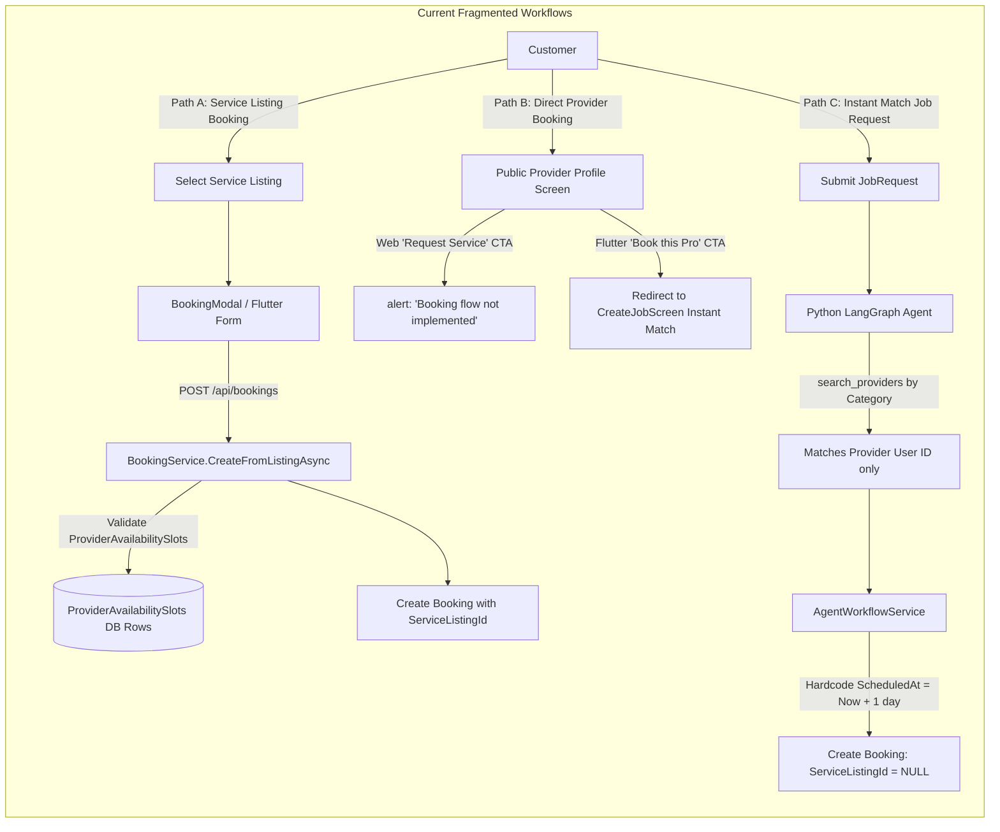
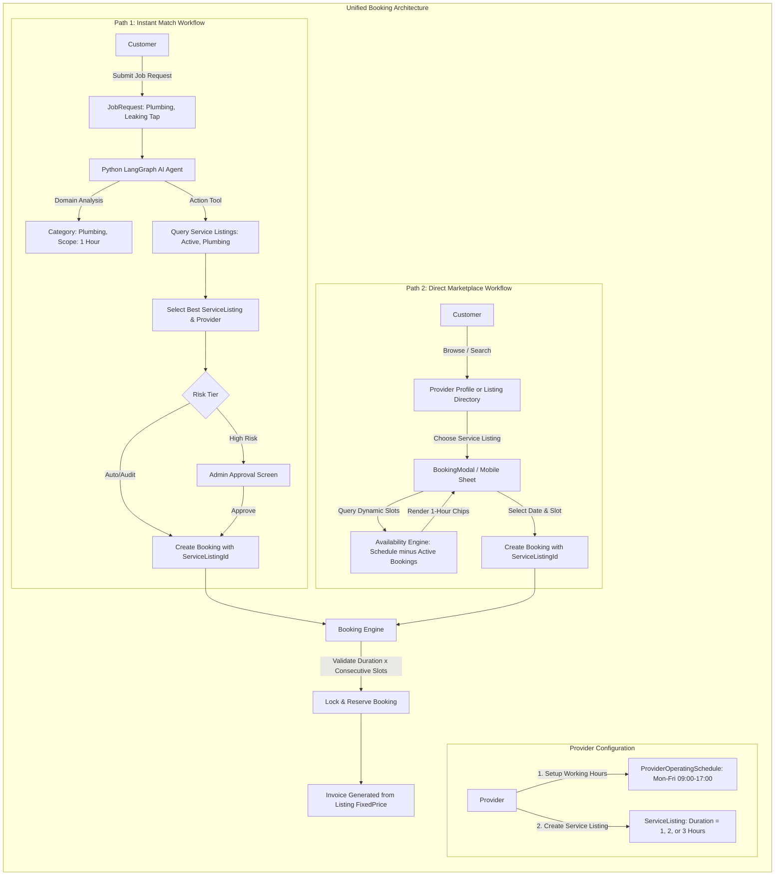
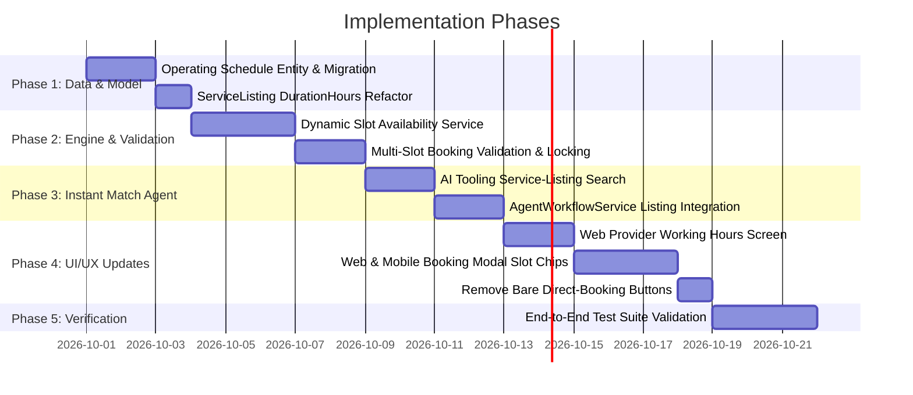

# Research & Implementation Specification: Streamlined Service-Listing Booking & Simplified 1-Hour Slot Engine

**Document Type**: Architectural Research & Implementation Plan  
**Repository**: `MovinduLochana/handee`  
**Target Path**: [`docs/specs/streamlined-service-listing-booking-research.md`](file:///d:/SLIIT/Year%203%20Semester%201/SE3090%20-%20Software%20Engineering%20Frameworks/Assignment/handee/docs/specs/streamlined-service-listing-booking-research.md)  
**Status**: Proposal / Ready for Review  

---

## 1. Executive Summary & Objective

In the current Handee platform, booking flows and scheduling mechanisms have developed across multiple disconnected paths, resulting in customer confusion, provider operational friction, and data integrity challenges:

1. **Dual and Conflicting Booking Paths**:
   - Customers can attempt to book a provider directly through profile screens or request jobs via Instant Match, where bookings are created without any linked `ServiceListing`.
   - On the other hand, a separate Service Listing booking flow exists where customers book a standardized fixed-price service. Direct provider booking without a listing creates ambiguity around scope, deliverables, price, and duration.
2. **Instant Match Disconnected from Service Listings**:
   - The Python LangGraph Domain Agent matches customers to bare provider IDs using generic heuristics rather than matching against the actual, published `ServiceListing` offerings of verified providers.
   - Instant Match creates bookings with `ScheduledAt` hardcoded to `UtcNow.AddDays(1)` and `ServiceListingId = null`, completely bypassing provider slot availability and fixed-price contracts.
3. **Overly Complex Slot Generation & Arbitrary Durations**:
   - The existing availability system requires providers to run a "recurring batch schedule generator" that inserts hundreds of individual physical rows into the `ProviderAvailabilitySlots` database table for every single 1-hour slot over a finite date horizon. If a provider does not generate these rows, their calendar is empty.
   - Service Listings currently allow arbitrary duration strings or minute counts (`TimeSpan EstimatedDuration`, e.g. `00:45:00` or `01:30:00`). When booked against 1-hour availability slots, non-integer durations create slot alignment bugs, partial overlaps, and double-booking vulnerabilities.

### The Desired Streamlined Architecture
- **Unified Entry Point**: All bookings on the platform must be anchored to a concrete `ServiceListing` created by a provider. Direct booking of a provider without a listing is eliminated.
- **Service-Listing-Aware Instant Match**: The AI agent identifies the customer's required service and finds candidate providers based on their published `ServiceListing` offerings, locking the booking and invoice to that listing's fixed price and duration.
- **Declarative Operating Schedule & Dynamic 1-Hour Slots**: Providers define simple operating hours (e.g., Monday–Friday, 09:00 to 17:00) without ever having to generate batches of physical slot records. 1-hour slots are computed dynamically on query by subtracting existing bookings from operating windows.
- **Whole-Hour Service Durations**: Service Listings specify duration in integer hours ($N \in \{1, 2, 3, \dots\}$ hours). A 1-hour service consumes 1 slot; a 2-hour service consumes 2 consecutive slots, validated strictly against daily closing boundaries.

---

## 2. Investigation of Current System (Primary Source Findings)

### 2.1 Entity Model & Database Schema

| Entity | Primary Source File | Key Fields & Observations |
| :--- | :--- | :--- |
| **`Booking`** | [`Booking.cs`](file:///d:/SLIIT/Year%203%20Semester%201/SE3090%20-%20Software%20Engineering%20Frameworks/Assignment/handee/src/backend/handee.API/Entities/Booking.cs) | `Guid? ServiceListingId` (Nullable), `Guid? JobRequestId` (Nullable), `Guid ProviderId`, `Guid CustomerId`, `DateTimeOffset? ScheduledAt`, `BookingStatus Status`. Configured in [`BookingConfiguration.cs`](file:///d:/SLIIT/Year%203%20Semester%201/SE3090%20-%20Software%20Engineering%20Frameworks/Assignment/handee/src/backend/handee.API/Data/Configurations/BookingConfiguration.cs) with `OnDelete: SetNull` for `ServiceListingId`. |
| **`ServiceListing`** | [`ServiceListing.cs`](file:///d:/SLIIT/Year%203%20Semester%201/SE3090%20-%20Software%20Engineering%20Frameworks/Assignment/handee/src/backend/handee.API/Entities/ServiceListing.cs) | `TimeSpan EstimatedDuration`, `decimal FixedPrice`, `string Availability` (informational text), `bool IsActive`. DTOs allow arbitrary `TimeSpan` (e.g. `00:45:00`). |
| **`ProviderAvailabilitySlot`** | [`ProviderAvailabilitySlot.cs`](file:///d:/SLIIT/Year%203%20Semester%201/SE3090%20-%20Software%20Engineering%20Frameworks/Assignment/handee/src/backend/handee.API/Entities/ProviderAvailabilitySlot.cs) | `Guid ProviderId`, `DateTimeOffset StartTime`, `DateTimeOffset EndTime`, `bool IsBooked`. Represents a single physical record per time window. |
| **`JobRequest`** | [`JobRequest.cs`](file:///d:/SLIIT/Year%203%20Semester%201/SE3090%20-%20Software%20Engineering%20Frameworks/Assignment/handee/src/backend/handee.API/Entities/JobRequest.cs) | `ServiceCategoryId`, `Description`, `Location`, `Urgency`, `BudgetMin`, `BudgetMax`, `Status`. Has no slot or schedule fields. |
| **`AgentWorkflow`** | [`AgentWorkflow.cs`](file:///d:/SLIIT/Year%203%20Semester%201/SE3090%20-%20Software%20Engineering%20Frameworks/Assignment/handee/src/backend/handee.API/Entities/AgentWorkflow.cs) | `SelectedProviderId` (`Guid?`), `EstimatedPrice` (`decimal?`), `ValidationTier`, `ApprovalStatus`. Does not reference `ServiceListingId`. |

---

### 2.2 Trace of Existing Booking Workflows



#### Detailed Code Findings:
1. **Direct Booking Flaw**:
   - In [`PublicProviderProfile.tsx`](file:///d:/SLIIT/Year%203%20Semester%201/SE3090%20-%20Software%20Engineering%20Frameworks/Assignment/handee/web/src/pages/public/PublicProviderProfile.tsx#L306-L313), the sidebar button displays "Request Service" and triggers `alert("Booking flow not implemented.")`.
   - In [`public_provider_profile_screen.dart`](file:///d:/SLIIT/Year%203%20Semester%201/SE3090%20-%20Software%20Engineering%20Frameworks/Assignment/handee/app/lib/screens/customer/public_provider_profile_screen.dart#L334-L345), clicking "Book this Pro" simply launches `CreateJobScreen`, rerouting the customer into the generic `JobRequest` workflow.
   - The backend API [`BookingController.cs`](file:///d:/SLIIT/Year%203%20Semester%201/SE3090%20-%20Software%20Engineering%20Frameworks/Assignment/handee/src/backend/handee.API/Controllers/BookingController.cs) only supports `POST /api/bookings` from a `ServiceListingId` (`CreateBookingFromListing`). There is no endpoint for direct provider booking without a listing.

2. **Instant Match Gaps**:
   - In [`dispatch_workflow.py`](file:///d:/SLIIT/Year%203%20Semester%201/SE3090%20-%20Software%20Engineering%20Frameworks/Assignment/handee/agents/src/workflows/dispatch_workflow.py#L119-L157), `action_tool_node` invokes `search_providers(category, location)` from [`action_tools.py`](file:///d:/SLIIT/Year%203%20Semester%201/SE3090%20-%20Software%20Engineering%20Frameworks/Assignment/handee/agents/src/tools/action_tools.py#L123-L215). It searches provider profiles and returns candidate provider user IDs. It does not select a `ServiceListing`.
   - In [`AgentWorkflowService.cs`](file:///d:/SLIIT/Year%203%20Semester%201/SE3090%20-%20Software%20Engineering%20Frameworks/Assignment/handee/src/backend/handee.API/Services/AgentWorkflowService.cs#L112-L121) and lines 283–295, when a match is auto-dispatched or approved by an admin:
     ```csharp
     var booking = new Booking
     {
         JobRequestId = jobRequest.Id,
         CustomerId = jobRequest.CustomerId,
         ProviderId = workflow.SelectedProviderId.Value,
         Status = BookingStatus.Requested,
         ScheduledAt = DateTimeOffset.UtcNow.AddDays(1) // Arbitrary hardcoded timestamp!
     };
     ```
     `booking.ServiceListingId` remains `null`. The booking is disconnected from the provider's actual catalogue, price, and schedule.

3. **Current Availability System Complexity**:
   - In [`ProviderAvailabilityService.cs`](file:///d:/SLIIT/Year%203%20Semester%201/SE3090%20-%20Software%20Engineering%20Frameworks/Assignment/handee/src/backend/handee.API/Services/ProviderAvailabilityService.cs#L104-L145), `CreateRecurringSlotsAsync` takes a start date, end date, days of week, and daily hours, and generates discrete rows in `ProviderAvailabilitySlots`.
   - In [`ProviderAvailability.tsx`](file:///d:/SLIIT/Year%203%20Semester%201/SE3090%20-%20Software%20Engineering%20Frameworks/Assignment/handee/web/src/pages/provider/ProviderAvailability.tsx), providers must open a recurring generator modal and re-generate slots every few weeks. If they fail to do so, customer booking screens display "No slots available".
   - In [`BookingService.cs`](file:///d:/SLIIT/Year%203%20Semester%201/SE3090%20-%20Software%20Engineering%20Frameworks/Assignment/handee/src/backend/handee.API/Services/BookingService.cs#L320-L334), `CreateFromListingAsync` checks if a slot exists for the *start time*, but fails to verify whether subsequent consecutive slots are available if the service exceeds 1 hour.

---

## 3. In-Depth Analysis of Issues & Edge Cases in the Redesign

### Issue 1: Operating Hour Boundaries & Multi-Hour Services
- **Scenario**: A provider works from 09:00 to 17:00 (5:00 PM). A service listing has a duration of 3 hours.
- **Problem**: If the system displays a 15:00 (3:00 PM) slot, the appointment will run from 15:00 to 18:00, exceeding the provider's operating day by 1 hour.
- **Resolution**:
  - The slot generator must only display start hours $H_{start}$ where:
    $$H_{start} + \text{DurationHours} \le \text{DailyEndHour}$$
  - For a 3-hour service on a 09:00–17:00 schedule, the latest available start time is 14:00 (2:00 PM).

### Issue 2: Consecutive Slot Availability vs. Existing Bookings
- **Scenario**: A provider is free from 09:00 to 17:00, but has an existing booking from 11:00 to 12:00. A customer wants to book a 2-hour service.
- **Problem**: 10:00 to 11:00 is technically free, but 10:00 to 12:00 cannot be booked because 11:00–12:00 is taken.
- **Resolution**:
  - Dynamic slot availability must check contiguous blocks:
    A start hour $H$ is valid for an $N$-hour listing if and only if:
    $$\forall i \in \{0, 1, \dots, N-1\}, \quad [H + i, H + i + 1] \text{ does not collide with any active booking.}$$
  - The booking validation in `BookingService` must re-verify this contiguous block inside a database transaction to prevent race conditions.

### Issue 3: Concurrency & Double-Booking Prevention Without Physical Slot Rows
- **Scenario**: In the old system, `ProviderAvailabilitySlot.IsBooked` was updated with a row lock. In a declarative system, there are no individual slot rows to lock prior to booking. Two customers could simultaneously click "Book 10:00 AM" for the same provider.
- **Resolution**:
  - In `BookingService.CreateFromListingAsync`, enforce a transaction with a provider-level lock or serializable collision check:
    ```csharp
    // Check if any conflicting active booking exists within [startTime, endTime)
    var conflict = await _db.Bookings
        .Where(b => b.ProviderId == listing.ProviderId
                    && b.ScheduledAt != null
                    && (b.Status == BookingStatus.Requested
                        || b.Status == BookingStatus.Accepted
                        || b.Status == BookingStatus.InProgress))
        .AnyAsync(b => b.ScheduledAt < requestedEndTime &&
                       requestedStartTime < b.ScheduledAt.Value.Add(b.ServiceListing.EstimatedDuration), ct);
    if (conflict)
        throw new ValidationException("The selected time slot was just booked by another customer.");
    ```
  - On PostgreSQL, an advisory lock on `(ProviderId, Date)` guarantees zero concurrency collisions.

### Issue 4: Instant Match AI Selecting Service Listings
- **Scenario**: A customer submits a Job Request ("Fix leaking sink in kitchen", Colombo).
- **Current Behavior**: AI finds provider Kamal, sets `booking.ServiceListingId = null`, hardcodes `ScheduledAt = Tomorrow`, and guesses a price of Rs. 3,500.
- **New Behavior**:
  1. The AI Agent classifies the category ("Plumbing").
  2. The Action Tool queries active `ServiceListing` records in "Plumbing" offered by verified providers in Colombo.
  3. The Agent selects the best-matching `ServiceListing` (e.g., "Standard Pipe Leak Repair" by Nuwan Silva, Fixed Price: Rs. 3,000, Duration: 1 hour).
  4. The Agent inspects the provider's operating schedule to propose the earliest available 1-hour slot (or sets `BookingStatus.Requested` with a suggested slot for customer/provider confirmation).
  5. The resulting `Booking` references `ServiceListingId` and locks the `Invoice` to the listing's fixed price.

### Issue 5: Providers with Zero Active Service Listings
- **Scenario**: A newly verified provider has not yet created any service listings.
- **Impact**: Under the new rule ("all bookings must go through a service listing"), this provider cannot be booked directly and cannot be matched by Instant Match.
- **Resolution**:
  - Make creating at least one `ServiceListing` a mandatory step in [`ProviderOnboarding.tsx`](file:///d:/SLIIT/Year%203%20Semester%201/SE3090%20-%20Software%20Engineering%20Frameworks/Assignment/handee/web/src/pages/provider/ProviderOnboarding.tsx).
  - On the public provider profile, if a provider has no active listings, display an informative state: "This provider has not listed any bookable services yet."
  - Filter candidate queries in Instant Match to providers who have at least one active listing in the target category.

### Issue 6: Historical Data Migration
- **Scenario**: Existing database records have `Booking.ServiceListingId = null` from earlier testing or legacy JobRequests.
- **Resolution**:
  - Keep `ServiceListingId` in the database schema nullable at the database column level (`Guid?`) to prevent breaking existing rows, but enforce `ServiceListingId != null` at the application/API layer for all new bookings.
  - Or run a migration that backfills a default "Custom Job Service" listing for each provider and associates orphaned bookings.

---

## 4. Target Architecture & Design



---

## 5. Detailed Implementation Blueprint

### 5.1 Step 1: Database & Entity Changes

#### 1. Add `ProviderOperatingSchedule` Entity
Create [`src/backend/handee.API/Entities/ProviderOperatingSchedule.cs`](file:///d:/SLIIT/Year%203%20Semester%201/SE3090%20-%20Software%20Engineering%20Frameworks/Assignment/handee/src/backend/handee.API/Entities/ProviderOperatingSchedule.cs):
```csharp
namespace handee.API.Entities;

public class ProviderOperatingSchedule
{
    public Guid Id { get; set; } = Guid.NewGuid();
    public Guid ProviderId { get; set; }
    
    // DayOfWeek: 0 = Sunday, 1 = Monday, ..., 6 = Saturday
    public DayOfWeek DayOfWeek { get; set; }
    
    // Operating hours (e.g. 09:00:00 to 17:00:00)
    public TimeSpan StartTime { get; set; } = new TimeSpan(9, 0, 0);
    public TimeSpan EndTime { get; set; } = new TimeSpan(17, 0, 0);
    
    public bool IsActive { get; set; } = true;
    
    public DateTimeOffset CreatedAt { get; set; } = DateTimeOffset.UtcNow;
    public DateTimeOffset? UpdatedAt { get; set; }

    public ApplicationUser Provider { get; set; } = default!;
}
```

#### 2. Update `ServiceListing` for Integer Hours
In [`src/backend/handee.API/Entities/ServiceListing.cs`](file:///d:/SLIIT/Year%203%20Semester%201/SE3090%20-%20Software%20Engineering%20Frameworks/Assignment/handee/src/backend/handee.API/Entities/ServiceListing.cs):
```csharp
// Add DurationHours (integer hours: 1, 2, 3, etc.)
public int DurationHours { get; set; } = 1;

// Keep EstimatedDuration as a computed helper or alias:
public TimeSpan EstimatedDuration 
{ 
    get => TimeSpan.FromHours(DurationHours > 0 ? DurationHours : 1);
    set => DurationHours = Math.Max(1, (int)Math.Round(value.TotalHours));
}
```

#### 3. Update `CreateServiceListingDto` & `UpdateServiceListingDto`
In [`src/backend/handee.API/DTO/ServiceListing/CreateServiceListingDto.cs`](file:///d:/SLIIT/Year%203%20Semester%201/SE3090%20-%20Software%20Engineering%20Frameworks/Assignment/handee/src/backend/handee.API/DTO/ServiceListing/CreateServiceListingDto.cs):
```csharp
[Required]
[Range(1, 12, ErrorMessage = "Service duration must be between 1 and 12 whole hours.")]
public int DurationHours { get; set; } = 1;
```

---

### 5.2 Step 2: Dynamic Availability & Slot Calculation Engine

Replace batch slot generation with on-the-fly dynamic slot projection in [`ProviderAvailabilityService.cs`](file:///d:/SLIIT/Year%203%20Semester%201/SE3090%20-%20Software%20Engineering%20Frameworks/Assignment/handee/src/backend/handee.API/Services/ProviderAvailabilityService.cs):

```csharp
public async Task<List<AvailableSlotDto>> GetAvailableSlotsAsync(
    Guid providerId,
    DateTimeOffset startDate,
    DateTimeOffset endDate,
    int durationHours = 1,
    CancellationToken ct = default)
{
    // 1. Fetch provider's weekly operating schedule
    var schedules = await _db.ProviderOperatingSchedules
        .Where(s => s.ProviderId == providerId && s.IsActive)
        .ToListAsync(ct);

    // If provider has not configured custom schedule, fallback to standard default (Mon-Fri, 9am-5pm)
    if (!schedules.Any())
    {
        schedules = DefaultWeekdaySchedule(providerId);
    }

    var scheduleByDay = schedules.ToDictionary(s => s.DayOfWeek);

    // 2. Fetch existing active bookings for this provider in the date range
    var activeBookings = await _db.Bookings
        .Include(b => b.ServiceListing)
        .Where(b => b.ProviderId == providerId
                    && b.ScheduledAt != null
                    && b.ScheduledAt < endDate
                    && b.ScheduledAt.Value.AddHours(b.ServiceListing != null ? b.ServiceListing.DurationHours : 1) > startDate
                    && (b.Status == BookingStatus.Requested || b.Status == BookingStatus.Accepted || b.Status == BookingStatus.InProgress))
        .Select(b => new {
            Start = b.ScheduledAt!.Value,
            End = b.ScheduledAt.Value.AddHours(b.ServiceListing != null ? b.ServiceListing.DurationHours : 1)
        })
        .ToListAsync(ct);

    var availableSlots = new List<AvailableSlotDto>();
    var currentDay = startDate.Date;
    var nowUtc = DateTimeOffset.UtcNow;

    // 3. Iterate day-by-day and generate 1-hour slots
    while (currentDay <= endDate.Date)
    {
        if (scheduleByDay.TryGetValue(currentDay.DayOfWeek, out var daySchedule))
        {
            var dayStartHour = daySchedule.StartTime.Hours;
            var dayEndHour = daySchedule.EndTime.Hours;

            // Maximum start hour must accommodate durationHours
            for (int h = dayStartHour; h + durationHours <= dayEndHour; h++)
            {
                var slotStart = new DateTimeOffset(currentDay.Year, currentDay.Month, currentDay.Day, h, 0, 0, TimeSpan.Zero);
                var slotEnd = slotStart.AddHours(durationHours);

                // Slot must be in the future
                if (slotStart <= nowUtc)
                    continue;

                // Check collision against active bookings across all required hours
                var hasConflict = activeBookings.Any(b => b.Start < slotEnd && slotStart < b.End);

                if (!hasConflict)
                {
                    availableSlots.Add(new AvailableSlotDto
                    {
                        StartTime = slotStart,
                        EndTime = slotEnd,
                        DurationHours = durationHours,
                        IsAvailable = true
                    });
                }
            }
        }
        currentDay = currentDay.AddDays(1);
    }

    return availableSlots;
}
```

---

### 5.3 Step 3: Hardened Booking Service Validation

In [`BookingService.cs`](file:///d:/SLIIT/Year%203%20Semester%201/SE3090%20-%20Software%20Engineering%20Frameworks/Assignment/handee/src/backend/handee.API/Services/BookingService.cs#L300-L380):

1. **Verify `ServiceListingId` is mandatory**:
   ```csharp
   var listing = await _db.ServiceListings
       .Include(l => l.Provider)
       .FirstOrDefaultAsync(l => l.Id == dto.ServiceListingId, ct)
       ?? throw new NotFoundException("Service listing not found.");
   ```
2. **Validate Whole-Hour Slot Alignment**:
   ```csharp
   if (dto.ScheduledAt.Minute != 0 || dto.ScheduledAt.Second != 0)
   {
       throw new ValidationException("Appointments must be booked on the hour (e.g. 10:00, 11:00).");
   }

   var duration = TimeSpan.FromHours(listing.DurationHours > 0 ? listing.DurationHours : 1);
   var startTime = dto.ScheduledAt.ToUniversalTime();
   var endTime = startTime.Add(duration);
   ```
3. **Verify Operating Hours & Collision**:
   ```csharp
   var schedule = await _db.ProviderOperatingSchedules
       .FirstOrDefaultAsync(s => s.ProviderId == listing.ProviderId && s.DayOfWeek == startTime.DayOfWeek && s.IsActive, ct);

   var opStart = schedule?.StartTime ?? new TimeSpan(9, 0, 0);
   var opEnd = schedule?.EndTime ?? new TimeSpan(17, 0, 0);

   if (startTime.TimeOfDay < opStart || endTime.TimeOfDay > opEnd)
   {
       throw new ValidationException($"Appointment ({listing.DurationHours} hours) exceeds provider working hours ({opStart:hh\\:mm} - {opEnd:hh\\:mm}).");
   }

   var hasConflict = await _db.Bookings
       .Include(b => b.ServiceListing)
       .Where(b => b.ProviderId == listing.ProviderId
                   && b.ScheduledAt != null
                   && (b.Status == BookingStatus.Requested
                       || b.Status == BookingStatus.Accepted
                       || b.Status == BookingStatus.InProgress))
       .AnyAsync(b => b.ScheduledAt < endTime &&
                      startTime < b.ScheduledAt.Value.AddHours(b.ServiceListing != null ? b.ServiceListing.DurationHours : 1), ct);

   if (hasConflict)
       throw new ValidationException("One or more required hourly slots are already booked by another customer.");
   ```

---

### 5.4 Step 4: Python Instant Match AI Agent Upgrades

In [`agents/src/tools/action_tools.py`](file:///d:/SLIIT/Year%203%20Semester%201/SE3090%20-%20Software%20Engineering%20Frameworks/Assignment/handee/agents/src/tools/action_tools.py):
1. Add `search_matching_service_listings(category: str, location: str)`:
   - Queries `GET /api/service-listings?query={category}`.
   - Filters active listings whose providers are verified in the customer's area.
   - Returns candidates with `listing_id`, `provider_id`, `fixed_price`, `duration_hours`.
2. In [`dispatch_workflow.py`](file:///d:/SLIIT/Year%203%20Semester%201/SE3090%20-%20Software%20Engineering%20Frameworks/Assignment/handee/agents/src/workflows/dispatch_workflow.py):
   - In `action_tool_node`: Match the best `ServiceListing`. Set:
     ```python
     selected_listing_id = matched_listing["id"]
     selected_provider_id = matched_listing["providerId"]
     estimated_price = matched_listing["fixedPrice"]
     duration_hours = matched_listing.get("durationHours", 1)
     ```
   - In `AgentWorkflowService.cs`:
     When creating the booking for an Instant Match job:
     ```csharp
     var booking = new Booking
     {
         JobRequestId = jobRequest.Id,
         ServiceListingId = workflow.SelectedServiceListingId.Value,
         ProviderId = workflow.SelectedProviderId.Value,
         CustomerId = jobRequest.CustomerId,
         Status = BookingStatus.Requested,
         ScheduledAt = proposedSlotTime
     };
     ```

---

### 5.5 Step 5: Frontend Web & Mobile UI Refinements

1. **Provider Availability Screen** ([`ProviderAvailability.tsx`](file:///d:/SLIIT/Year%203%20Semester%201/SE3090%20-%20Software%20Engineering%20Frameworks/Assignment/handee/web/src/pages/provider/ProviderAvailability.tsx)):
   - Remove "Generate Recurring Schedule" modal and individual slot row deletions.
   - Replace with a simple **Weekly Operating Hours** card:
     - Toggles for Monday through Sunday.
     - Start Time (e.g. 09:00) and End Time (e.g. 17:00) per active day.
     - Single "Save Working Hours" button calling `PUT /api/provider-availability/schedule`.

2. **Provider Service Listing Creation** ([`ServiceListingForm.tsx`](file:///d:/SLIIT/Year%203%20Semester%201/SE3090%20-%20Software%20Engineering%20Frameworks/Assignment/handee/web/src/components/provider/ServiceListingForm.tsx)):
   - Replace the arbitrary `HH:MM:SS` text input with an **Estimated Duration (Hours)** dropdown or counter:
     - Options: `1 Hour (1 Slot)`, `2 Hours (2 Slots)`, `3 Hours (3 Slots)`, `4 Hours (4 Slots)`, etc.

3. **Customer Public Provider Profile** ([`PublicProviderProfile.tsx`](file:///d:/SLIIT/Year%203%20Semester%201/SE3090%20-%20Software%20Engineering%20Frameworks/Assignment/handee/web/src/pages/public/PublicProviderProfile.tsx) & Flutter [`public_provider_profile_screen.dart`](file:///d:/SLIIT/Year%203%20Semester%201/SE3090%20-%20Software%20Engineering%20Frameworks/Assignment/handee/app/lib/screens/customer/public_provider_profile_screen.dart)):
   - Remove the detached "Request Service / Book this Pro" button.
   - Replace with a smooth-scroll button labeled "Browse & Book Services":
     `onClick={() => listingsSectionRef.current?.scrollIntoView({ behavior: 'smooth' })}`.
   - Each Service Listing Card has the clear, unambiguous "Book Service" button.

4. **Customer Booking Modal** ([`BookingModal.tsx`](file:///d:/SLIIT/Year%203%20Semester%201/SE3090%20-%20Software%20Engineering%20Frameworks/Assignment/handee/web/src/components/public/BookingModal.tsx)):
   - Receives the listing's `durationHours`.
   - Queries `GET /api/provider-availability/{providerId}?durationHours={listing.durationHours}&date={selectedDate}`.
   - Renders available 1-hour start chips (e.g. `[09:00 AM, 10:00 AM, 01:00 PM, 02:00 PM]`).
   - If a 2-hour service is chosen and the customer selects 10:00 AM, the UI clearly shows: `Window: 10:00 AM - 12:00 PM (2 Slots Reserved)`.

---

## 6. Implementation Roadmap & Verification Plan



### Verification Checklist
- [ ] **Unit Tests**:
  - Test dynamic slot engine with empty schedule, custom schedule, and collision against 1-hour and 2-hour active bookings.
  - Test boundary rejection (e.g., 2-hour job starting 1 hour before daily end time).
  - Test rejection of non-integer minutes (`10:15 AM`).
- [ ] **Integration Tests**:
  - `POST /api/bookings` with valid listing, available consecutive slots $\to$ 201 Created and atomic Invoice draft.
  - Concurrent booking simulation: two requests for the exact same slot $\to$ one succeeds with 201, second receives 400 Bad Request ("Slot already booked").
- [ ] **AI Agent Tests**:
  - Instant Match job request generates candidate matching `ServiceListingId` rather than bare provider user ID.
  - Dispatch workflow sets `booking.ServiceListingId` and locks price to listing fixed price.
- [ ] **E2E UI Tests**:
  - Web provider sets hours (9 AM - 5 PM) without running batch generation.
  - Customer views profile, clicks "Book" on a 2-hour listing, selects 10:00 AM, and confirms booking.
  - Profile page confirms that bare "Book this Pro" buttons are eliminated in favor of direct listing booking.
