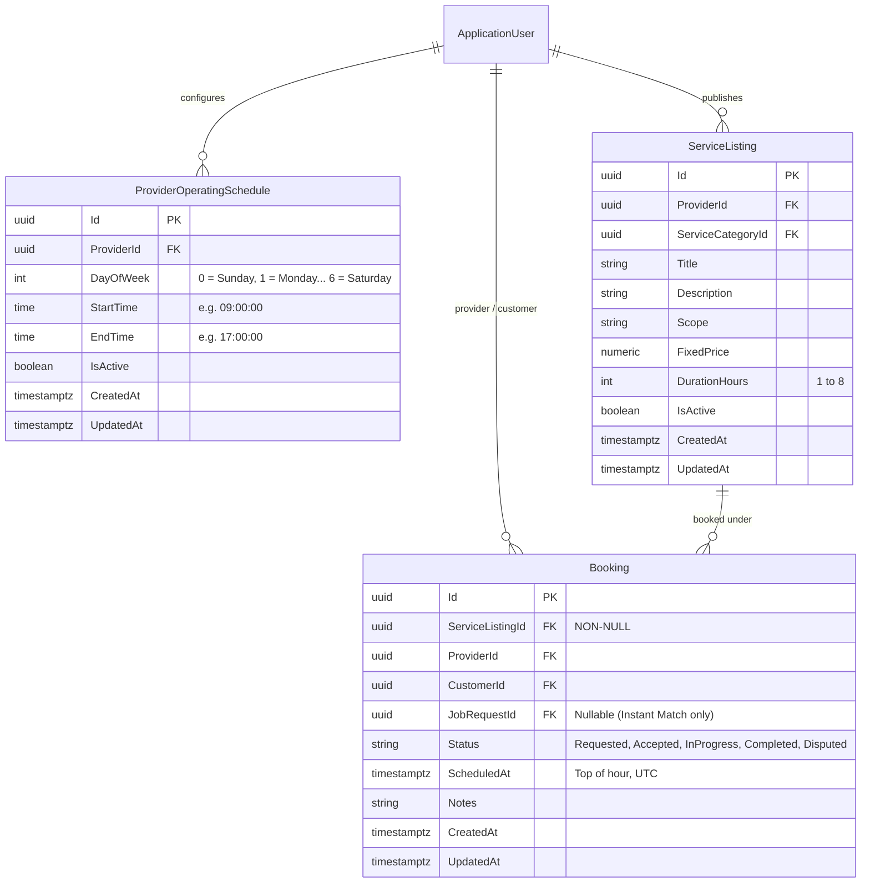

# Technical Research & Architecture Specification: Zero-Backward-Compatibility Time Slot & Availability System

**Document Target Path**: `docs/specs/time-slot-availability-zero-compat-optimization.md`  
**Date**: September 30, 2026  
**Investigation Scope**: Full Repository (`src/backend/handee.API`, `src/backend/handee.Tests`, `app/`, `web/`, `agents/`, `src/backend/handee.API/Data/Migrations/`)  
**Status**: Completed Architectural Investigation & Optimization Blueprint  

---

## 1. Executive Summary

The Handee platform previously operated on a dual-system scheduling model:
1. A **legacy discrete physical slot table** (`ProviderAvailabilitySlots`), where providers had to manually or periodically generate hundreds of database rows (`StartTime`, `EndTime`, `IsBooked`).
2. A **modern declarative schedule + dynamic predefined slot engine** (`ProviderOperatingSchedules` + `Bookings`), where providers simply declare their weekly operating hours (e.g., Monday–Friday 09:00–17:00) and customer-facing clients dynamically calculate bookable 1-hour predefined slots on the fly by subtracting active bookings.

Because the project is actively in development and all customer booking functionality is consolidated into the Flutter mobile application, **all backward-compatibility considerations can and should be completely eliminated**. 

This research report documents every piece of legacy baggage, dead table, duplicate property, redundant endpoint, and orphaned component across all four sub-projects, and specifies a single-source-of-truth, highly optimized scheduling architecture.

---

## 2. Exhaustive Audit of Backward-Compatibility Baggage & Legacy Artifacts

### 2.1 Backend (`src/backend/handee.API`)

#### A. Redundant Physical Slot Table vs Declarative Schedule
- **Primary Source Citations**:
  - [`src/backend/handee.API/Entities/ProviderAvailabilitySlot.cs` (lines 1–36)](file:///d:/SLIIT/Year%203%20Semester%201/SE3090%20-%20Software%20Engineering%20Frameworks/Assignment/handee/src/backend/handee.API/Entities/ProviderAvailabilitySlot.cs#L1-L36)
  - [`src/backend/handee.API/Entities/ProviderOperatingSchedule.cs` (lines 1–16)](file:///d:/SLIIT/Year%203%20Semester%201/SE3090%20-%20Software%20Engineering%20Frameworks/Assignment/handee/src/backend/handee.API/Entities/ProviderOperatingSchedule.cs#L1-L16)
  - [`src/backend/handee.API/Data/AppDbContext.cs` (line 21)](file:///d:/SLIIT/Year%203%20Semester%201/SE3090%20-%20Software%20Engineering%20Frameworks/Assignment/handee/src/backend/handee.API/Data/AppDbContext.cs#L21)
- **Findings**:
  - The `ProviderAvailabilitySlot` entity and database table `ProviderAvailabilitySlots` are completely redundant. Predefined slots are calculated on demand in `ProviderAvailabilityService.GetPredefinedSlotsForDateAsync` (lines 326–416) purely from `ProviderOperatingSchedules` and active `Bookings`.
  - Maintaining physical slot rows creates severe data desynchronization bugs:
    - In `BookingService.CreateFromListingAsync` (lines 397–416), matching slots are mutated to `IsBooked = true`.
    - In `BookingService.UpdateScheduleAsync` (rescheduling, lines 254–279) and `BookingService.UpdateStatusAsync` (cancellation/dispute, lines 189–252), `ProviderAvailabilitySlot.IsBooked` is **never updated or released**. Cancelled or rescheduled bookings leave old slots permanently marked as `IsBooked = true`.
    - If a provider never generated physical slots, legacy queries returned zero availability even when the provider was fully operating.

#### B. Booking Entity & Dual Conflict Checking
- **Primary Source Citations**:
  - [`src/backend/handee.API/Entities/Booking.cs` (lines 12–53)](file:///d:/SLIIT/Year%203%20Semester%201/SE3090%20-%20Software%20Engineering%20Frameworks/Assignment/handee/src/backend/handee.API/Entities/Booking.cs#L12-L53)
  - [`src/backend/handee.API/Services/BookingService.cs` (lines 355–416)](file:///d:/SLIIT/Year%203%20Semester%201/SE3090%20-%20Software%20Engineering%20Frameworks/Assignment/handee/src/backend/handee.API/Services/BookingService.cs#L355-L416)
- **Findings**:
  - `Booking.cs` does not have an `AvailabilitySlotId` foreign key. It links directly to `ServiceListingId` (Guid?), `ProviderId` (Guid), `CustomerId` (Guid), and has `ScheduledAt` (DateTimeOffset?).
  - In `BookingService.CreateFromListingAsync`:
    - Lines 356–373: Checks if the provider has *any* rows in `ProviderAvailabilitySlots`. If yes, it requires a matching physical slot. If no, it skips this check.
    - Lines 376–394: Queries `_db.Bookings` for active statuses (`Requested`, `Accepted`, `InProgress`) overlapping `[startTime, endTime)`.
    - Lines 397–416: Mutates matching `ProviderAvailabilitySlot.IsBooked = true`.
  - In `BookingService.UpdateScheduleAsync` (lines 254–279): Rescheduling directly assigns `booking.ScheduledAt = dto.ScheduledAt` without validating top-of-hour alignment, provider operating hours, or active booking collisions.

#### C. ServiceListing: Dual Durations & Free-Text Availability Field
- **Primary Source Citations**:
  - [`src/backend/handee.API/Entities/ServiceListing.cs` (lines 11–18)](file:///d:/SLIIT/Year%203%20Semester%201/SE3090%20-%20Software%20Engineering%20Frameworks/Assignment/handee/src/backend/handee.API/Entities/ServiceListing.cs#L11-L18)
  - [`src/backend/handee.API/DTO/ServiceListing/CreateServiceListingDto.cs` (lines 22–36)](file:///d:/SLIIT/Year%203%20Semester%201/SE3090%20-%20Software%20Engineering%20Frameworks/Assignment/handee/src/backend/handee.API/DTO/ServiceListing/CreateServiceListingDto.cs#L22-L36)
  - [`src/backend/handee.API/DTO/ServiceListing/UpdateServiceListingDto.cs` (lines 23–36)](file:///d:/SLIIT/Year%203%20Semester%201/SE3090%20-%20Software%20Engineering%20Frameworks/Assignment/handee/src/backend/handee.API/DTO/ServiceListing/UpdateServiceListingDto.cs#L23-L36)
  - [`src/backend/handee.API/DTO/ServiceListing/ServiceListingResponseDto.cs` (lines 11–14)](file:///d:/SLIIT/Year%203%20Semester%201/SE3090%20-%20Software%20Engineering%20Frameworks/Assignment/handee/src/backend/handee.API/DTO/ServiceListing/ServiceListingResponseDto.cs#L11-L14)
- **Findings**:
  - `ServiceListing` contains both `int DurationHours` and an unmapped/computed `TimeSpan EstimatedDuration` bridging to legacy clients:
    ```csharp
    public int DurationHours { get; set; } = 1;
    public TimeSpan EstimatedDuration
    {
        get => TimeSpan.FromHours(DurationHours > 0 ? DurationHours : 1);
        set => DurationHours = Math.Max(1, (int)Math.Round(value.TotalHours));
    }
    ```
  - `Availability` (e.g., `"Available"`, `"Mon-Fri"`) is a dead legacy free-text field that plays no functional role in the declarative scheduling engine.

#### D. Legacy Controller Endpoints & Service Methods
- **Primary Source Citations**:
  - [`src/backend/handee.API/Controllers/ProviderAvailabilityController.cs` (lines 11–168)](file:///d:/SLIIT/Year%203%20Semester%201/SE3090%20-%20Software%20Engineering%20Frameworks/Assignment/handee/src/backend/handee.API/Controllers/ProviderAvailabilityController.cs#L11-L168)
  - [`src/backend/handee.API/Services/ProviderAvailabilityService.cs` (lines 19–249)](file:///d:/SLIIT/Year%203%20Semester%201/SE3090%20-%20Software%20Engineering%20Frameworks/Assignment/handee/src/backend/handee.API/Services/ProviderAvailabilityService.cs#L19-L249)
- **Legacy Endpoints to Eliminate**:
  1. `POST /api/provider-availability` (`CreateSlotAsync`): Single slot creation.
  2. `POST /api/provider-availability/batch` (`CreateBatchSlotsAsync`): Batch slot creation.
  3. `POST /api/provider-availability/recurring` (`CreateRecurringSlotsAsync`): Recurring slot generation across date ranges.
  4. `GET /api/provider-availability/{providerId}` (`GetForProviderAsync`): Reads rows from `ProviderAvailabilitySlots`.
  5. `GET /provider-availability/mine` (`GetOwnAsync`): Reads rows for current provider.
  6. `DELETE /provider-availability/{id}` (`DeleteSlotAsync`): Physical slot deletion.
  7. Redundant legacy route attribute: `[Route("provider-availability")]` on controller class.
- **Legacy DTOs to Delete**:
  - `src/backend/handee.API/DTO/CreateSlotDto.cs`
  - `src/backend/handee.API/DTO/BatchCreateSlotsDto.cs`
  - `src/backend/handee.API/DTO/RecurringScheduleDto.cs`
  - `src/backend/handee.API/DTO/SlotResponseDto.cs`

---

### 2.2 Frontend Flutter Mobile App (`app/`)

- **Primary Source Citations**:
  - [`app/lib/widgets/provider_availability_slot_picker.dart` (lines 1–178)](file:///d:/SLIIT/Year%203%20Semester%201/SE3090%20-%20Software%20Engineering%20Frameworks/Assignment/handee/app/lib/widgets/provider_availability_slot_picker.dart#L1-L178)
  - `app/lib/data/models/provider_availability_slot_model.dart`
  - [`app/lib/data/repositories/provider_availability_repository.dart` (lines 12–39)](file:///d:/SLIIT/Year%203%20Semester%201/SE3090%20-%20Software%20Engineering%20Frameworks/Assignment/handee/app/lib/data/repositories/provider_availability_repository.dart#L12-L39)
  - [`app/lib/core/constants/api_endpoints.dart` (line 63)](file:///d:/SLIIT/Year%203%20Semester%201/SE3090%20-%20Software%20Engineering%20Frameworks/Assignment/handee/app/lib/core/constants/api_endpoints.dart#L63)
  - [`app/lib/data/models/service_listing_model.dart` (lines 33–44)](file:///d:/SLIIT/Year%203%20Semester%201/SE3090%20-%20Software%20Engineering%20Frameworks/Assignment/handee/app/lib/data/models/service_listing_model.dart#L33-L44)
- **Findings**:
  - `ProviderAvailabilitySlotPicker` and `ProviderAvailabilitySlotModel` are dead/orphaned code. `service_listing_details_screen.dart` uses `PredefinedSlotPicker` and `predefined_slot_model.dart`.
  - `ProviderAvailabilityRepository.getForProvider` calls the legacy `/api/provider-availability/$providerId` endpoint and is unreferenced by active screens.
  - `ServiceListingModel.fromJson` still contains fallback parsing code that splits `estimatedDuration` strings (`"01:00:00"`) when `durationHours` is missing.

---

### 2.3 Web Portal (`web/`)

- **Primary Source Citations**:
  - [`web/src/api/providerAvailability.ts` (lines 16–74)](file:///d:/SLIIT/Year%203%20Semester%201/SE3090%20-%20Software%20Engineering%20Frameworks/Assignment/handee/web/src/api/providerAvailability.ts#L16-L74)
  - [`web/src/api/types.ts` (lines 327–358)](file:///d:/SLIIT/Year%203%20Semester%201/SE3090%20-%20Software%20Engineering%20Frameworks/Assignment/handee/web/src/api/types.ts#L327-L358)
  - [`web/src/pages/provider/ProviderOnboarding.tsx` (lines 202–204)](file:///d:/SLIIT/Year%203%20Semester%201/SE3090%20-%20Software%20Engineering%20Frameworks/Assignment/handee/web/src/pages/provider/ProviderOnboarding.tsx#L202-L204)
  - [`web/src/components/provider/ServiceListingForm.tsx` (lines 93–96)](file:///d:/SLIIT/Year%203%20Semester%201/SE3090%20-%20Software%20Engineering%20Frameworks/Assignment/handee/web/src/components/provider/ServiceListingForm.tsx#L93-L96)
- **Findings**:
  - `web/src/api/providerAvailability.ts` exposes 6 dead methods (`getForProvider`, `getMine`, `create`, `createBatch`, `createRecurring`, `delete`) that are not used anywhere in the web app.
  - `web/src/api/types.ts` contains 4 dead interfaces (`ProviderAvailabilitySlotDto`, `CreateSlotDto`, `BatchCreateSlotsDto`, `RecurringScheduleDto`).
  - Forms continue to submit redundant fields: `availability: "Available"` and `estimatedDuration: "01:00:00"`.

---

### 2.4 AI Agents (`agents/`)

- **Primary Source Citations**:
  - `agents/src/tools/action_tools.py` (lines 440, 457, 468)
  - `agents/src/workflows/dispatch_workflow.py` (lines 127–129, 169–173, 198–200)
  - [`src/backend/handee.API/Services/AgentWorkflowService.cs` (lines 608–630)](file:///d:/SLIIT/Year%203%20Semester%201/SE3090%20-%20Software%20Engineering%20Frameworks/Assignment/handee/src/backend/handee.API/Services/AgentWorkflowService.cs#L608-L630)
- **Findings**:
  - The Python dispatch agent already reads `durationHours = int(item.get("durationHours", 1))` and matches service listings directly.
  - The backend `AgentWorkflowService.FindNextAvailableSlotAsync` already calls `GetPredefinedSlotsForDateAsync` over the next 7 days to pick the first available top-of-hour slot.
  - The AI Agent system requires no legacy migration; it is already fully aligned with the service-listing and dynamic predefined slot model.

---

## 3. Zero-Backward-Compatibility Architecture Design

### 3.1 Data Schema



#### Entity Framework Core Configurations:
1. **Drop `ProviderAvailabilitySlot` Entity & Table**:
   - Delete `src/backend/handee.API/Entities/ProviderAvailabilitySlot.cs`.
   - Remove `DbSet<ProviderAvailabilitySlot>` from `AppDbContext.cs`.
   - Delete `ProviderAvailabilitySlotConfiguration.cs`.
2. **`ProviderOperatingScheduleConfiguration`**:
   - Enforce composite unique index on `(ProviderId, DayOfWeek)`:
     ```csharp
     builder.HasIndex(s => new { s.ProviderId, s.DayOfWeek }).IsUnique();
     ```
3. **`BookingConfiguration`**:
   - Composite index for high-speed collision checks:
     ```csharp
     builder.HasIndex(b => new { b.ProviderId, b.ScheduledAt, b.Status });
     builder.Property(b => b.ServiceListingId).IsRequired();
     ```
4. **`ServiceListingConfiguration`**:
   - Remove `Availability` and `EstimatedDuration`.
   - Enforce check constraint: `DurationHours >= 1 AND DurationHours <= 8`.

---

### 3.2 Canonical API Surface

| Endpoint | Method | Auth | Description | Parameters / Payload | Response |
| :--- | :---: | :---: | :--- | :--- | :--- |
| `/api/provider-availability/slots` | `GET` | Public | Dynamic 1-hour predefined slots | `?providerId={guid}&date={yyyy-MM-dd}&durationHours={1..8}` | `DailySlotsResponseDto` |
| `/api/provider-availability/{providerId}/schedule` | `GET` | Public | Provider's weekly schedule | `providerId` (route) | `ProviderOperatingScheduleDto` |
| `/api/provider-availability/schedule` | `PUT` | Provider | Update weekly schedule | `UpdateOperatingScheduleDto` | `ProviderOperatingScheduleDto` |
| `/bookings` | `POST` | Customer | Create booking from listing | `CreateListingBookingDto` | `BookingResponseDto` |
| `/bookings/{id}/schedule` | `PUT` | Customer / Provider | Reschedule booking with collision validation | `UpdateBookingScheduleDto` | `BookingResponseDto` |

---

### 3.3 Dynamic Slot & Conflict Resolution Algorithm

#### Mathematical Specification:
Let target date $D \in \text{DateOnly}$, requested service duration $N \in \{1, \dots, 8\}$.
1. **Operating Hours Determination**:
   - Query `ProviderOperatingSchedules` for `(ProviderId, D.DayOfWeek)`.
   - If present and `IsActive = true`: working range is $[S, E)$ where $S = \text{schedule.StartTime.Hours}$, $E = \text{schedule.EndTime.Hours}$.
   - If not configured: apply default weekday operating hours: Monday through Friday, $[9, 17)$.
   - If `IsActive = false` or $S \ge E$: return `IsWorkingDay = false`, empty slot list.
2. **Active Bookings Query**:
   - Query window: $D\text{T}00:00:00\text{Z}$ to $(D + 1)\text{T}00:00:00\text{Z}$.
   - Active statuses: $\mathcal{S}_{active} = \{\text{Requested}, \text{Accepted}, \text{InProgress}\}$.
   - Active booking intervals: $\mathcal{B} = \{[b.\text{ScheduledAt}, b.\text{ScheduledAt} + b.\text{DurationHours}) \mid b.\text{Status} \in \mathcal{S}_{active}\}$.
3. **Slot Projection ($O(1)$ Memory & Time)**:
   For each integer hour $h \in [S, E)$:
   - Candidate window: $W_h = [T_h, T_h + N)$ where $T_h = \text{DateTimeOffset}(D.\text{Year}, D.\text{Month}, D.\text{Day}, h, 0, 0, \text{UTC})$.
   - Boundary Check: If $h + N > E \implies \text{IsAvailable} = \text{false}$, $\text{Reason} = \text{"InsufficientTime"}$.
   - Past Time Check: If $T_h \le \text{UtcNow} \implies \text{IsAvailable} = \text{false}$, $\text{Reason} = \text{"Past"}$.
   - Collision Check:
     $$\text{Collision}(W_h) = \exists [B_{start}, B_{end}) \in \mathcal{B} : \max(T_h, B_{start}) < \min(T_h + N, B_{end})$$
     If collision exists: $\text{IsAvailable} = \text{false}$, $\text{Reason} = \text{"Booked"}$.
   - Otherwise: $\text{IsAvailable} = \text{true}$, $\text{Reason} = \text{null}$.
4. **Concurrency & Race Condition Prevention**:
   - When creating or rescheduling a booking: execute within a database transaction with `IsolationLevel.Serializable` or acquire PostgreSQL transaction advisory lock:
     `SELECT pg_advisory_xact_lock(hashtext(:providerId || :dateStr))`
   - Verify collision check immediately prior to insert/update.

---

## 4. Transition & Refactoring Blueprint

### Phase 1: Database & Migrations
1. Add migration `DropLegacyAvailabilitySlotsAndOptimize`:
   - Drop table `ProviderAvailabilitySlots`.
   - Drop column `Availability` from `ServiceListings`.
   - Add unique index `IX_ProviderOperatingSchedules_ProviderId_DayOfWeek`.
   - Add composite index `IX_Bookings_ProviderId_ScheduledAt_Status`.
2. Update `AppDbContext.cs` to remove `ProviderAvailabilitySlots`. Delete `ProviderAvailabilitySlotConfiguration.cs`.

### Phase 2: Backend Cleanliness & Rescheduling Hardening
1. In `ProviderAvailabilityService.cs`:
   - Delete all legacy slot methods (`CreateSlotAsync`, `CreateBatchSlotsAsync`, `CreateRecurringSlotsAsync`, `GetForProviderAsync`, `GetOwnAsync`, `DeleteSlotAsync`).
   - Retain only: `GetOperatingScheduleAsync`, `UpdateOperatingScheduleAsync`, `GetPredefinedSlotsForDateAsync`.
2. In `ProviderAvailabilityController.cs`:
   - Remove legacy action routes (`POST`, `POST batch`, `POST recurring`, `GET {providerId}`, `GET mine`, `DELETE {id}`).
   - Retain: `GET slots`, `GET {providerId}/schedule`, `PUT schedule`.
   - Remove duplicate route attribute `[Route("provider-availability")]`.
3. In `BookingService.cs`:
   - Strip all references to `_db.ProviderAvailabilitySlots`.
   - Enhance `UpdateScheduleAsync` to validate top-of-hour alignment, provider operating hours, and active booking collisions.
4. Delete legacy DTO files: `CreateSlotDto.cs`, `BatchCreateSlotsDto.cs`, `RecurringScheduleDto.cs`, `SlotResponseDto.cs`.
5. In `ServiceListing.cs`: Delete `TimeSpan EstimatedDuration` and `string Availability`. Keep only `int DurationHours`.
6. Refactor tests in `src/backend/handee.Tests` to remove legacy slot tests and assert dynamic schedule projection.

### Phase 3: Flutter Mobile App
1. Delete orphaned file `app/lib/widgets/provider_availability_slot_picker.dart`.
2. Delete orphaned file `app/lib/data/models/provider_availability_slot_model.dart`.
3. In `ProviderAvailabilityRepository`: Remove `getForProvider`.
4. In `ApiEndpoints`: Remove `providerAvailability(id)`.
5. In `ServiceListingModel`: Clean JSON deserializer to parse only `durationHours`.

### Phase 4: Web Portal
1. In `web/src/api/providerAvailability.ts`: Remove 6 legacy methods (`getForProvider`, `getMine`, `create`, `createBatch`, `createRecurring`, `delete`).
2. In `web/src/api/types.ts`: Remove legacy slot interfaces.
3. In `ProviderOnboarding.tsx` and `ServiceListingForm.tsx`: Stop sending `availability` and `estimatedDuration`; send only `durationHours`.
4. In `BookingModal.tsx`: Rely purely on `durationHours`.

---

## 5. Conclusion

By eliminating the physical slot generation paradigm and adopting a pure dynamic projection engine, Handee achieves:
- **Zero Synchronization Bugs**: Bookings, cancellations, and reschedules instantly reflect on available slots with zero race conditions.
- **Drastically Reduced Database Footprint**: No longer persisting thousands of physical slot rows per provider over time.
- **Simplified Client Integration**: Both Flutter and Web clients interact with a unified, declarative API surface.
