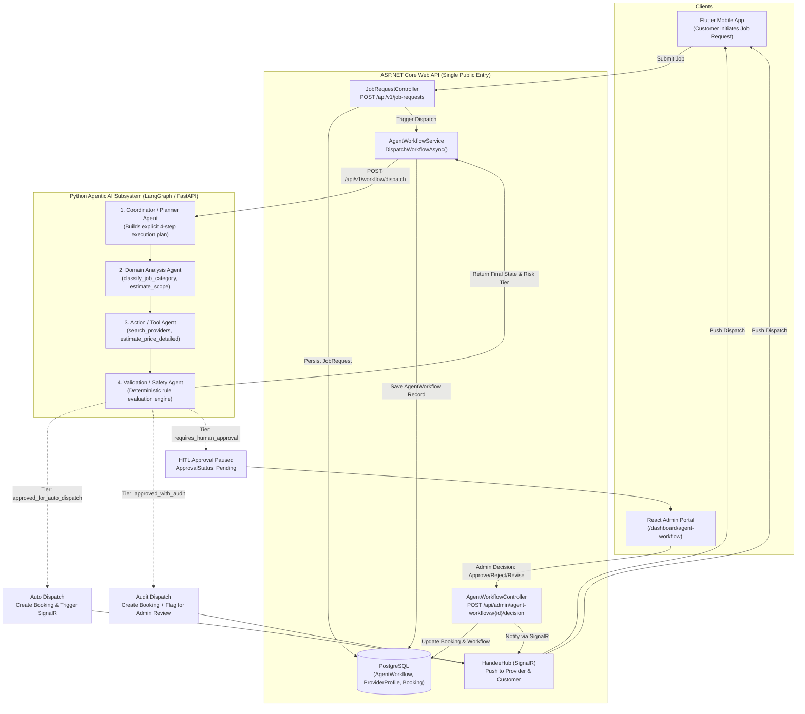

# Research & Technical Specification: Validation Agent Implementation

**Document Type**: Architectural Research & Implementation Specification  
**Project**: Handee — Trust-Verified Tradesperson Marketplace  
**Component**: Provider Verification & Profiles (Agentic AI Subsystem)  
**Author Role**: Agentic AI & Backend Engineer  
**Date**: September 2026  
**Status**: Completed Research & Ready for Implementation  

---

## 1. Executive Summary & Research Scope

This research document investigates the design, domain requirements, architectural placement, and implementation details for the **Validation / Safety Agent** within the Handee platform. 

In Handee's four-agent architecture, the Validation Agent serves as the final, authoritative gatekeeper for the job dispatch and quote matching pipeline. Unlike generative or search-oriented agents, the Validation Agent operates under a strict **Zero-Tool Least-Privilege Guardrail**: it executes purely deterministic business rules against candidate provider profiles, calculated quotes, category benchmarks, and domain scope signals.

### Key Research Findings
1. **Rubric & Component Ownership**: In accordance with the module's Rule of Ownership ([project_specification.md §7](file:///d:/SLIIT/Year%203%20Semester%201/SE3090%20-%20Software%20Engineering%20Frameworks/Assignment/handee/docs/project_specification.md#L132-L138)), the Validation / Safety Agent is the primary AI contribution of the **Provider Verification & Profiles** component owner, accounting for 12 individual marks under rubric item §19 ([project_specification.md §19](file:///d:/SLIIT/Year%203%20Semester%201/SE3090%20-%20Software%20Engineering%20Frameworks/Assignment/handee/docs/project_specification.md#L405)).
2. **Tiered Human-in-the-Loop (HITL) Gate**: To prevent bottlenecking on instant jobs while safeguarding platform trust, the agent enforces a **three-tier classification** ([project_specification.md §10.4](file:///d:/SLIIT/Year%203%20Semester%201/SE3090%20-%20Software%20Engineering%20Frameworks/Assignment/handee/docs/project_specification.md#L227-L242)):
   - `approved_for_auto_dispatch` (Low Risk): Fully verified provider, rating $\ge 4.0$, price within category median band $\le 25\%$, no scope ambiguity. Dispatches immediately without human intervention.
   - `approved_with_audit` (Medium Risk): Exactly one non-critical soft signal (e.g., new provider with $< 3$ reviews, price variance $25\% - 40\%$, or minor budget overshoot). Dispatches immediately to optimize customer latency while queuing the proposal for post-dispatch Admin audit.
   - `requires_human_approval` (High Risk): Hard failures (unverified provider, rating $< 3.5$, price outlier $> 60\%$, no candidates) or $\ge 2$ soft signals. Halts automated dispatch and requires explicit Admin adjudication (**Approve**, **Reject**, **Request Revision**) via the React Admin portal.
3. **Current State & Implementation Gaps**:
   - The basic mathematical logic exists in [agents/src/tools/validation_rules.py](file:///d:/SLIIT/Year%203%20Semester%201/SE3090%20-%20Software%20Engineering%20Frameworks/Assignment/handee/agents/src/tools/validation_rules.py), but it currently consumes un-typed Python dictionaries (`provider: Optional[Dict[str, Any]]`) rather than validated Pydantic contracts.
   - [agents/src/schemas/contracts.py](file:///d:/SLIIT/Year%203%20Semester%201/SE3090%20-%20Software%20Engineering%20Frameworks/Assignment/handee/agents/src/schemas/contracts.py) lacks strongly-typed input models (`ValidationInput`, `ProviderCandidateProfile`) and models `risk_tier` as an open `str` rather than a typed enum or `Literal`.
   - The test suite in [agents/tests/test_workflow.py](file:///d:/SLIIT/Year%203%20Semester%201/SE3090%20-%20Software%20Engineering%20Frameworks/Assignment/handee/agents/tests/test_workflow.py) only contains 3 basic assertions, missing the mandatory **Golden-Case Evaluation Suite** demanded by [project_specification.md §15.3](file:///d:/SLIIT/Year%203%20Semester%201/SE3090%20-%20Software%20Engineering%20Frameworks/Assignment/handee/docs/project_specification.md#L332).
   - The React Admin Monitoring page ([web/src/pages/dashboard/AgentWorkflow.tsx](file:///d:/SLIIT/Year%203%20Semester%201/SE3090%20-%20Software%20Engineering%20Frameworks/Assignment/handee/web/src/pages/dashboard/AgentWorkflow.tsx)) uses hardcoded static mock records and is not yet connected to the backend API.

---

## 2. Primary Source Evidence & Citation Matrix

Every architectural assertion and rule in this research is backed by primary source documents within this repository:

| Claim / Requirement | Primary Source File & Section | Exact Line / Reference |
|---|---|---|
| **Agent Roster & Zero-Tool Restriction** | [docs/project_specification.md](file:///d:/SLIIT/Year%203%20Semester%201/SE3090%20-%20Software%20Engineering%20Frameworks/Assignment/handee/docs/project_specification.md) §10.1 | Lines 208–209: *"Validation / Safety: Allowed Tools: None — pure rule evaluation, no tool calls."* |
| **Tiered HITL Gate Definition** | [docs/project_specification.md](file:///d:/SLIIT/Year%203%20Semester%201/SE3090%20-%20Software%20Engineering%20Frameworks/Assignment/handee/docs/project_specification.md) §10.4 | Lines 227–242: Low risk (`approved_for_auto_dispatch`), Medium risk (`approved_with_audit`), High risk (`requires_human_approval`). |
| **Component Ownership (12 Marks)** | [docs/project_specification.md](file:///d:/SLIIT/Year%203%20Semester%201/SE3090%20-%20Software%20Engineering%20Frameworks/Assignment/handee/docs/project_specification.md) §7, §19 | Line 135: *"Provider Verification & Profiles -> Validation / Safety Agent"*; Line 405: 12 marks individual contribution. |
| **Single Public Backend & Internal AI Rule** | [docs/project_specification.md](file:///d:/SLIIT/Year%203%20Semester%201/SE3090%20-%20Software%20Engineering%20Frameworks/Assignment/handee/docs/project_specification.md) §6.1 | Lines 110–114: Clients communicate only with ASP.NET Core; Python Agent service is internal only. |
| **End-to-End Sequence** | [docs/project_specification.md](file:///d:/SLIIT/Year%203%20Semester%201/SE3090%20-%20Software%20Engineering%20Frameworks/Assignment/handee/docs/project_specification.md) §9.2 | Lines 167–193: Mermaid sequence diagram showing workflow pause and admin resolution. |
| **Golden-Case Evaluation Requirement** | [docs/project_specification.md](file:///d:/SLIIT/Year%203%20Semester%201/SE3090%20-%20Software%20Engineering%20Frameworks/Assignment/handee/docs/project_specification.md) §15.1, §15.3 | Lines 323, 332: *"Golden-case agent evaluation — a fixed set of job scenarios fed through the agent suite, asserting schema correctness and tool-selection accuracy."* |
| **Current Validation Engine** | [agents/src/tools/validation_rules.py](file:///d:/SLIIT/Year%203%20Semester%201/SE3090%20-%20Software%20Engineering%20Frameworks/Assignment/handee/agents/src/tools/validation_rules.py) | Lines 6–92: `evaluate_validation_tier()`. |
| **Current Pipeline Node** | [agents/src/workflows/dispatch_workflow.py](file:///d:/SLIIT/Year%203%20Semester%201/SE3090%20-%20Software%20Engineering%20Frameworks/Assignment/handee/agents/src/workflows/dispatch_workflow.py) | Lines 154–226: `validation_safety_node()`. |
| **Backend Workflow Entity & Enums** | [src/backend/handee.API/Entities/AgentWorkflow.cs](file:///d:/SLIIT/Year%203%20Semester%201/SE3090%20-%20Software%20Engineering%20Frameworks/Assignment/handee/src/backend/handee.API/Entities/AgentWorkflow.cs) | Lines 3–16: `WorkflowValidationTier` and `WorkflowApprovalStatus`. |
| **Backend Agent Service Bridge** | [src/backend/handee.API/Services/AgentWorkflowService.cs](file:///d:/SLIIT/Year%203%20Semester%201/SE3090%20-%20Software%20Engineering%20Frameworks/Assignment/handee/src/backend/handee.API/Services/AgentWorkflowService.cs) | Lines 43–120: `DispatchWorkflowAsync()`; Lines 253–345: `MakeDecisionAsync()`. |
| **Admin Decision API Controller** | [src/backend/handee.API/Controllers/AgentWorkflowController.cs](file:///d:/SLIIT/Year%203%20Semester%201/SE3090%20-%20Software%20Engineering%20Frameworks/Assignment/handee/src/backend/handee.API/Controllers/AgentWorkflowController.cs) | Lines 12–70: `[Route("api/admin/agent-workflows")]`. |
| **Provider Profile Verification Entity** | [src/backend/handee.API/Entities/ProviderProfile.cs](file:///d:/SLIIT/Year%203%20Semester%201/SE3090%20-%20Software%20Engineering%20Frameworks/Assignment/handee/src/backend/handee.API/Entities/ProviderProfile.cs) | Lines 46–49: `VerificationStatus`, `RatingAggregate`, `TotalReviewCount`. |

---

## 3. End-to-End System Architecture & Data Flow



---

## 4. Detailed Specification of the Validation Rule Engine

### 4.1 Evaluation Inputs

The Validation Agent requires four distinct dimensions of input data before computing the risk tier:

1. **Candidate Provider Record**:
   - `id` / `userId`: Provider unique identifier.
   - `fullName`: Provider name.
   - `verificationStatus`: String or Enum (`Verified`, `Pending`, `InReview`, `Rejected`).
   - `isVerified`: Explicit boolean flag.
   - `rating`: Float aggregate between $0.0$ and $5.0$.
   - `totalReviews`: Integer count of completed, reviewed bookings.
   - `hourlyRate`: Historical hourly wage rate.
2. **Pricing Context**:
   - `estimated_price`: Proposed total price computed by the Action/Tool Agent.
   - `category`: Canonical service trade category name.
   - `budget_min`: Optional customer minimum budget.
   - `budget_max`: Optional customer maximum budget.
3. **Category Benchmark Reference**:
   - Baseline median pricing per trade category derived from platform historical transactions ([agents/src/tools/action_tools.py:10-21](file:///d:/SLIIT/Year%203%20Semester%201/SE3090%20-%20Software%20Engineering%20Frameworks/Assignment/handee/agents/src/tools/action_tools.py#L10-L21)):
     - Plumbing: Rs. 3,500
     - Electrical: Rs. 4,000
     - AC Repair: Rs. 5,000
     - Carpentry: Rs. 3,800
     - Painting: Rs. 3,200
     - Masonry: Rs. 4,200
     - Appliance Repair: Rs. 3,500
     - Cleaning: Rs. 2,500
     - Roofing: Rs. 4,500
     - General Maintenance: Rs. 3,000
4. **Scope & Ambiguity Signals**:
   - `ambiguity_flag`: Boolean emitted by Domain Analysis Agent indicating unclear or multiple conflicting trade keywords.
   - `price_multiplier_spread`: Difference between `price_multiplier_max` and `price_multiplier_min`.

---

### 4.2 Deterministic Safety Rules

The validation engine categorizes rule outcomes into **Hard Failures** and **Soft Signals**:

#### Hard Failure Rules (Immediate High Risk Trigger)
If any of these conditions are met, the workflow immediately enters `requires_human_approval` (pausing dispatch):
1. **Rule H1: No Candidate Available** — Candidate provider is `None` or empty.
2. **Rule H2: Unverified Identity** — Provider is not verified (`isVerified == False` and `verificationStatus != "Verified"`).
3. **Rule H3: Deficient Rating Threshold** — For established providers ($\ge 3$ reviews), `rating < 4.0`. For any provider, `rating < 3.5`.
4. **Rule H4: Severe Price Outlier** — Price variance ratio $|Price - Benchmark| / Benchmark > 0.60$ ($60\%$ deviation from category median).
5. **Rule H5: Extreme Customer Budget Breach** — Customer provided a `budget_max` and `estimated_price > budget_max * 1.30` ($30\%$ above maximum stated willingness to pay).

#### Soft Signal Rules (Potential Post-Dispatch Audit)
Soft signals indicate non-critical variances that do not justify blocking an urgent job, but require post-facto human visibility:
1. **Rule S1: New Provider Onboarding** — Provider is verified but has fewer than 3 reviews (`totalReviews < 3`).
2. **Rule S2: Moderate Price Deviation** — Price variance ratio is between $25\%$ and $40\%$ ($0.25 < \Delta \le 0.40$).
3. **Rule S3: Mild Budget Breach** — Customer provided a `budget_max` and `budget_max < estimated_price <= budget_max * 1.15` ($1\% - 15\%$ above stated budget).
4. **Rule S4: Description Ambiguity** — The job description was flagged as ambiguous by the Domain Analysis Agent (`ambiguity_flag == True`).

---

### 4.3 Classification Tier Synthesis Matrix

| Hard Failures Count | Soft Signals Count | Resulting Risk Tier | Approval Status | Workflow Action |
|:---:|:---:|:---:|:---:|---|
| **0** | **0** | `approved_for_auto_dispatch` | `approved` | Dispatched immediately. Provider receives push notification, customer receives real-time confirmation. |
| **0** | **1** | `approved_with_audit` | `approved` | Dispatched immediately to preserve low latency. Enqueued in Admin portal under "Audit Required" tab. |
| **$\ge 1$** | *Any* | `requires_human_approval` | `pending` | **Dispatch Paused**. Job placed in Admin HITL approval queue. Awaits manual decision. |
| **0** | **$\ge 2$** | `requires_human_approval` | `pending` | **Dispatch Paused**. Compound uncertainty requires human triage before committing provider. |

---

## 5. Implementation Gap Analysis: Built vs. Target

| Architectural Dimension | Current Implementation | Target Specification | Severity |
|---|---|---|---|
| **Pydantic Type Safety** | `evaluate_validation_tier` takes raw arguments and loose `dict` for provider ([validation_rules.py:7](file:///d:/SLIIT/Year%203%20Semester%201/SE3090%20-%20Software%20Engineering%20Frameworks/Assignment/handee/agents/src/tools/validation_rules.py#L7)). | Strongly typed `ValidationInput` and `ProviderCandidateProfile` schemas in [contracts.py](file:///d:/SLIIT/Year%203%20Semester%201/SE3090%20-%20Software%20Engineering%20Frameworks/Assignment/handee/agents/src/schemas/contracts.py). | High |
| **Enum Serialization** | `ValidationResult.risk_tier` is an unconstrained string ([contracts.py:94](file:///d:/SLIIT/Year%203%20Semester%201/SE3090%20-%20Software%20Engineering%20Frameworks/Assignment/handee/agents/src/schemas/contracts.py#L94)). | Strict `ValidationRiskTier` StrEnum matching backend `WorkflowValidationTier`. | Medium |
| **Rule Granularity & Auditability** | Returns a list of strings (`reasons`) mixed with generic status messages. | Structured `RuleAuditEntry` itemizing each evaluated rule, its threshold, actual value, and pass/fail state. | Medium |
| **Evaluation Test Suite** | 3 tests in [test_workflow.py:424](file:///d:/SLIIT/Year%203%20Semester%201/SE3090%20-%20Software%20Engineering%20Frameworks/Assignment/handee/agents/tests/test_workflow.py#L424). | Dedicated [test_validation_agent.py](file:///d:/SLIIT/Year%203%20Semester%201/SE3090%20-%20Software%20Engineering%20Frameworks/Assignment/handee/agents/tests/) with 25+ test cases covering every matrix permutation and golden evaluation suite. | High |
| **React HITL Dashboard** | Static mock data in [AgentWorkflow.tsx:5-26](file:///d:/SLIIT/Year%203%20Semester%201/SE3090%20-%20Software%20Engineering%20Frameworks/Assignment/handee/web/src/pages/dashboard/AgentWorkflow.tsx#L5-L26). | Live integration with `GET /api/admin/agent-workflows` and `POST /api/admin/agent-workflows/{id}/decision`. | High |
| **Admin Decision Handoff** | Implemented on backend ([AgentWorkflowService.cs:253](file:///d:/SLIIT/Year%203%20Semester%201/SE3090%20-%20Software%20Engineering%20Frameworks/Assignment/handee/src/backend/handee.API/Services/AgentWorkflowService.cs#L253)), but UI lacks interactive action buttons for revision notes. | Interactive modal in React for Admin to approve, reject, or request revision with reason. | Medium |

---

## 6. Implementation Technical Blueprint

### 6.1 Step 1: Strongly-Typed Pydantic Contracts

Update [agents/src/schemas/contracts.py](file:///d:/SLIIT/Year%203%20Semester%201/SE3090%20-%20Software%20Engineering%20Frameworks/Assignment/handee/agents/src/schemas/contracts.py) to declare complete input/output schemas for the Validation Agent:

```python
class ValidationRiskTier(StrEnum):
    APPROVED_FOR_AUTO_DISPATCH = "approved_for_auto_dispatch"
    APPROVED_WITH_AUDIT = "approved_with_audit"
    REQUIRES_HUMAN_APPROVAL = "requires_human_approval"


class ProviderCandidateProfile(BaseModel):
    id: str
    userId: str
    fullName: str
    isVerified: bool = False
    verificationStatus: str = "Pending"
    rating: float = Field(default=0.0, ge=0.0, le=5.0)
    totalReviews: int = Field(default=0, ge=0)
    hourlyRate: Optional[float] = None
    skillCategories: List[str] = Field(default_factory=list)
    serviceArea: Optional[str] = None


class ValidationRuleCheck(BaseModel):
    rule_id: str
    rule_name: str
    is_hard_rule: bool
    passed: bool
    actual_value: Any
    threshold: Any
    message: str


class ValidationInput(BaseModel):
    provider: Optional[ProviderCandidateProfile] = None
    estimated_price: float = Field(..., gt=0)
    category: ServiceCategoryName
    budget_min: Optional[float] = None
    budget_max: Optional[float] = None
    ambiguity_flag: bool = False
    complexity: Literal["Low", "Medium", "High"] = "Medium"


class ValidationResult(BaseModel):
    risk_tier: ValidationRiskTier
    is_verified_provider: bool
    is_price_within_band: bool
    rating_passed: bool
    scope_clarity_passed: bool
    hard_failures_count: int
    soft_signals_count: int
    evaluated_rules: List[ValidationRuleCheck] = Field(default_factory=list)
    reasons: List[str] = Field(default_factory=list)
```

---

### 6.2 Step 2: Refactoring the Rule Engine

Harden [agents/src/tools/validation_rules.py](file:///d:/SLIIT/Year%203%20Semester%201/SE3090%20-%20Software%20Engineering%20Frameworks/Assignment/handee/agents/src/tools/validation_rules.py) into an auditable engine:

```python
def evaluate_validation_tier(input_data: ValidationInput) -> ValidationResult:
    """
    Pure deterministic validation engine executing tiered safety checks.
    Adheres strictly to the Zero-Tool / Least-Privilege Guardrail.
    """
    provider = input_data.provider
    price = input_data.estimated_price
    category = input_data.category
    budget_max = input_data.budget_max
    ambiguity_flag = input_data.ambiguity_flag

    rules: List[ValidationRuleCheck] = []
    reasons: List[str] = []
    hard_failures = 0
    soft_signals = 0

    # 1. Candidate Provider Presence
    if not provider:
        return ValidationResult(
            risk_tier=ValidationRiskTier.REQUIRES_HUMAN_APPROVAL,
            is_verified_provider=False,
            is_price_within_band=False,
            rating_passed=False,
            scope_clarity_passed=not ambiguity_flag,
            hard_failures_count=1,
            soft_signals_count=0,
            evaluated_rules=[
                ValidationRuleCheck(
                    rule_id="H1_PROVIDER_PRESENCE",
                    rule_name="Provider Candidate Matched",
                    is_hard_rule=True,
                    passed=False,
                    actual_value=None,
                    threshold="Provider instance required",
                    message="No candidate provider could be matched for this job request."
                )
            ],
            reasons=["No candidate provider could be matched for this job request."]
        )

    # 2. Identity Verification Check (Hard Rule)
    is_verified = bool(provider.isVerified or provider.verificationStatus == "Verified")
    if not is_verified:
        hard_failures += 1
        msg = f"Provider '{provider.fullName}' is unverified (status: {provider.verificationStatus})."
        reasons.append(msg)
        rules.append(ValidationRuleCheck(
            rule_id="H2_VERIFICATION_STATUS",
            rule_name="Identity Verification",
            is_hard_rule=True,
            passed=False,
            actual_value=provider.verificationStatus,
            threshold="Verified",
            message=msg
        ))
    else:
        rules.append(ValidationRuleCheck(
            rule_id="H2_VERIFICATION_STATUS",
            rule_name="Identity Verification",
            is_hard_rule=True,
            passed=True,
            actual_value=provider.verificationStatus,
            threshold="Verified",
            message="Provider identity and trade credentials verified."
        ))

    # 3. Rating & Track Record Check
    rating = provider.rating
    total_reviews = provider.totalReviews
    is_new_provider = total_reviews < 3

    if is_new_provider:
        soft_signals += 1
        msg = f"New provider with limited history ({total_reviews} reviews). Enforcing audit signal."
        reasons.append(msg)
        rules.append(ValidationRuleCheck(
            rule_id="S1_NEW_PROVIDER_SIGNAL",
            rule_name="Provider Review Maturity",
            is_hard_rule=False,
            passed=False,
            actual_value=total_reviews,
            threshold=">= 3 reviews",
            message=msg
        ))

    # Rating threshold: hard fail if rating < 3.5; hard fail if established and rating < 4.0
    rating_passed = (is_new_provider and rating >= 0.0) or (rating >= 4.0)
    if rating < 3.5 or (not is_new_provider and rating < 4.0):
        hard_failures += 1
        msg = f"Provider rating ({rating:.1f}) is below minimum platform standard (4.0)."
        reasons.append(msg)
        rules.append(ValidationRuleCheck(
            rule_id="H3_RATING_THRESHOLD",
            rule_name="Customer Satisfaction Rating",
            is_hard_rule=True,
            passed=False,
            actual_value=rating,
            threshold=4.0,
            message=msg
        ))
    else:
        rules.append(ValidationRuleCheck(
            rule_id="H3_RATING_THRESHOLD",
            rule_name="Customer Satisfaction Rating",
            is_hard_rule=True,
            passed=True,
            actual_value=rating,
            threshold=4.0,
            message="Provider rating satisfies quality threshold."
        ))

    # 4. Pricing & Budget Evaluation
    benchmark = CATEGORY_BENCHMARKS.get(category, 3500.0)
    variance_ratio = abs(price - benchmark) / benchmark
    price_exceeds_budget = budget_max is not None and price > budget_max

    # Pricing Hard Failures
    if variance_ratio > 0.60:
        hard_failures += 1
        msg = f"Quote (Rs. {price:,.2f}) deviates by {variance_ratio*100:.1f}% from median (Rs. {benchmark:,.2f})."
        reasons.append(msg)
        rules.append(ValidationRuleCheck(
            rule_id="H4_PRICE_OUTLIER",
            rule_name="Category Benchmark Variance",
            is_hard_rule=True,
            passed=False,
            actual_value=variance_ratio,
            threshold="<= 0.60",
            message=msg
        ))
    elif 0.25 < variance_ratio <= 0.40:
        soft_signals += 1
        msg = f"Quote (Rs. {price:,.2f}) has moderate variance ({variance_ratio*100:.1f}%) from median."
        reasons.append(msg)
        rules.append(ValidationRuleCheck(
            rule_id="S2_MODERATE_PRICE_VARIANCE",
            rule_name="Moderate Benchmark Deviation",
            is_hard_rule=False,
            passed=False,
            actual_value=variance_ratio,
            threshold="<= 0.25",
            message=msg
        ))

    # Customer Budget Checks
    if budget_max is not None:
        if price > budget_max * 1.30:
            hard_failures += 1
            msg = f"Quote (Rs. {price:,.2f}) exceeds customer ceiling (Rs. {budget_max:,.2f}) by >30%."
            reasons.append(msg)
            rules.append(ValidationRuleCheck(
                rule_id="H5_EXTREME_BUDGET_BREACH",
                rule_name="Customer Budget Ceiling",
                is_hard_rule=True,
                passed=False,
                actual_value=price,
                threshold=budget_max * 1.30,
                message=msg
            ))
        elif price > budget_max:
            soft_signals += 1
            msg = f"Quote (Rs. {price:,.2f}) slightly exceeds customer budget (Rs. {budget_max:,.2f})."
            reasons.append(msg)
            rules.append(ValidationRuleCheck(
                rule_id="S3_MILD_BUDGET_BREACH",
                rule_name="Minor Budget Breach",
                is_hard_rule=False,
                passed=False,
                actual_value=price,
                threshold=budget_max,
                message=msg
            ))

    # 5. Scope Ambiguity Check
    if ambiguity_flag:
        soft_signals += 1
        msg = "Job scope flagged as ambiguous by Domain Analysis Agent."
        reasons.append(msg)
        rules.append(ValidationRuleCheck(
            rule_id="S4_SCOPE_AMBIGUITY",
            rule_name="Description Scope Clarity",
            is_hard_rule=False,
            passed=False,
            actual_value="Ambiguous",
            threshold="Clear",
            message=msg
        ))
    else:
        rules.append(ValidationRuleCheck(
            rule_id="S4_SCOPE_AMBIGUITY",
            rule_name="Description Scope Clarity",
            is_hard_rule=False,
            passed=True,
            actual_value="Clear",
            threshold="Clear",
            message="Job description scope is well-defined."
        ))

    # Determine Risk Tier Synthesis
    if hard_failures > 0 or soft_signals >= 2:
        risk_tier = ValidationRiskTier.REQUIRES_HUMAN_APPROVAL
        reasons.append(f"High risk classification: {hard_failures} hard failures, {soft_signals} soft signals.")
    elif soft_signals == 1:
        risk_tier = ValidationRiskTier.APPROVED_WITH_AUDIT
        reasons.append("Approved with audit: Single soft signal flagged for post-dispatch Admin review.")
    else:
        risk_tier = ValidationRiskTier.APPROVED_FOR_AUTO_DISPATCH
        reasons.append("Low risk: All deterministic safety, credential, rating, and price rules satisfied.")

    return ValidationResult(
        risk_tier=risk_tier,
        is_verified_provider=is_verified,
        is_price_within_band=(variance_ratio <= 0.40 and not (budget_max and price > budget_max * 1.15)),
        rating_passed=rating_passed,
        scope_clarity_passed=not ambiguity_flag,
        hard_failures_count=hard_failures,
        soft_signals_count=soft_signals,
        evaluated_rules=rules,
        reasons=reasons
    )
```

---

### 6.3 Step 3: Golden-Case Evaluation Test Suite

Create [agents/tests/test_validation_agent.py](file:///d:/SLIIT/Year%203%20Semester%201/SE3090%20-%20Software%20Engineering%20Frameworks/Assignment/handee/agents/tests/) to satisfy the spec's requirement for a fixed scenario evaluation suite:

```python
import pytest
from src.schemas.contracts import (
    ValidationInput,
    ProviderCandidateProfile,
    ValidationRiskTier,
)
from src.tools.validation_rules import evaluate_validation_tier


# ─── Golden Evaluation Scenarios ─────────────────────────────────────────────

def test_golden_case_1_clean_auto_dispatch():
    """Verified provider, 4.9 rating, 34 reviews, exactly at median benchmark."""
    inp = ValidationInput(
        provider=ProviderCandidateProfile(
            id="p-1", userId="u-1", fullName="Sunil Perera",
            isVerified=True, verificationStatus="Verified",
            rating=4.9, totalReviews=34
        ),
        estimated_price=3500.0,
        category="Plumbing"
    )
    res = evaluate_validation_tier(inp)
    assert res.risk_tier == ValidationRiskTier.APPROVED_FOR_AUTO_DISPATCH
    assert res.hard_failures_count == 0
    assert res.soft_signals_count == 0


def test_golden_case_2_audit_new_provider():
    """Verified provider, 4.8 rating, but only 1 review (Soft Signal S1)."""
    inp = ValidationInput(
        provider=ProviderCandidateProfile(
            id="p-2", userId="u-2", fullName="Amara Silva",
            isVerified=True, verificationStatus="Verified",
            rating=4.8, totalReviews=1
        ),
        estimated_price=3500.0,
        category="Plumbing"
    )
    res = evaluate_validation_tier(inp)
    assert res.risk_tier == ValidationRiskTier.APPROVED_WITH_AUDIT
    assert res.soft_signals_count == 1
    assert res.hard_failures_count == 0


def test_golden_case_3_hitl_unverified_provider():
    """Unverified provider (Hard Failure H2) -> Pauses dispatch."""
    inp = ValidationInput(
        provider=ProviderCandidateProfile(
            id="p-3", userId="u-3", fullName="Unknown Provider",
            isVerified=False, verificationStatus="Pending",
            rating=4.5, totalReviews=10
        ),
        estimated_price=3500.0,
        category="Plumbing"
    )
    res = evaluate_validation_tier(inp)
    assert res.risk_tier == ValidationRiskTier.REQUIRES_HUMAN_APPROVAL
    assert res.hard_failures_count >= 1


def test_golden_case_4_hitl_severe_price_outlier():
    """Price Rs. 6,500 on Plumbing (median 3,500) -> 85% variance (Hard Failure H4)."""
    inp = ValidationInput(
        provider=ProviderCandidateProfile(
            id="p-1", userId="u-1", fullName="Sunil Perera",
            isVerified=True, verificationStatus="Verified",
            rating=4.9, totalReviews=34
        ),
        estimated_price=6500.0,
        category="Plumbing"
    )
    res = evaluate_validation_tier(inp)
    assert res.risk_tier == ValidationRiskTier.REQUIRES_HUMAN_APPROVAL
    assert res.hard_failures_count >= 1


def test_golden_case_5_hitl_compound_soft_signals():
    """New provider (Soft Signal 1) + Ambiguous scope (Soft Signal 2) -> Compound uncertainty."""
    inp = ValidationInput(
        provider=ProviderCandidateProfile(
            id="p-2", userId="u-2", fullName="Amara Silva",
            isVerified=True, verificationStatus="Verified",
            rating=4.8, totalReviews=1
        ),
        estimated_price=3500.0,
        category="Plumbing",
        ambiguity_flag=True
    )
    res = evaluate_validation_tier(inp)
    assert res.risk_tier == ValidationRiskTier.REQUIRES_HUMAN_APPROVAL
    assert res.soft_signals_count == 2
```

---

### 6.4 Step 4: React Admin Monitoring & HITL Approval Interface

To complete the full-stack loop, implement the API client in [web/src/api/agentWorkflow.ts](file:///d:/SLIIT/Year%203%20Semester%201/SE3090%20-%20Software%20Engineering%20Frameworks/Assignment/handee/web/src/api/) and connect [web/src/pages/dashboard/AgentWorkflow.tsx](file:///d:/SLIIT/Year%203%20Semester%201/SE3090%20-%20Software%20Engineering%20Frameworks/Assignment/handee/web/src/pages/dashboard/AgentWorkflow.tsx):

```typescript
// web/src/api/agentWorkflow.ts
import api from "./client";

export interface AgentStepLogDto {
  stepNumber: number;
  agentName: string;
  action: string;
  durationMs: number;
  inputJson?: string;
  outputJson?: string;
}

export interface AgentWorkflowDto {
  id: string;
  jobRequestId: string;
  workflowId: string;
  objective: string;
  plan: string[];
  validationTier: "approved_for_auto_dispatch" | "approved_with_audit" | "requires_human_approval";
  approvalStatus: "pending" | "approved" | "rejected" | "revised";
  estimatedPrice?: number;
  selectedProviderId?: string;
  selectedProviderName?: string;
  categoryName?: string;
  decisionNote?: string;
  createdAt: string;
  stepLogs: AgentStepLogDto[];
}

export const agentWorkflowApi = {
  getAll: (tier?: string, status?: string) =>
    api.get<AgentWorkflowDto[]>("/api/admin/agent-workflows", { params: { tier, status } }),

  getById: (id: string) =>
    api.get<AgentWorkflowDto>(`/api/admin/agent-workflows/${id}`),

  makeDecision: (id: string, decision: "Approved" | "Rejected" | "Revised", note?: string) =>
    api.post<AgentWorkflowDto>(`/api/admin/agent-workflows/${id}/decision`, { decision, note }),
};
```

---

## 7. Rubric & Viva Defense Strategy (12 Marks)

When defending the Validation Agent in the oral examination (viva), emphasize these four core architectural design choices:

1. **Why Pure Deterministic Rules over LLM Generative Evaluation?**
   - *Defense*: Safety and compliance cannot tolerate hallucination. A provider must provably possess verified credentials in the database, and price bounds must strictly adhere to platform economic limits. An LLM may hallucinate that an unverified provider is "likely trustworthy"; deterministic Pydantic logic strictly guarantees `requires_human_approval`.
2. **Why Tiered Outcomes (3 Tiers) rather than Binary (Pass/Fail)?**
   - *Defense*: Handee is an on-demand marketplace. Forcing every booking through manual admin review introduces severe friction and latency, destroying the instant match experience. Conversely, full automation creates safety risks. The three-tier model solves this: $80\%+$ of low-risk jobs execute instantly, medium-risk jobs dispatch without delay while logging an audit trail, and only high-risk jobs pause for human approval.
3. **Least-Privilege Principle & Attack Surface Minimization**:
   - *Defense*: In accordance with secure agent design ([project_specification.md §10.5](file:///d:/SLIIT/Year%203%20Semester%201/SE3090%20-%20Software%20Engineering%20Frameworks/Assignment/handee/docs/project_specification.md#L243-L249)), the Validation Agent has an allow-list of **zero external tools**. It cannot query third-party APIs, mutate database state, or execute external scripts. It simply accepts state and computes an immutable validation contract.
4. **Closing the Loop on the Cross-Platform Workflow**:
   - *Defense*: Demonstrates the mandated workflow: customer submits on Flutter $\to$ ASP.NET Core invokes Python AI $\to$ Validation Agent flags high risk $\to$ React Admin portal displays proposal $\to$ Admin clicks "Approve" $\to$ ASP.NET Core dispatches booking $\to$ SignalR pushes instant update to Flutter.
