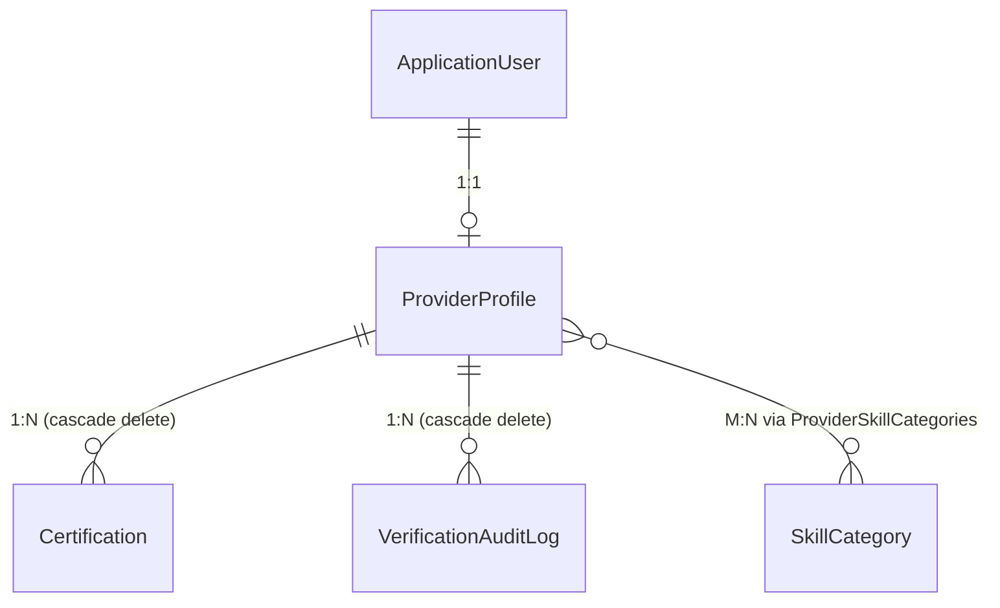
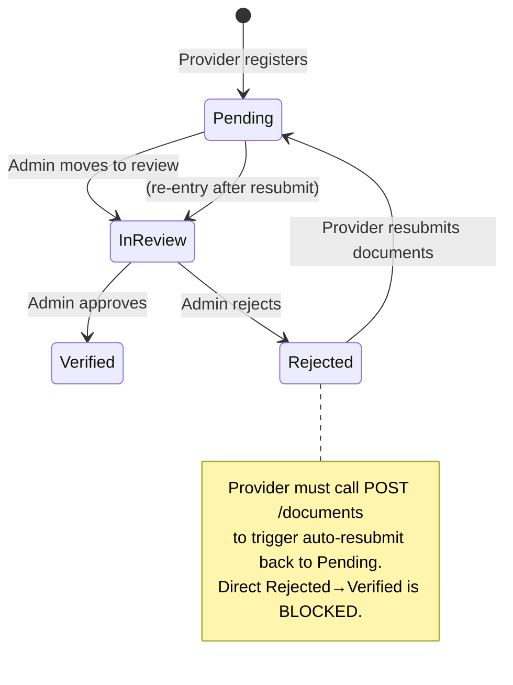

# Provider Verification & Profiles — Technical & Business Walkthrough

> **Last audited:** 2026-09-14 · Build: ✅ `Passed — 45/45 tests, 0 failures` (27 auth + 18 provider)
> This document is structured to be updated in place. Each section header links to the relevant source file.

---

## 1. Business Context

### What Problem Does This Component Solve?

Handee is a marketplace that connects **Customers** (people who need skilled work done) with **Providers** (tradespeople: plumbers, electricians, etc.). The central trust problem is: *how does a Customer know a Provider is legitimate before inviting them into their home?*

This component implements the entire trust pipeline:

1. A Provider registers → a blank profile is created in **Pending** status.
2. The Provider uploads identity (NIC) and trade certification documents.
3. An Admin reviews the documents and transitions the profile to **Verified** or **Rejected**.
4. Only **Verified + Available** providers appear in Customer search results.
5. A downstream AI service can query a structured **trust-signal payload** to personalise recommendations.

### Actors & Their Interests

| Actor | What they need | How this component serves them |
|---|---|---|
| **Provider** | Manage their public profile; know their verification status; resubmit if rejected | `GET /me`, `PUT /{id}`, `POST /{id}/documents` |
| **Customer** | Find trustworthy, nearby providers; see public profile | `GET /{id}` (public projection), `GET /search` |
| **Admin** | Review documents; approve/reject providers; have a full audit trail | `GET /{id}` (admin projection), `PATCH /{id}/verification` |
| **AI Service** | Structured trust data for ranking and personalisation | `GET /api/internal/{id}/trust-signals` |

---

## 2. Architecture Overview

```mermaid
graph TD
    subgraph API Layer
        PC[ProviderController\n7 endpoints]
    end

    subgraph Service Layer
        PPS[ProviderProfileService\nProfile CRUD, geocoding, doc upload]
        VS[VerificationService\nState machine]
        PTS[ProviderTrustService\nTrust signals + Redis cache]
    end

    subgraph Data Layer
        PPR[ProviderProfileRepository]
        CR[CertificationRepository]
        GMS[GoogleMapsService\nPolly retry]
        LS[LocalStorageService]
    end

    subgraph Persistence
        PG[(PostgreSQL\nProviderProfiles\nCertifications\nSkillCategories\nVerificationAuditLogs)]
        RD[(Redis\ntrust:{id} cache\n60s TTL)]
    end

    PC --> PPS
    PC --> VS
    PC --> PTS
    PPS --> PPR
    PPS --> CR
    PPS --> GMS
    PPS --> LS
    PPS --> VS
    VS --> PPR
    PTS --> PPR
    PTS --> RD
    PPR --> PG
    CR --> PG
```

### Layer Responsibilities

| Layer | Files | Responsibility |
|---|---|---|
| **Controller** | `ProviderController.cs` | Route → auth → delegate; no business logic |
| **Profile Service** | `ProviderProfileService.cs` | Reads, writes, geocoding, doc upload, role-shaped mapping |
| **Verification Service** | `VerificationService.cs` | Sole owner of status transitions; writes audit logs |
| **Trust Service** | `ProviderTrustService.cs` | Assembles & caches trust payload for AI consumers |
| **Repository** | `ProviderProfileRepository.cs`, `CertificationRepository.cs` | EF Core queries; bounding-box geo search |
| **External Services** | `GoogleMapsService.cs`, `LocalStorageService.cs` | Geocoding (Polly-hardened), file storage |

---

## 3. Data Model

### 3.1 Entity Relationship



### 3.2 [ProviderProfile](file:///d:/SLIIT/Year%203%20Semester%201/SE3090%20-%20Software%20Engineering%20Frameworks/Assignment/handee/src/backend/handee.Api/Entities/ProviderProfile.cs)

| Field | Type | DB constraint | Notes |
|---|---|---|---|
| `Id` | `Guid` | PK | |
| `UserId` | `Guid` | FK → `AspNetUsers`, **Unique**, Cascade delete | One profile per user enforced at DB level |
| `Headline` | `string?` | `varchar(120)` | Short tagline shown on search cards |
| `Bio` | `string?` | `varchar(500)` | Medium summary |
| `Description` | `string?` | `varchar(3000)` | Full rich-text description |
| `YearsOfExperience` | `int` | | |
| `ProfilePhotoUrl` | `string?` | | |
| `Languages` | `List<string>` | `text[]` | PostgreSQL native array column |
| `ServicesOffered` | `List<string>` | `text[]` | PostgreSQL native array column |
| `IsAvailableForWork` | `bool` | default `true` | Excluded from search when `false` |
| `AvailabilityNote` | `string?` | `varchar(200)` | e.g. "On leave until Oct" |
| `ServiceAreaLatitude` | `double?` | Composite index with Lng | Used in bounding-box geo filter |
| `ServiceAreaLongitude` | `double?` | Composite index with Lat | |
| `ServiceAreaDisplayName` | `string?` | `varchar(200)` | Human-readable resolved address |
| `ServiceRadiusKm` | `double` | default `25` | How far provider is willing to travel |
| `VerificationStatus` | `enum` | stored as `varchar(20)` string | `Pending \| InReview \| Verified \| Rejected` |
| `RatingAggregate` | `decimal(3,2)` | | Maintained by Reviews component (future) |
| `TotalReviewCount` | `int` | | |
| `CreatedAt` | `DateTimeOffset` | | UTC |

### 3.3 [Certification](file:///d:/SLIIT/Year%203%20Semester%201/SE3090%20-%20Software%20Engineering%20Frameworks/Assignment/handee/src/backend/handee.Api/Entities/Certification.cs)

Represents a single uploaded document. A provider can upload multiple documents of different types.

| Field | Type | Notes |
|---|---|---|
| `Type` | `CertificationType` | `NIC \| TradeCertification \| Other` — stored as string |
| `FileUrl` | `string` | Path returned by `IStorageService` (`uploads/certifications/…`) |
| `OriginalFileName` | `string?` | Original name for display; never used for I/O |
| `ReviewStatus` | `DocumentReviewStatus` | `Pending \| Approved \| Rejected` — per-document, independent of profile status |
| `UploadedAt` | `DateTimeOffset` | UTC |

### 3.4 [VerificationAuditLog](file:///d:/SLIIT/Year%203%20Semester%201/SE3090%20-%20Software%20Engineering%20Frameworks/Assignment/handee/src/backend/handee.Api/Entities/VerificationAuditLog.cs)

An **immutable** append-only row written every time an Admin changes a provider's status. Never deleted, never updated. Provides a full compliance trail.

| Field | Type | Notes |
|---|---|---|
| `AdminUserId` | `Guid` | Who performed the action |
| `PreviousStatus` | `VerificationStatus` | State before transition |
| `NewStatus` | `VerificationStatus` | State after transition |
| `Timestamp` | `DateTimeOffset` | UTC — indexed for time-range queries |
| `Note` | `string?` | Admin's reason (up to 500 chars) |

### 3.5 [SkillCategory](file:///d:/SLIIT/Year%203%20Semester%201/SE3090%20-%20Software%20Engineering%20Frameworks/Assignment/handee/src/backend/handee.Api/Entities/SkillCategory.cs)

A reference table of trade categories (Plumbing, Electrical, etc.). Name is a **unique index** to prevent duplicates. Linked to profiles via the auto-configured `ProviderSkillCategories` join table.

---

## 4. Verification State Machine

This is the business-critical heart of the component. All status changes **must** go through `VerificationService` — direct DB updates are prohibited.



### Legal Transition Whitelist

Enforced in [`VerificationService.cs`](file:///d:/SLIIT/Year%203%20Semester%201/SE3090%20-%20Software%20Engineering%20Frameworks/Assignment/handee/src/backend/handee.Api/Services/VerificationService.cs) as a `HashSet<(From, To)>`:

| From | To | Who triggers | Method |
|---|---|---|---|
| `Pending` | `InReview` | Admin | `TransitionAsync` |
| `InReview` | `Verified` | Admin | `TransitionAsync` |
| `InReview` | `Rejected` | Admin | `TransitionAsync` |
| `Rejected` | `Pending` | Provider (implicit) | `ResubmitAsync` via `UploadDocumentAsync` |

Any other combination throws `InvalidOperationException` → the controller returns `400 Bad Request`.

### What Happens on a Transition

1. **Guard:** Profile is fetched from DB. Transition pair is checked against the whitelist.
2. **OpenTelemetry span** is started (`handee.ProviderVerification`) with `from`/`to` tags.
3. **Audit log row** is inserted (`VerificationAuditLogs` table) with `AdminUserId`, old and new status, timestamp, and optional note.
4. **Profile status** is updated (EF change tracking). Both changes are committed in a **single `SaveChangesAsync`** call — atomic.
5. **`ApplicationUser.ProviderVerificationStatus`** denormalized field is synced via `UserManager` — this is the fast-path cache used during JWT auth checks to gate Provider access.

---

## 5. API Endpoints

**Base route:** `api/providers` · **Controller authorization:** `[Authorize]` (all endpoints require auth unless overridden)

### 5.1 `GET /api/providers/me` — Provider Self Lookup

```
Authorization: Bearer {provider-jwt}
```

Resolves the caller's own profile from their JWT `NameIdentifier` claim. Returns `ProviderProfileProviderDto` (full view including document URLs and GPS coordinates). Returns `404` if the profile does not exist yet.

**Why this exists:** A provider's `profileId` is a different GUID from their `userId`. This endpoint lets the Provider frontend bootstrap without knowing the profile ID in advance.

---

### 5.2 `GET /api/providers/{id}` — Role-Shaped Profile Read

```
Authorization: Bearer {jwt}  (or anonymous)
```

The response shape is determined by the caller's role — same URL, three different projections:

| Caller Role | DTO returned | Extra fields vs Customer |
|---|---|---|
| `Customer` / anonymous | `ProviderProfileCustomerDto` | Public-safe fields only — **no email, no document URLs, no GPS coordinates** |
| `Provider` (own only) | `ProviderProfileProviderDto` | Adds: `UserId`, `Email`, `GPS coords`, `Certifications` list |
| `Admin` | `ProviderProfileAdminDto` | Adds everything above plus: full `AuditLogs` list (ordered newest-first) |

**Access control for Providers:** A Provider calling with someone else's `id` receives `403 Forbidden`. The ownership check is a lightweight query (`GetOwnerUserIdAsync`) — only 2 columns selected, no join loading.

---

### 5.3 `PUT /api/providers/{id}` — Update Profile

```
Authorization: Bearer {provider-jwt}
Content-Type: application/json

{
  "headline": "Licensed Electrician — 10 years",
  "bio": "...",
  "description": "...",
  "yearsOfExperience": 10,
  "languages": ["Sinhala", "English"],
  "servicesOffered": ["Wiring", "Switchboard upgrades"],
  "isAvailableForWork": true,
  "availabilityNote": null,
  "skillCategoryIds": ["<guid>"],
  "serviceAreaAddress": "Colombo 03",
  "serviceRadiusKm": 20
}
```

All fields are **optional** (nullable). Only provided fields are applied to the profile (partial-update pattern without PATCH).

**Geocoding flow:**
- If `serviceAreaLatitude` + `serviceAreaLongitude` are both provided → used directly.
- If only `serviceAreaAddress` is provided → `GoogleMapsService.GeocodeAsync` is called.
- If geocoding fails (network error after Polly retries) → service area is **left unchanged** and a `Warning` log is emitted. The rest of the profile update **still succeeds**.

---

### 5.4 `POST /api/providers/{id}/documents` — Upload Document

```
Authorization: Bearer {provider-jwt}
Content-Type: multipart/form-data

file: <binary>
type: NIC | TradeCertification | Other
```

1. File is saved via `IStorageService` → `uploads/certifications/{filename}`.
2. A `Certification` row is inserted with `ReviewStatus = Pending`.
3. **If the profile was `Rejected`**, `ResubmitAsync` is called automatically → status resets to `Pending`. This means a provider doesn't need a separate "resubmit" call; uploading a new document is sufficient.

Returns `201 Created` with the certification's `id`, `type`, `fileUrl`, `originalFileName`, `uploadedAt`, `reviewStatus`.

---

### 5.5 `PATCH /api/providers/{id}/verification` — Admin Verification Action

```
Authorization: Bearer {admin-jwt}
Content-Type: application/json

{
  "newStatus": "Verified",
  "note": "All documents verified successfully."
}
```

Calls `VerificationService.TransitionAsync` then **busts the trust-signal cache** (`ProviderTrustService.InvalidateCacheAsync`). This ensures the AI service gets fresh data immediately after a status change.

Returns `204 No Content` on success, `400 Bad Request` with `{ "error": "..." }` on an illegal transition.

---

### 5.6 `GET /api/providers/search` — Provider Search

```
Authorization: Bearer {jwt}
GET /api/providers/search?skillCategoryId={guid}&lat=-6.9&lng=107.6&radiusKm=15
```

All parameters are optional. Only **Verified + available** providers are returned.

**Bounding-box geo filter** (applied in the DB query when `lat`/`lng` provided):

```
latDelta  = radiusKm / 111.0
lngDelta  = radiusKm / (111.0 × cos(lat × π/180))

WHERE lat BETWEEN (lat - latDelta) AND (lat + latDelta)
  AND lng BETWEEN (lng - lngDelta) AND (lng + lngDelta)
```

This is a fast rectangular approximation indexed by the composite `(ServiceAreaLatitude, ServiceAreaLongitude)` index. Accurate enough for marketplace use at ≤50 km radii. A Haversine post-filter can be added in a future iteration for precise circular results.

Returns a list of `ProviderProfileCustomerDto`.

---

### 5.7 `GET /api/internal/providers/{id}/trust-signals` — AI Trust Payload

```
X-Internal-Api-Key: {shared-secret}
GET /api/internal/providers/{id}/trust-signals
```

**Not JWT-protected** — authenticated via `X-Internal-Api-Key` header checked against `InternalApi:SharedSecret` in config. Intended for the Python Agentic AI service running in the same network boundary.

**Cache:** Redis key `trust:{providerId}`, **60-second TTL**. On cache miss: profile is loaded from DB, `TrustSignalDto` is serialised to JSON and written to Redis. Cache is busted when an Admin changes verification status (`PATCH /verification`).

**Safety invariant in code:** A `Rejected` or `Pending` provider can never receive a `VerificationStatus: Verified` in this payload. Any inconsistency throws `InvalidOperationException` — surfaces as a loud error, not a silent data integrity bug.

**Response shape:**

```json
{
  "providerId": "...",
  "verificationStatus": "Verified",
  "ratingAggregate": 4.75,
  "totalReviewCount": 38,
  "accountAgeDays": 210,
  "isAvailableForWork": true
}
```

---

## 6. External Services

### 6.1 [GoogleMapsService](file:///d:/SLIIT/Year%203%20Semester%201/SE3090%20-%20Software%20Engineering%20Frameworks/Assignment/handee/src/backend/handee.Api/Common/ExternalServices/GoogleMapsService.cs)

Wraps the Google Maps Geocoding API. Uses **Polly** for resilience:

- **Retry policy:** 3 attempts with exponential back-off on transient HTTP errors (5xx, network timeouts).
- **Circuit breaker:** Opens after 5 consecutive failures; stays open for 30 seconds.

Returns `(double Lat, double Lng, string DisplayName)?` — nullable so callers can gracefully handle geocoding failure.

**Config key:** `GoogleMaps:ApiKey` in `appsettings.json`.

### 6.2 [LocalStorageService](file:///d:/SLIIT/Year%203%20Semester%201/SE3090%20-%20Software%20Engineering%20Frameworks/Assignment/handee/src/backend/handee.Api/Common/ExternalServices/LocalStorageService.cs)

Implements `IStorageService`. Writes uploaded files to `uploads/{subfolder}/{guid}{ext}` relative to the application root. The interface contract means swapping to Azure Blob Storage or S3 requires only a new implementation class and a DI re-registration — no callers change.

**Config key:** `Storage:UploadPath` (currently `"uploads"`).

---

## 7. EF Core Configuration & Database

### Tables Created by This Component

| Table | Key constraints |
|---|---|
| `ProviderProfiles` | PK `Id`; Unique index on `UserId`; Composite index on `(ServiceAreaLatitude, ServiceAreaLongitude)`; FK → `AspNetUsers` (cascade) |
| `Certifications` | PK `Id`; FK → `ProviderProfiles` (cascade) |
| `SkillCategories` | PK `Id`; Unique index on `Name` |
| `ProviderSkillCategories` | Join table (M:N); no PK of its own — auto-configured by EF |
| `VerificationAuditLogs` | PK `Id`; Index on `ProviderProfileId`; Index on `Timestamp`; FK → `ProviderProfiles` (cascade) |

### Enum Storage

All enums (`VerificationStatus`, `CertificationType`, `DocumentReviewStatus`) are stored as **string** (`varchar`), not integers. This keeps the database human-readable and prevents silent bugs when enum members are reordered.

### Migration

`20260909074725_AddProviderProfiles.cs` — generated and applied. Creates all 5 tables above.

---

## 8. Configuration Reference

All keys live in [`appsettings.json`](file:///d:/SLIIT/Year%203%20Semester%201/SE3090%20-%20Software%20Engineering%20Frameworks/Assignment/handee/src/backend/handee.Api/appsettings.json). **Must be overridden via environment variables or secrets in production.**

| Key | Dev value | Purpose |
|---|---|---|
| `ConnectionStrings:Redis` | `localhost:6379` | Redis for trust-signal cache |
| `GoogleMaps:ApiKey` | `YOUR_GOOGLE_MAPS_API_KEY_HERE` | Geocoding API key |
| `Storage:UploadPath` | `uploads` | Root folder for file uploads |
| `InternalApi:SharedSecret` | `dev-internal-secret-change-in-prod` | Shared secret for AI service calls |

---

## 9. NuGet Packages Added

| Package | Version | Purpose |
|---|---|---|
| `StackExchange.Redis` | 2.8.41 | Redis client |
| `Microsoft.Extensions.Caching.StackExchangeRedis` | 9.0.0 | `IDistributedCache` Redis backend |
| `Polly.Extensions.Http` | 3.0.0 | Retry + circuit-breaker for `GoogleMapsService` |
| `OpenTelemetry.Extensions.Hosting` | 1.12.0 | Tracing setup |
| `OpenTelemetry.Instrumentation.AspNetCore` | 1.12.0 | ASP.NET Core request tracing |
| `OpenTelemetry.Exporter.OpenTelemetryProtocol` | 1.12.0 | OTLP exporter (e.g. Jaeger, Tempo) |

---

## 10. Tests

**Location:** `handee.Tests/Providers/` · **Total: 18 tests, all passing**

### 10.1 VerificationServiceTests (9 tests)

Uses an **in-memory EF Core database** (fresh per test via `Guid.NewGuid()` DB name) and mocks for `IProviderProfileRepository` and `UserManager<ApplicationUser>`.

| # | Test | Validates |
|---|---|---|
| 1 | `Pending_To_InReview_Should_Succeed` | Legal transition committed |
| 2 | `InReview_To_Verified_Should_Succeed_And_Write_AuditLog` | Status updated **and** audit log row written with correct fields and `AdminUserId` |
| 3 | `InReview_To_Rejected_Should_Succeed` | Legal rejection path |
| 4 | `Rejected_Resubmit_Should_Move_To_Pending` | `ResubmitAsync` resets status |
| 5 | `Rejected_To_Verified_Direct_Flip_Should_Throw` | `InvalidOperationException` thrown |
| 6 | `Pending_To_Verified_Skip_InReview_Should_Throw` | `InvalidOperationException` thrown |
| 7 | `Verified_To_Pending_Direct_Should_Throw` | `InvalidOperationException` thrown |
| 8 | `Resubmit_From_Pending_Should_Throw` | `ResubmitAsync` only valid from `Rejected` |
| 9 | `Transition_Unknown_Profile_Should_Throw_KeyNotFound` | `KeyNotFoundException` on missing profile |

### 10.2 ProviderTrustServiceTests (9 tests)

Uses mocks for `IProviderProfileRepository` and `IDistributedCache` (configured to always miss, so the DB-load path is exercised).

| # | Test | Validates |
|---|---|---|
| 1 | `Verified_Provider_High_Rating_Returns_Verified` | Status correctly reflected |
| 2 | `Verified_Provider_Low_Rating_Still_Returns_Verified_Status` | Rating doesn't down-grade status |
| 3 | `Pending_Provider_Returns_Pending` | |
| 4 | `Rejected_Provider_Returns_Rejected` | |
| 5 | `InReview_Provider_Returns_InReview` | |
| 6 | `Rejected_Provider_Must_Never_Return_Verified` | **Critical safety invariant** |
| 7 | `Pending_Provider_Must_Never_Return_Verified` | **Critical safety invariant** |
| 8 | `TrustSignal_Contains_Expected_Fields` | `ProviderId`, `RatingAggregate`, `TotalReviewCount`, `AccountAgeDays` all correct |
| 9 | `Unknown_Profile_Should_Throw_KeyNotFound` | 404-safe handling |

---

## 11. Security Design

### Role-Based Access Summary

| Resource | Customer | Provider (own) | Provider (other's) | Admin |
|---|---|---|---|---|
| Read profile | ✅ (public fields) | ✅ (full + docs) | ❌ 403 | ✅ (full + audit) |
| Update profile | ❌ | ✅ | ❌ 403 | ❌ |
| Upload document | ❌ | ✅ | ❌ 403 | ❌ |
| Change verification status | ❌ | ❌ | ❌ | ✅ |
| Search providers | ✅ | ✅ | — | ✅ |
| Trust signals endpoint | ❌ (no API key) | ❌ | — | ❌ (no API key) |

### Key Security Decisions

- **No PII leakage to Customers:** `ProviderProfileCustomerDto` intentionally excludes `Email`, raw GPS coordinates (`ServiceAreaLatitude/Longitude`), and all document `FileUrl`s. Customers only see the human-readable `ServiceAreaDisplayName`.
- **State machine is the only mutation path:** No endpoint sets `VerificationStatus` directly. All transitions run through `VerificationService`, which validates, logs, and syncs atomically.
- **Internal AI endpoint uses API key, not JWT:** The AI service is a Python process — issuing it a JWT would require refresh machinery. A shared secret is simpler and avoids token management. *This should move to mTLS in a production hardening pass.*
- **Audit logs are append-only:** No `UPDATE` or `DELETE` path exists for `VerificationAuditLog` in the codebase. Cascade delete on the parent profile is the only way audit rows are removed (i.e., if the provider account is fully deleted).

---

## 12. Known Gaps & Future Work

| # | Gap | Priority | Notes |
|---|---|---|---|
| 1 | **Document review status** is stored per-`Certification` but no Admin endpoint exists to update it | Medium | Admins currently rely on the profile-level `VerificationStatus` only |
| 2 | **Geo search is bounding-box only** (rectangular approximation) | Low | Accurate enough for <50 km; add Haversine post-filter for precise results |
| 3 | **`LocalStorageService`** is not production-ready | High | Swap to Azure Blob / S3 via the `IStorageService` interface |
| 4 | **Internal trust-signal endpoint uses shared secret** | High | Migrate to mTLS or service-to-service OAuth in production |
| 5 | **Rating fields** (`RatingAggregate`, `TotalReviewCount`) have no write path in this component | Medium | Must be updated by the future Reviews component |
| 6 | **No pagination on search results** | Medium | `SearchAsync` returns all matching profiles; add `skip`/`take` before go-live |
| 7 | **`ProfilePhotoUrl`** is stored as a URL string but there is no dedicated upload endpoint for profile photos | Low | Provider must supply a URL directly; add a `POST /photo` endpoint |

---

## 13. File Index

| File | Path |
|---|---|
| [Handee.Api.csproj](file:///d:/SLIIT/Year%203%20Semester%201/SE3090%20-%20Software%20Engineering%20Frameworks/Assignment/handee/src/backend/handee.Api/Handee.Api.csproj) | `handee.Api/` |
| [ProviderProfile.cs](file:///d:/SLIIT/Year%203%20Semester%201/SE3090%20-%20Software%20Engineering%20Frameworks/Assignment/handee/src/backend/handee.Api/Entities/ProviderProfile.cs) | `Entities/` |
| [Certification.cs](file:///d:/SLIIT/Year%203%20Semester%201/SE3090%20-%20Software%20Engineering%20Frameworks/Assignment/handee/src/backend/handee.Api/Entities/Certification.cs) | `Entities/` |
| [SkillCategory.cs](file:///d:/SLIIT/Year%203%20Semester%201/SE3090%20-%20Software%20Engineering%20Frameworks/Assignment/handee/src/backend/handee.Api/Entities/SkillCategory.cs) | `Entities/` |
| [VerificationAuditLog.cs](file:///d:/SLIIT/Year%203%20Semester%201/SE3090%20-%20Software%20Engineering%20Frameworks/Assignment/handee/src/backend/handee.Api/Entities/VerificationAuditLog.cs) | `Entities/` |
| [ProviderEntityConfigurations.cs](file:///d:/SLIIT/Year%203%20Semester%201/SE3090%20-%20Software%20Engineering%20Frameworks/Assignment/handee/src/backend/handee.Api/Data/Configurations/ProviderEntityConfigurations.cs) | `Data/Configurations/` |
| [ProviderDtos.cs](file:///d:/SLIIT/Year%203%20Semester%201/SE3090%20-%20Software%20Engineering%20Frameworks/Assignment/handee/src/backend/handee.Api/DTO/Provider/ProviderDtos.cs) | `DTO/Provider/` |
| [IProviderProfileRepository.cs](file:///d:/SLIIT/Year%203%20Semester%201/SE3090%20-%20Software%20Engineering%20Frameworks/Assignment/handee/src/backend/handee.Api/Interfaces/IProviderProfileRepository.cs) | `Interfaces/` |
| [ICertificationRepository.cs](file:///d:/SLIIT/Year%203%20Semester%201/SE3090%20-%20Software%20Engineering%20Frameworks/Assignment/handee/src/backend/handee.Api/Interfaces/ICertificationRepository.cs) | `Interfaces/` |
| [IStorageService.cs](file:///d:/SLIIT/Year%203%20Semester%201/SE3090%20-%20Software%20Engineering%20Frameworks/Assignment/handee/src/backend/handee.Api/Interfaces/IStorageService.cs) | `Interfaces/` |
| [IGoogleMapsService.cs](file:///d:/SLIIT/Year%203%20Semester%201/SE3090%20-%20Software%20Engineering%20Frameworks/Assignment/handee/src/backend/handee.Api/Interfaces/IGoogleMapsService.cs) | `Interfaces/` |
| [ProviderProfileRepository.cs](file:///d:/SLIIT/Year%203%20Semester%201/SE3090%20-%20Software%20Engineering%20Frameworks/Assignment/handee/src/backend/handee.Api/Repositories/ProviderProfileRepository.cs) | `Repositories/` |
| [CertificationRepository.cs](file:///d:/SLIIT/Year%203%20Semester%201/SE3090%20-%20Software%20Engineering%20Frameworks/Assignment/handee/src/backend/handee.Api/Repositories/CertificationRepository.cs) | `Repositories/` |
| [ProviderProfileService.cs](file:///d:/SLIIT/Year%203%20Semester%201/SE3090%20-%20Software%20Engineering%20Frameworks/Assignment/handee/src/backend/handee.Api/Services/ProviderProfileService.cs) | `Services/` |
| [VerificationService.cs](file:///d:/SLIIT/Year%203%20Semester%201/SE3090%20-%20Software%20Engineering%20Frameworks/Assignment/handee/src/backend/handee.Api/Services/VerificationService.cs) | `Services/` |
| [ProviderTrustService.cs](file:///d:/SLIIT/Year%203%20Semester%201/SE3090%20-%20Software%20Engineering%20Frameworks/Assignment/handee/src/backend/handee.Api/Services/ProviderTrustService.cs) | `Services/` |
| [ProviderController.cs](file:///d:/SLIIT/Year%203%20Semester%201/SE3090%20-%20Software%20Engineering%20Frameworks/Assignment/handee/src/backend/handee.Api/Controllers/ProviderController.cs) | `Controllers/` |
| [GoogleMapsService.cs](file:///d:/SLIIT/Year%203%20Semester%201/SE3090%20-%20Software%20Engineering%20Frameworks/Assignment/handee/src/backend/handee.Api/Common/ExternalServices/GoogleMapsService.cs) | `Common/ExternalServices/` |
| [LocalStorageService.cs](file:///d:/SLIIT/Year%203%20Semester%201/SE3090%20-%20Software%20Engineering%20Frameworks/Assignment/handee/src/backend/handee.Api/Common/ExternalServices/LocalStorageService.cs) | `Common/ExternalServices/` |
| [VerificationServiceTests.cs](file:///d:/SLIIT/Year%203%20Semester%201/SE3090%20-%20Software%20Engineering%20Frameworks/Assignment/handee/src/backend/handee.Tests/Providers/VerificationServiceTests.cs) | `handee.Tests/Providers/` |
| [ProviderTrustServiceTests.cs](file:///d:/SLIIT/Year%203%20Semester%201/SE3090%20-%20Software%20Engineering%20Frameworks/Assignment/handee/src/backend/handee.Tests/Providers/ProviderTrustServiceTests.cs) | `handee.Tests/Providers/` |

---

*To update this document: re-run `dotnet test` to confirm the pass count, audit any new files, and update the relevant section. The "Last audited" timestamp at the top should be updated on every audit pass.*
