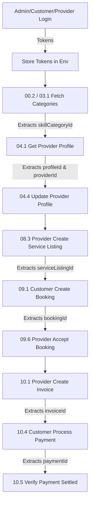

# Handee API - Postman Test Suite & Automation Guide

This directory contains the complete automated and manual Postman testing suite for the **Handee ASP.NET Core REST API** backend.

---

## Files Included

1. **`Handee_API_Complete_Test_Suite.postman_collection.json`**  
   The complete Postman Collection (v2.1.0 schema) organized into 13 logical folders containing 70 test requests covering all available API endpoints, response assertions, dynamic ID extraction, request chaining, and authorization/negative tests.

2. **`Handee_Local.postman_environment.json`**  
   The Postman Environment definition for local backend testing (`http://localhost:5057`). Pre-configured with seed credentials, base URLs, and dynamic placeholders.

3. **`generate_postman_suite.py`**  
   The automation generator script used to regenerate or update the collection and environment files.

---

## Postman Workspace Synchronization

- **Collection Name**: `Handee API - Complete Test Suite`
- **Environment Name**: `Handee - Local`
- **Postman Workspace ID**: `7d33f3f1-f2ef-4c82-8b51-7640ea63f8b4`
- **Synchronized Collection UID**: `53268790-f69fd671-701a-4805-9201-f4c7f3a48c60`
- **Synchronized Environment UID**: `53268790-8625115d-b61c-482e-955e-1740d83b557a`

---

## Environment Variables

| Variable Name | Initial / Default Value | Purpose |
|---|---|---|
| `baseUrl` | `http://localhost:5057/api` | Base URL for REST API endpoints |
| `authBaseUrl` | `http://localhost:5057` | Root host address (OpenAPI, admin routes, internal AI APIs) |
| `adminEmail` | `admin@handee.lk` | Seeded Admin user email |
| `adminPassword` | `Admin@1234!` | Seeded Admin user password |
| `customerEmail` | `customer1@mockdata.local` | Seeded Customer user email |
| `customerPassword` | `Password123!` | Seeded Customer user password |
| `providerEmail` | `provider1@mockdata.local` | Seeded Provider user email |
| `providerPassword` | `Password123!` | Seeded Provider user password |
| `adminAccessToken` | *(Dynamically set)* | Extracted JWT bearer token for Admin role |
| `adminRefreshToken` | *(Dynamically set)* | Extracted Refresh Token for Admin |
| `customerAccessToken` | *(Dynamically set)* | Extracted JWT bearer token for Customer role |
| `customerRefreshToken` | *(Dynamically set)* | Extracted Refresh Token for Customer |
| `providerAccessToken` | *(Dynamically set)* | Extracted JWT bearer token for Provider role |
| `providerRefreshToken` | *(Dynamically set)* | Extracted Refresh Token for Provider |
| `skillCategoryId` | *(Dynamically set)* | Extracted Service Category ID from database |
| `providerId` | *(Dynamically set)* | Extracted Provider Profile ID (synonymous with profileId) |
| `profileId` | *(Dynamically set)* | Extracted Provider Profile ID |
| `certificationId` | *(Dynamically set)* | Extracted Trade Certification ID |
| `reviewId` | *(Dynamically set)* | Extracted Customer Review ID |
| `reviewPhotoId` | *(Dynamically set)* | Extracted Review Photo ID |
| `jobRequestId` | *(Dynamically set)* | Extracted Job Request ID |
| `bookingId` | *(Dynamically set)* | Extracted Booking ID |
| `serviceListingId` | *(Dynamically set)* | Extracted Service Listing ID |
| `invoiceId` | *(Dynamically set)* | Extracted Invoice ID |
| `paymentId` | *(Dynamically set)* | Extracted Payment ID |
| `customerId` | *(Dynamically set)* | User ID of the authenticated customer |
| `providerUserId` | *(Dynamically set)* | User ID of the authenticated provider |
| `internalApiKey` | `dev-internal-secret-change-in-prod` | Shared secret for internal Python AI agent endpoints |

---

## Collection Structure & Dependency Flow

The collection is organized in sequential dependency order so it can be executed from top to bottom with zero manual intervention:

```text
Handee API - Complete Test Suite
├── 00 - Health / Setup
│   ├── 00.1 - Check API OpenAPI Spec & Ping
│   └── 00.2 - Verify Seeded Service Categories & Initialize Category ID (Sets skillCategoryId)
│
├── 01 - Authentication
│   ├── 01.1 - Register New Customer
│   ├── 01.2 - Admin Login (Sets adminAccessToken & adminRefreshToken)
│   ├── 01.3 - Customer Login (Sets customerAccessToken & customerRefreshToken)
│   ├── 01.4 - Provider Login (Sets providerAccessToken & providerRefreshToken)
│   ├── 01.5 - Refresh Token (Customer Rotation)
│   ├── 01.6 - Forgot Password Request
│   ├── 01.7 - Logout (Customer Rotation Teardown)
│   └── 01.8 - Restore Customer Session Login
│
├── 02 - User Profile
│   ├── 02.1 - Get Current Customer Profile (Sets customerId)
│   ├── 02.2 - Get Current Provider Profile (Sets providerUserId)
│   ├── 02.3 - Get Current Admin Profile
│   ├── 02.4 - Update Customer Profile
│   └── 02.5 - Upload Profile Photo
│
├── 03 - Skill Categories
│   └── 03.1 - List All Categories (Ensures skillCategoryId exists)
│
├── 04 - Providers
│   ├── 04.1 - Get My Provider Profile (Sets profileId & providerId)
│   ├── 04.2 - Search Providers (Public / Filtered)
│   ├── 04.3 - Get Provider Profile by ID as Customer (Checks public projection)
│   ├── 04.4 - Update Own Provider Profile
│   └── 04.5 - Get Provider Trust Signals (Internal AI Service, X-Internal-Api-Key)
│
├── 05 - Certifications
│   ├── 05.1 - Provider Upload Certification Document (Sets certificationId)
│   ├── 05.2 - Admin Get Verification Queue
│   ├── 05.3 - Admin Get Verification Summary
│   ├── 05.4 - Admin Review Certification Document
│   └── 05.5 - Admin Update Provider Verification Status
│
├── 06 - Reviews
│   ├── 06.1 - Customer Create Review for Provider (Sets reviewId)
│   ├── 06.2 - Get Reviews for Provider
│   ├── 06.3 - Customer Update Own Review
│   ├── 06.4 - Customer Upload Photo for Review
│   └── 06.5 - Delete Review
│
├── 07 - Job Requests
│   ├── 07.1 - Customer Create Job Request (Sets jobRequestId)
│   ├── 07.2 - Customer Get My Job Requests
│   ├── 07.3 - Get Job Request by ID
│   └── 07.4 - Admin / Staff Get Job Requests
│
├── 08 - Service Listings
│   ├── 08.1 - Provider Create Availability Slot
│   ├── 08.2 - Get Provider Availability Slots
│   ├── 08.3 - Provider Create Service Listing (Sets serviceListingId)
│   ├── 08.4 - Search Active Service Listings
│   ├── 08.5 - Get Service Listing by ID
│   ├── 08.6 - Provider Update Service Listing
│   └── 08.7 - Provider Get My Service Listings
│
├── 09 - Bookings
│   ├── 09.1 - Customer Create Booking from Listing (Sets bookingId)
│   ├── 09.2 - Customer Get My Bookings
│   ├── 09.3 - Provider Get My Bookings
│   ├── 09.4 - Get Booking by ID
│   ├── 09.5 - Customer Update Booking Schedule
│   ├── 09.6 - Provider Accept Booking Status (Sets status to Accepted)
│   └── 09.7 - Admin / Staff Get Bookings
│
├── 10 - Payments / Invoices
│   ├── 10.1 - Provider Create Invoice for Booking (Sets invoiceId)
│   ├── 10.2 - Get Invoice by ID
│   ├── 10.3 - Customer Get Invoices
│   ├── 10.4 - Customer Process Payment (Sets paymentId)
│   ├── 10.5 - Get Payment by ID
│   ├── 10.6 - Provider Get Earnings Summary
│   └── 10.7 - Admin Get Payouts Overview
│
├── 11 - Assistant & AI Workflows
│   ├── 11.1 - Customer Query AI Assistant
│   └── 11.2 - Admin Get Agent Workflows
│
└── 99 - Negative / Authorization Tests
    ├── 99.01 - Register - Invalid Role [400 Bad Request]
    ├── 99.02 - Register - Missing Required Password [400 Bad Request]
    ├── 99.03 - Login - Wrong Password [401 Unauthorized]
    ├── 99.04 - Login - Non-existent User [401 Unauthorized]
    ├── 99.05 - Protected Endpoint - Missing Token [401 Unauthorized]
    ├── 99.06 - Protected Endpoint - Malformed JWT Token [401 Unauthorized]
    ├── 99.07 - Admin Endpoint - Customer Token Forbidden [403 Forbidden]
    ├── 99.08 - Provider Verification - Customer Token Forbidden [403 Forbidden]
    ├── 99.09 - Provider Profile - Non-existent ID [404 Not Found]
    ├── 99.10 - Internal Trust Signals - Missing API Key [401 Unauthorized]
    ├── 99.11 - Internal Trust Signals - Invalid API Key [401 Unauthorized]
    └── 99.12 - Refresh Token - Invalid / Garbage Token [401 Unauthorized]
```

---

## Request Chaining Architecture

Every resource creation automatically captures the generated primary key into an environment variable and propagates it to dependent endpoints:



---

## How to Run

### Option 1: In Postman GUI (Recommended)
1. Open Postman.
2. In the top-left, click **Import** and select:
   - `Handee_API_Complete_Test_Suite.postman_collection.json`
   - `Handee_Local.postman_environment.json`
   *(Or navigate directly to workspace **Prageeth Navodya's Workspace** where the collection is already synced).*
3. Select the environment **Handee - Local** from the top-right dropdown.
4. Click on the collection **Handee API - Complete Test Suite** and select **Run Collection**.
5. Ensure all folders are checked, keep default delay at `0 ms`, and click **Run Handee API - Complete Test Suite**.

### Option 2: Headless via Newman CLI
Ensure Newman is installed (`npm install -g newman`):

```bash
newman run tests/postman/Handee_API_Complete_Test_Suite.postman_collection.json \
  -e tests/postman/Handee_Local.postman_environment.json \
  --reporters cli
```
