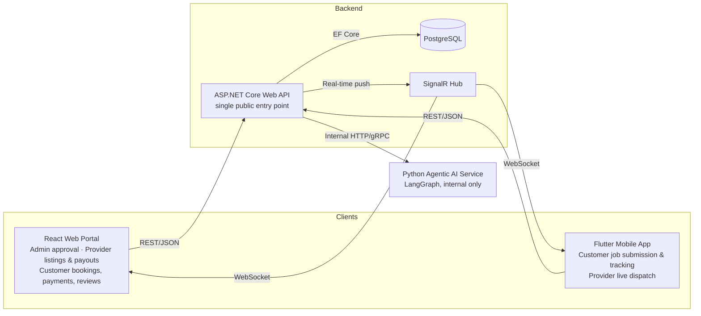
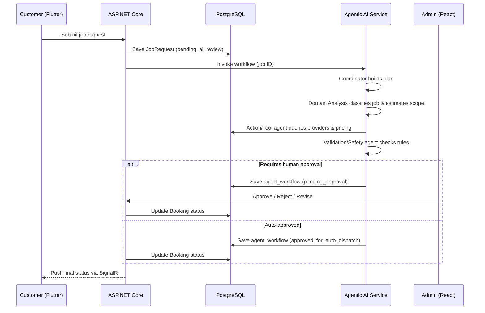
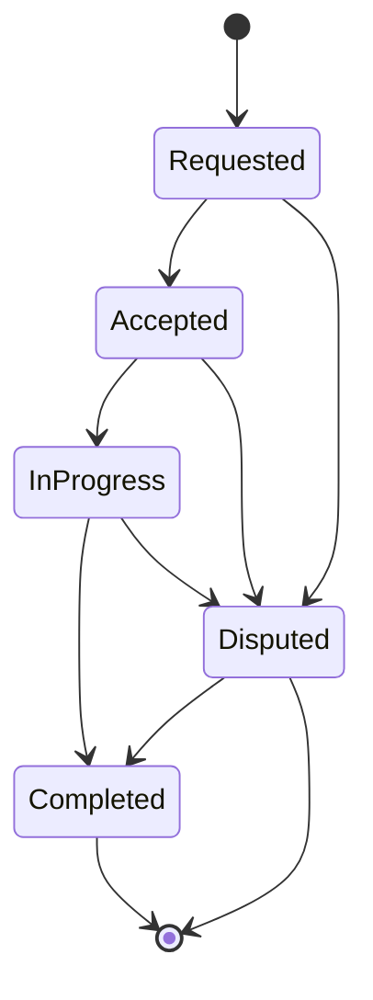

**SE3090 — Software Engineering Frameworks — Assignment 1 — Integrated Full-Stack and Agentic AI Application DevelopmentProject Proposal**

Faculty of Computing, SLIIT

_Released: 31 July 2026 | Due: 30 September 2026, 11:50 PM_

---

## 1. Executive Summary

**Handee** is a trust-verified marketplace connecting homeowners with independently vetted tradespeople (plumbers, electricians, AC technicians, painters, and similar trades) across Sri Lanka. The platform addresses a well-known gap in the local informal services market: customers have no reliable way to verify a provider's credentials, availability, or fair pricing before a job starts, and providers have no structured way to build a reputation, publish their services, or secure steady bookings.

Handee is not limited to urgent, break-fix situations. A customer can request **Instant Match** for something that needs attention now, or browse **Service Listings** to book planned, routine maintenance in advance — the same way they'd book any other service. Both paths run through the same trust and verification backbone.

The system is built as a single ASP.NET Core Web API backed by PostgreSQL, consumed identically by a **React web application** and a **Flutter mobile application**. Rather than splitting these clients by user role, they are split by function: Flutter is the live, field-facing surface (submitting jobs, tracking a provider in real time, receiving push alerts), while React is the back-office self-service portal used by all three roles — Admins approving AI-flagged matches, Providers publishing and managing Service Listings and payouts, and Customers managing bookings, payments, and reviews. An internal Python Agentic AI service — never reachable directly by either client — automates the highest-value and most error-prone step in the workflow: matching a job to a qualified provider and validating the proposed quote, with a mandatory human approval gate before any high-impact decision reaches the customer. The same agent service also powers a customer-facing AI assistant, reached only through the backend, that helps customers find and reserve the right provider conversationally.

The four-person group splits ownership along four independent business components — **Booking & Scheduling**, **Provider Verification & Profiles**, **Payments & Invoicing**, and **Job Feed & Dispatch** — each carrying its own backend slice, database entities, React screens, Flutter screens, tests, and a distinct Agentic AI contribution, satisfying the module's Rule of Ownership.

---

## 2. Problem Statement & Domain Justification

Homeowners in Sri Lanka typically source tradespeople through word-of-mouth, informal Facebook groups, or unverified classifieds — whether the need is urgent or simply routine maintenance they've been putting off. This produces three recurring problems:

1. **No verification** of certification, identity, or past work quality before a stranger is invited into a home
2. **No standard pricing reference**, leaving customers exposed to inflated quotes and providers exposed to lowball offers
3. **No accountability mechanism** when work is incomplete, delayed, or disputed

These problems exist whether someone is booking an emergency plumber at 9pm or scheduling a routine AC service two weeks out. Handee addresses all three by centralising verification, pricing benchmarks, and dispute-relevant history in one auditable system, while an Agentic AI layer automates provider matching and quote sanity-checking so that Admin staff only need to intervene on genuinely high-impact decisions rather than every booking.

**Domain fit for the rubric**: the marketplace naturally supports at least three distinct user roles, a clear cross-platform workflow (mobile-initiated job request → backend → AI matching → web-based human approval → status pushed back to mobile), and a HITL trigger with an obvious, defensible business rule (unverified provider, high-value quote, or an outlier price).

---

## 3. Project Objectives

- Deliver a production-grade, cloud-deployed full-stack application satisfying the **Single Public Backend Rule** and **Internal AI Service Rule** without exception
- Implement a **four-agent Agentic AI subsystem** that plans, analyses, acts through allow-listed tools, and validates its own output against deterministic business rules before any customer-facing effect
- Support **both on-demand and scheduled bookings** through two complementary paths — AI-matched Instant Match and browsable Service Listings — so the platform serves everyday maintenance, not just emergencies
- Demonstrate the mandated **cross-platform workflow** end-to-end: job submitted on Flutter, processed by ASP.NET Core and the AI service, approved on React, and reflected back on Flutter in real time via SignalR
- Achieve secure, **role-based access control (JWT + RBAC)** across all three user roles, on both clients
- Produce a reproducible, version-controlled deployment (**Terraform on Azure, GitHub Actions CI/CD**) so the live system can be rebuilt in minutes if anything breaks before evaluation
- Document architectural reasoning through **Architecture Decision Records (ADRs)** covering deployment topology, service boundaries, observability, and infrastructure-as-code choices

---

## 4. Scope of Work

### 4.1 In Scope

- Customer and Provider registration, authentication, and role-based dashboards on both Flutter and React
- Job request submission with category, description, photos, location, urgency, and budget range (Flutter) — for on-demand, AI-matched work
- Service Listing publishing and browsing — fixed-scope, fixed-price offerings customers can book directly for planned maintenance (React for Providers to publish/manage, both Flutter and React for Customers to browse/book)
- Provider verification workflow: document upload, skill categories, service area, background-check status
- AI-driven provider matching and quote validation, with an Admin approval gate in React
- A customer-facing AI assistant (backend-mediated) that helps customers find and reserve a suitable provider or Service Listing
- Booking lifecycle management (requested → accepted → in-progress → completed → disputed)
- Invoicing and payment status tracking through a sandbox payment gateway
- Real-time status updates (SignalR), ratings and reviews, and basic analytics for Admin

### 4.2 Out of Scope (for this assignment)

- Real money transactions — all payments run through a sandbox/test gateway
- Full production-scale Kubernetes hosting — K8s/Istio is delivered as a repository artifact and local demo only, not the production host
- Multi-country localisation or multi-currency support

---

## 5. User Roles

| Role                   | Flutter (live/field surface)                                                                                                                  | React (self-service portal)                                                                                                                                                                                          |
| ---------------------- | --------------------------------------------------------------------------------------------------------------------------------------------- | -------------------------------------------------------------------------------------------------------------------------------------------------------------------------------------------------------------------- |
| **Customer**           | Submits job requests with photos/location/budget, tracks booking status in real time, chats with the AI assistant to find providers on the go | Browses Service Listings, books planned maintenance, manages payment methods, views invoices/payment status, rates completed jobs                                                                                    |
| **Service Provider**   | Receives job dispatch alerts, accepts/declines in real time, updates job progress in the field                                                | Completes verification, publishes and manages Service Listings, sets availability calendar, views payout history and earnings                                                                                        |
| **Admin / Dispatcher** | — (React only)                                                                                                                                | Reviews and approves AI-generated provider matches and quotes when flagged for human review, manages provider verification status, oversees disputes, monitors platform analytics and the agent workflow audit trail |

Splitting by function rather than duplicating every screen on every client keeps the mandated cross-platform demo workflow unambiguous — a job is always _initiated_ on Flutter — while giving Providers and Customers a proper desktop-class portal for the parts of the experience that aren't time-critical.

---

## 6. High-Level System Architecture

The system follows the module's mandatory architecture pattern exactly: both clients talk only to ASP.NET Core, which is the sole owner of the PostgreSQL database and the only caller of the internal Agentic AI service.

### 6.1 Non-Negotiable Architecture Rules

- **Single Public Backend**: React and Flutter consume the exact same ASP.NET Core API and PostgreSQL database — no disconnected prototypes
- **Internal AI Service**: the Agentic AI subsystem is invoked internally by the backend only; neither client ever calls it directly — including the customer-facing AI assistant, which is just another authenticated backend endpoint that happens to call the agent service internally
- **Cross-Platform Workflow**: job initiated on Flutter → backend + database → AI execution triggered → pause for human approval on React → final status pushed back to Flutter

### 6.2 Mandatory Technology Stack

| Layer           | Technology                                                                                                          |
| --------------- | ------------------------------------------------------------------------------------------------------------------- |
| Backend         | C# / ASP.NET Core Web API — single public entry point                                                               |
| Database & ORM  | PostgreSQL + Entity Framework Core (migrations, constraints, seed data)                                             |
| Web App         | React (functional components, hooks, routing, state management) — Admin, Provider, and Customer self-service portal |
| Mobile App      | Flutter & Dart — Customer and Provider live/field apps; camera, GPS, secure storage, push notifications             |
| Agentic AI      | Python — LangGraph orchestration (FastAPI service), Pydantic schema validation                                      |
| CI/CD & Testing | Git, GitHub Actions, unit/integration/performance tests, agent golden-case evaluation                               |

---

## 7. Component Ownership & Team Structure

Each of the four group members owns one business component end-to-end — backend API, database entities, React screens, Flutter screens, tests, and a distinct Agentic AI contribution — in line with the module's Rule of Ownership.

| Component                            | Core Responsibilities                                                                                                                                                                                              | Agentic AI Contribution                                                                                                                                                                                    |
| ------------------------------------ | ------------------------------------------------------------------------------------------------------------------------------------------------------------------------------------------------------------------ | ---------------------------------------------------------------------------------------------------------------------------------------------------------------------------------------------------------- |
| **Booking & Scheduling**             | Service requests (both Instant Match and Service Listing bookings), provider availability calendar, booking confirmation/rescheduling, status workflow (requested → accepted → in-progress → completed → disputed) | **Domain Analysis Agent** — classifies job category, estimates scope/complexity, flags ambiguous descriptions                                                                                              |
| **Provider Verification & Profiles** | NIC/certification upload, skill categories, service area (GPS), ratings/reviews, background-check status workflow                                                                                                  | **Validation / Safety Agent** — enforces verification and rating rules before any match is approved                                                                                                        |
| **Payments & Invoicing**             | Job quotes, itemised invoices, sandbox payment gateway integration, provider payout ledger                                                                                                                         | **Price-estimation tool + approval-to-payment handoff logic**                                                                                                                                              |
| **Job Feed & Dispatch**              | Real-time nearby-provider matching (map-based), Service Listing publishing/browsing, urgent-request broadcast, provider accept/decline queue, job history/analytics                                                | **Coordinator/Planner Agent, Action/Tool Agent, and the customer-facing AI assistant endpoint** — build the plan, execute matching tool calls, and power conversational search over listings and providers |

All four members additionally share responsibility for the shared `agent_workflow` persistence layer, the React Agent Monitoring/Approval screen, and integration testing across component boundaries, since the core demo workflow deliberately touches every component.

---

## 8. Two Booking Paths

Handee supports two complementary ways to get work done, both backed by the same verification and trust layer:

|                        | Instant Match                                                                                 | Service Listing                                                                                            |
| ---------------------- | --------------------------------------------------------------------------------------------- | ---------------------------------------------------------------------------------------------------------- |
| **Best for**           | Something needs attention now — leak, outage, urgent repair                                   | Planned, routine maintenance — AC servicing, painting, gutter cleaning                                     |
| **Initiated by**       | Customer submits a free-text job request on Flutter                                           | Provider publishes a fixed-scope, fixed-price listing on React; Customer browses and books a slot          |
| **Provider selection** | AI-matched — Coordinator, Domain Analysis, and Action/Tool agents find and propose a provider | Customer-selected directly from the listing                                                                |
| **Pricing**            | AI-estimated, validated against category price bands                                          | Fixed by the Provider in advance                                                                           |
| **HITL gate**          | Yes — Validation/Safety agent can require Admin approval                                      | Only if flagged by the same deterministic rules (e.g. a first-time provider's very first listing bookings) |

The customer-facing AI assistant sits across both paths — a customer can ask it to find an available AC technician this week, and it can either point them at a matching Service Listing or kick off an Instant Match request, depending on what's available.

---

## 9. Core Cross-Platform Workflow: Job Dispatch & Quote Validation (Instant Match)

This single workflow remains the centrepiece of the demo: it is the one interaction that provably touches Flutter, ASP.NET Core, PostgreSQL, all four AI agents, the React approval screen, and the SignalR push back to Flutter — satisfying the mandated cross-platform pattern in one pass.

### 9.1 Trigger

A customer submits a job request in Flutter (category, description, photos, location, urgency, budget range). ASP.NET Core validates and persists the request to PostgreSQL with status `pending_ai_review`, then internally invokes the Agentic AI service with the job ID.

### 9.2 End-to-End Sequence

---

## 10. Agentic AI Subsystem Design

The subsystem satisfies the module's minimum criteria: at least four distinct agents, allow-listed tool calls, persisted state in the database, deterministic schema validation, and a genuine Human-in-the-Loop approval control on a high-impact action.

### 10.1 Agent Roster

| Agent                     | Allowed Tools                                                                                    | Responsibility                                                                                                                                                                                                                                                                                                                        |
| ------------------------- | ------------------------------------------------------------------------------------------------ | ------------------------------------------------------------------------------------------------------------------------------------------------------------------------------------------------------------------------------------------------------------------------------------------------------------------------------------- |
| **Coordinator / Planner** | None directly — delegates only                                                                   | Receives the objective, builds an explicit step plan, and routes each step to the correct downstream agent. Never touches a tool itself.                                                                                                                                                                                              |
| **Domain Analysis**       | `classify_job_category()`, `estimate_scope()`                                                    | Classifies the job category and estimates complexity/duration from the free-text description; flags ambiguity for a wider cost range.                                                                                                                                                                                                 |
| **Action / Tool**         | `search_providers()`, `estimate_price()`, `check_provider_rating()`, `search_service_listings()` | Executes matching and pricing against PostgreSQL and historical job data, and searches published Service Listings for the AI assistant; returns a ranked, schema-validated candidate list.                                                                                                                                            |
| **Validation / Safety**   | None — pure rule evaluation, no tool calls                                                       | Deterministic, **tiered** risk checks: provider must be verified, quote must fall within an accepted band of the category average, rating must clear a configurable threshold. Produces one of three outcomes — `approved_for_auto_dispatch`, `approved_with_audit`, or `requires_human_approval` — rather than a single binary flag. |

### 10.2 Customer-Facing AI Assistant

A conversational entry point, reached only via an authenticated backend endpoint (e.g. `POST /api/assistant/query`), lets customers ask for help in natural language ("find me a plumber available this weekend under Rs 5,000"). The backend forwards the query to the Agentic AI service, which uses the same Action/Tool agent (`search_providers`, `search_service_listings`) to return ranked, schema-validated results. This preserves the Internal AI Service Rule exactly — the client only ever talks to ASP.NET Core.

### 10.3 Shared State & Persistence

Every workflow run is persisted in an `agent_workflow` table keyed by workflow ID, storing:

- The objective
- The plan
- Each step's tool inputs/outputs and timing
- The validation outcome
- The approval status (pending / approved / rejected / revised)
- The final result

This table is both the audit trail the rubric expects and the data source for the React Agent Monitoring screen.

### 10.4 Human-in-the-Loop Approval Gate — Tiered, Not Binary

A blanket "every match waits for a human" rule would defeat the point of Instant Match, so the Validation/Safety agent classifies every proposal into one of three risk tiers instead of a single pass/fail flag:

| Tier            | Condition                                                                                                                  | Effect                                                                                                                                                                                                                                                                                                                                                    |
| --------------- | -------------------------------------------------------------------------------------------------------------------------- | --------------------------------------------------------------------------------------------------------------------------------------------------------------------------------------------------------------------------------------------------------------------------------------------------------------------------------------------------------- |
| **Low risk**    | Verified provider with an established rating, quote within the normal band for the category                                | `approved_for_auto_dispatch` — dispatched immediately, no human in the loop. This is the expected outcome for the large majority of jobs once the provider base and price history mature.                                                                                                                                                                 |
| **Medium risk** | One soft signal only — e.g. a moderately new provider with an otherwise clean record, or a quote slightly outside the band | `approved_with_audit` — the provider is notified and dispatched immediately (so the customer still gets an instant response), but the proposal is queued for Admin review after the fact. If Admin later rejects it, the booking is flagged for follow-up rather than blocking dispatch upfront.                                                          |
| **High risk**   | First-time or borderline-rated provider **and** an outlier quote, or any deterministic rule fails outright                 | `requires_human_approval` — the only tier that pauses dispatch. The proposal, provider, quote, and agent reasoning trail are shown to the Admin in React with **Approve**, **Reject**, and **Request Revision** controls; only an explicit Admin action moves the job out of `pending_approval`, and the result is what Flutter reflects to the customer. |

Two design choices keep this honest rather than just theoretical:

- **The gate gets narrower over time.** Both flagging conditions (provider trust, price-band variance) are driven by historical data that thickens as the platform runs, so the proportion of jobs reaching `requires_human_approval` is expected to shrink as the provider base matures — worth stating explicitly in the domain justification.
- **Matching and pricing are gated separately from each other.** A bad _match_ is self-correcting — a provider can simply decline — so only the _proposal_ (a specific provider at a specific price) is ever gated, not the search itself. This keeps the agent pipeline (Coordinator → Domain Analysis → Action/Tool) running at full speed regardless of tier; only the final Validation/Safety decision branches.
- **An approval SLA is tracked as a real metric.** The `agent_workflow` table's approval timestamp lets the React Agent Monitoring screen show average time-to-decision for flagged proposals, which doubles as a good live metric to show in the viva.

### 10.5 Safety, Observability & Guardrail Principles

- **Least privilege** — each agent can only call the tools listed for it; the Domain Analysis agent, for example, can never call `search_providers` directly
- **Safe failure** — if no candidate provider is found or a tool times out, the workflow ends in a recorded `failed_no_candidates` state rather than silently guessing
- **Untrusted input handling** — the customer's free-text job description or assistant query is treated as untrusted and validated/sanitised before it reaches any tool call or the database
- **Strict schema validation** on every tool input/output using Pydantic, so a malformed or hallucinated tool call is rejected before it can reach PostgreSQL

---

## 11. Data Model Overview

The database is owned entirely by ASP.NET Core via EF Core migrations. Core entities span all four components and the shared AI workflow:

| Entity                         | Purpose                                                                                                              |
| ------------------------------ | -------------------------------------------------------------------------------------------------------------------- |
| `User / Role`                  | Base identity for Customer, Provider, and Admin, with JWT/RBAC claims                                                |
| `ProviderProfile`              | Certifications, skill categories, service area (GPS), verification status, rating aggregate                          |
| `ServiceCategory`              | Trade categories (plumbing, electrical, AC repair, painting, etc.) and historical price bands                        |
| `ServiceListing`               | Provider-published fixed-scope, fixed-price offering with its own availability slots — the "browse & book" path      |
| `JobRequest`                   | Customer-submitted request for AI-matched work: category, description, photos, location, urgency, budget             |
| `Booking`                      | Lifecycle state machine linking either a `JobRequest` or a `ServiceListing` booking to an assigned `ProviderProfile` |
| `Quote / Invoice`              | AI-proposed or listing-fixed pricing, Admin-approved where flagged, itemised invoice, payment status                 |
| `Payment / Payout`             | Sandbox payment gateway transaction records and provider payout ledger                                               |
| `Review`                       | Post-completion rating and feedback tied to a `Booking`                                                              |
| `AgentWorkflow / AgentStepLog` | Persisted plan, tool calls, validation outcome, and approval status per job                                          |

### 11.1 Booking Lifecycle

---

## 12. Third-Party Integrations

All external calls are made exclusively by ASP.NET Core; neither client ever calls a third-party API directly. Keys live in backend configuration/secrets, and every integration is wrapped in Polly retry and circuit-breaker policies to handle timeouts and rate limits gracefully.

| Service                                                 | Purpose                                                                                    | Notes                                                                                 |
| ------------------------------------------------------- | ------------------------------------------------------------------------------------------ | ------------------------------------------------------------------------------------- |
| **Google Maps / Distance Matrix API**                   | Provider-to-job distance and location-based matching for the Job Feed & Dispatch component | Primary integration — directly supports the Action/Tool agent's `search_providers()`  |
| **Sandbox Payment Gateway** (Stripe or PayHere sandbox) | Job quote payment and payout tracking                                                      | No real money moves; used to demonstrate the Payments & Invoicing workflow end-to-end |
| **SMS / Email** (Twilio or SendGrid)                    | Booking confirmations and urgent-request alerts                                            | Secondary/stretch integration triggered asynchronously after Admin approval           |

---

## 13. Architecture Enhancements

| Enhancement                     | Role in Handee                                                                                                                                         |
| ------------------------------- | ------------------------------------------------------------------------------------------------------------------------------------------------------ |
| **ASP.NET Core SignalR**        | Pushes live status updates — job assigned, approval pending, provider en route — to Flutter and React without polling                                  |
| **Redis**                       | Caches active sessions, category price averages, Service Listing search results, and in-flight agent execution state for fast re-reads during matching |
| **OpenTelemetry + Seq/Jaeger**  | Traces a single job request end-to-end: Flutter → ASP.NET Core → PostgreSQL → Python agent service → Google Maps API — demoed live in the viva         |
| **Kafka / RabbitMQ** (optional) | Queues background dispatch jobs (e.g. bulk urgent-request broadcast) instead of blocking the HTTP request                                              |

---

## 14. Architecture Decision: Modular Monolith over Full Microservices

Layered Arhitecture

## 15. DevOps, CI/CD & Testing Strategy

### 15.1 GitHub Actions Pipeline

A multi-job pipeline runs on every push/PR to `main`:

- **Backend job** — restore, build, `dotnet test` against an in-memory/test PostgreSQL instance
- **Frontend job** — `npm ci`, ESLint, `npm test -- --watchAll=false`
- **Mobile job** — `flutter analyze`, `flutter test`
- **Agent evaluation job** — PyTest suite validating Pydantic schemas, tool-call contracts, and golden-case outputs

### 15.2 Local Development

A single `docker-compose.yml` spins up PostgreSQL, Redis, the backend, the AI service, and Seq (logging UI) with one command, so any group member — or an evaluator — can run the full stack locally without manual setup.

### 15.3 Testing Coverage

- Unit and integration tests per component (owned by the respective student)
- Golden-case agent evaluation — a fixed set of job scenarios fed through the agent suite, asserting schema correctness and tool-selection accuracy
- Performance tests on the matching/dispatch endpoint given it is the core demo path

---

## 16. Deployment & Infrastructure

### 16.1 Production Topology

Deployment targets **Azure**, funded by the team's student credits, provisioned entirely through **Terraform** rather than manual portal configuration — giving a reproducible, single-command rebuild if any resource is misconfigured before evaluation.

| Layer                     | Azure Resource                                                                    |
| ------------------------- | --------------------------------------------------------------------------------- |
| ASP.NET Core Web API      | Azure App Service (Linux, B1 tier) — public HTTPS base URL, `/swagger`, `/health` |
| PostgreSQL                | Azure Database for PostgreSQL Flexible Server (B1ms tier)                         |
| React Web App             | Azure Static Web App                                                              |
| Python Agentic AI Service | Azure App Service — internal only, reachable solely from the backend              |
| Secrets                   | Azure Key Vault — DB connection strings, JWT signing key, Maps/payment API keys   |

Terraform state is kept out of Git and stored in a remote Azure Blob Storage backend. A GitHub Actions workflow runs `terraform fmt` → `validate` → `plan` on pull requests and `terraform apply` on merge to `main`, giving a full GitOps trail for the deployment itself.

### 16.2 Kubernetes & Service Mesh — Repository Artifact

Running production on a free-tier Kubernetes cluster with an Istio service mesh carries real live-demo risk (pod memory limits, sidecar overhead) and is not required for the mandatory deployment.

Handee follows a dual-pipeline approach:

- **Production** stays on the lightweight Azure App Service topology above
- A complete `/k8s` directory — Helm charts for the API, AI service, PostgreSQL, and Redis, plus Istio manifests (`VirtualService`, `DestinationRule`, `Gateway`, `PeerAuthentication` for mTLS) — is included in the repository and demonstrated running locally on K3s/Minikube in the recorded demo video

This earns architectural credit for enterprise container-orchestration knowledge without risking the live evaluation URL.

---

## 17. Risk Management

| Risk                                                                             | Impact                                                                       | Mitigation                                                                                                                                          |
| -------------------------------------------------------------------------------- | ---------------------------------------------------------------------------- | --------------------------------------------------------------------------------------------------------------------------------------------------- |
| Live cloud URL unavailable during evaluation                                     | High — loses deployment marks                                                | Terraform enables a full rebuild in minutes; production stays on lightweight Azure App Service rather than a fragile K8s cluster                    |
| Agent produces an invalid or unsafe match                                        | High — core AI workflow                                                      | Deterministic Validation/Safety agent plus mandatory HITL gate before any customer-facing effect                                                    |
| Component work overlaps or blocks another student                                | Medium — team delivery                                                       | Strict domain-module ownership inside the Modular Monolith, with the shared `agent_workflow` and approval screen as the only jointly-owned surface  |
| React portal scope grows too large for the timeline (three roles instead of one) | Medium — delivery risk from the added Provider/Customer self-service screens | Reuse a shared component library across role dashboards; scope each role's portal to the minimum screens needed for the rubric before adding polish |
| Third-party API rate limits/timeouts during demo                                 | Medium — live workflow                                                       | Polly retry and circuit-breaker policies around every external call, with graceful fallback messaging                                               |

---

## 18. Project Timeline

The assignment runs from **31 July 2026 to 30 September 2026, 11:50 PM**. Work is organised into five phases:

| Phase                                   | Focus                                                                                                                                                |
| --------------------------------------- | ---------------------------------------------------------------------------------------------------------------------------------------------------- |
| **Phase 1 — Setup & Architecture**      | Repository scaffolding, database schema design (including `ServiceListing`), CI pipeline skeleton, initial ADRs, base Terraform/Azure infrastructure |
| **Phase 2 — Core Component Build**      | Each student builds their backend slice, EF Core entities, React screens (their role's portal), and Flutter screens in parallel                      |
| **Phase 3 — Agentic AI Integration**    | Wiring the four agents into the shared workflow, the customer-facing AI assistant endpoint, HITL approval screen, SignalR real-time push             |
| **Phase 4 — Integration & Hardening**   | Third-party API integration, JWT/RBAC security, golden-case evaluation, end-to-end testing                                                           |
| **Phase 5 — Final Polish & Submission** | Deployment freeze, ADRs finalised, report writing, demo video recording, viva preparation                                                            |

---

## 19. Marking Rubric Alignment

The proposal is deliberately shaped against all 100 marks of the SE3090 Assignment 1 rubric:

| Category                            | Marks           | How Handee Addresses It                                                                                             |
| ----------------------------------- | --------------- | ------------------------------------------------------------------------------------------------------------------- |
| Component Design & Business Logic   | 10 (Group)      | Four independent, end-to-end domain components with no fragmented workflows                                         |
| Architecture, AI & State Management | 10 (Group)      | Four-agent pipeline, persisted `agent_workflow` state, mandatory HITL gate                                          |
| Documentation, ADRs & Deployment    | 10 (Group)      | Terraform-driven Azure deployment, live URLs, working APK, ADRs 1–6                                                 |
| ASP.NET Core Web API                | 10 (Individual) | REST conventions, DTOs, async, middleware, Clean Architecture per module                                            |
| PostgreSQL Data Modeling            | 10 (Individual) | Normalised schema, EF Core migrations, indexes, constraints, audit fields                                           |
| React Web UI                        | 10 (Individual) | Reusable components shared across three role-based portals, protected routes, Admin approval and monitoring screens |
| Flutter Mobile App                  | 10 (Individual) | State management, camera/GPS/QR native features, secure storage                                                     |
| Individual Agentic AI Contribution  | 12 (Individual) | Each student owns one agent or tool with its own contract and tests                                                 |
| API Security & Cross-Platform Flow  | 10 (Individual) | JWT, RBAC, and the Flutter → backend → AI → React → Flutter workflow demo                                           |
| Testing, CI/CD & Git Workflow       | 8 (Individual)  | Active PRs/issues, four-job GitHub Actions pipeline, unit/integration suites                                        |

---

## 20. Architecture Decision Records to be Produced

- **ADR 01** — Modular Monolith Gateway vs. full database-per-service microservices
- **ADR 02** — Choice of LangGraph for Agentic AI orchestration
- **ADR 03** — Deployment topology and managed cloud platform selection (Azure App Service + Static Web Apps + Flexible Server)
- **ADR 04** — Observability and distributed state/caching architecture (OpenTelemetry, Redis)
- **ADR 05** — Kubernetes/Istio as a repository artifact vs. production host
- **ADR 06** — Splitting Flutter and React by function (live vs. self-service) rather than by user role
- **ADR 07** — Infrastructure-as-Code via Terraform vs. imperative Azure portal configuration

---

## 21. Conclusion

Handee gives the group a domain with genuine real-world relevance in Sri Lanka, a natural three-role structure, and a single demoable workflow that legitimately exercises every mandatory architectural rule in the assignment brief. Supporting both on-demand Instant Match and browsable Service Listings broadens the product beyond emergencies into everyday use, and splitting the web and mobile clients by function rather than duplicating every screen keeps the mandated cross-platform demo clean while still giving Providers and Customers a proper self-service portal. The four-agent AI design meets the minimum criteria exactly, with a defensible, business-driven Human-in-the-Loop gate rather than an artificial one bolted on for marks.

Combined with Terraform-driven Azure deployment and a K8s/Istio repository artifact, the proposal is positioned to score strongly across every rubric category while remaining something each team member can build, explain, and debug live in the viva.

---
